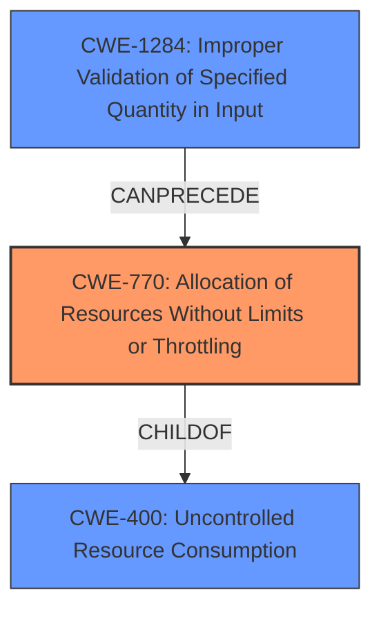

# Analysis for CVE-2021-33609

# Summary
| CWE ID    | CWE Name                                                        | Confidence | CWE Abstraction Level | CWE Vulnerability Mapping Label | CWE-Vulnerability Mapping Notes |
| :--------- | :-------------------------------------------------------------- | :--------- | :---------------------- | :------------------------------ | :------------------------------ |
| CWE-770  | Allocation of Resources Without Limits or Throttling           | 1          | Base                    | Primary                         | Allowed                       |
| CWE-400  | Uncontrolled Resource Consumption                               | 0.7        | Class                    | Secondary                       | Allowed-with-Review            |
| CWE-1284 | Improper Validation of Specified Quantity in Input              | 0.6        | Base                    | Secondary                       | Allowed                       |

## Evidence and Confidence

*   **Confidence Score:** 0.8
*   **Evidence Strength:** HIGH

## Relationship Analysis
The primary CWE is CWE-770 Allocation of Resources Without Limits or Throttling. This CWE has a child relationship with CWE-400 Uncontrolled Resource Consumption. CWE-1284 Improper Validation of Specified Quantity in Input can precede CWE-770. CWE-770 is the base level of abstraction. CWE-400 is a Class and might have Base-level children that would be more appropriate, but is a valid secondary mapping.

## Vulnerability Chain
The vulnerability chain starts with a **missing check** (CWE-770) on the number of rows requested, leading to uncontrolled resource consumption (CWE-400) and ultimately heap exhaustion.

## Summary of Analysis
The initial analysis and criticism focused on identifying the root cause and the subsequent impact of the vulnerability. The **missing check** in the `DataCommunicator` class allows an attacker to request an excessive number of rows, leading to heap exhaustion.

The graph relationships influenced the final selection by highlighting the connection between **allocation of resources without limits** (CWE-770) and **uncontrolled resource consumption** (CWE-400). The **missing check** is the root cause and the **heap exhaustion** is the result of the attack vector.

The selected CWEs are at the optimal level of specificity because CWE-770 directly addresses the **lack of limits** on resource allocation, while CWE-400 captures the resulting **uncontrolled resource consumption**.

The evidence from the vulnerability description key phrases and CVE Reference Links Content Summary support the CWE selection:

*   **Vulnerability Description Key Phrases:**
    *   **rootcause:** **Missing check**
    *   **impact:** heap exhaustion
*   **CVE Reference Links Content Summary:**
    *   "The `DataCommunicator` class in Vaadin 8 lacked a check on the number of rows requested. This allowed an authenticated attacker to request an arbitrary amount of data."
    *   "**Uncontrolled Resource Consumption (CWE-400):** The vulnerability stems from the lack of a limit on the number of data rows that can be requested via `DataCommunicator`. This allows for excessive resource consumption."

Relevant CWE Information:

# Enhanced Context (25 CWEs)

## CWE-1284: Improper Validation of Specified Quantity in Input
**Abstraction Level**: Base
**Similarity Score**: 0.76
**Source**: dense

**Description**:
The product receives input that is expected to specify a quantity (such as size or length), but it does not validate or incorrectly validates that the quantity has the required properties.

**Mapping Guidance**:
- Usage: Allowed
- Rationale: This CWE entry is at the Base level of abstraction, which is a preferred level of abstraction for mapping to the root causes of vulnerabilities.

*This CWE is considered because the number of rows requested is a quantity that should be validated. The weakness occurs because this quantity is not validated properly. This is added as a secondary CWE.*

## CWE-770: Allocation of Resources Without Limits or Throttling
**Abstraction Level**: Base
**Similarity Score**: 6914.39
**Source**: sparse

**Description**:
The product allocates a reusable resource or group of resources on behalf of an actor without imposing any restrictions on the size or number of resources that can be allocated, in violation of the intended security policy for that actor.

**Mapping Guidance**:
- Usage: Allowed
- Rationale: This CWE entry is at the Base level of abstraction, which is a preferred level of abstraction for mapping to the root causes of vulnerabilities.

*This CWE is chosen as the primary CWE because the root cause is the allocation of resources (memory) without limits or throttling.*

## CWE-400: Improper Resource Shutdown or Release
**Abstraction Level**: Class
**Similarity Score**: 0.74
**Source**: dense

**Description**:
The product does not release or incorrectly releases a resource before it is made available for re-use.

**Mapping Guidance**:
- Usage: Allowed-with-Review
- Rationale: This CWE entry is a Class and might have Base-level children that would be more appropriate

*This CWE is considered because the lack of proper resource handling (specifically, limiting resource allocation) leads to resource exhaustion.*