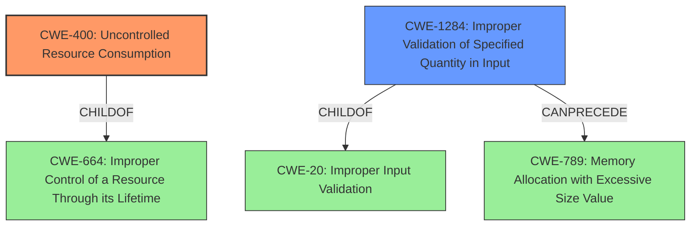

# Raw Analyzer Response for CVE-2021-33620

# Summary
| CWE ID | CWE Name | Confidence | CWE Abstraction Level | CWE Vulnerability Mapping Label | CWE-Vulnerability Mapping Notes |
|---|---|---|---|---|---|
| CWE-400 | Uncontrolled Resource Consumption | 0.9 | Class | Primary | Allowed-with-Review |
| CWE-1284 | Improper Validation of Specified Quantity in Input | 0.7 | Base | Secondary | Allowed |

## Evidence and Confidence

*   **Confidence Score:** 0.8
*   **Evidence Strength:** HIGH

## Relationship Analysis
The primary CWE selected is CWE-400, which is a Class-level CWE. While discouraged for direct mapping, its children like CWE-770 (Allocation of Resources Without Limits or Throttling) are more specific. However, given the limited information, CWE-400 provides a suitable starting point. CWE-1284 is a child of CWE-20 (Improper Input Validation) and can precede CWE-789 (Memory Allocation with Excessive Size Value), suggesting a potential chain. The relationships influenced the selection by highlighting the need to consider input validation as a contributing factor to the resource consumption issue.

## Vulnerability Chain
The vulnerability chain starts with **improper input validation** (CWE-20), leading to **improper validation of specified quantity in input** (CWE-1284), which then results in **uncontrolled resource consumption** (CWE-400) and ultimately a denial-of-service (DoS).

## Summary of Analysis
The initial assessment focused on the description indicating a denial-of-service due to an HTTP response header. The "CVE Reference Links Content Summary" confirmed this, stating, "The vulnerability is caused by an input validation bug in Squid's HTTP response processing. Specifically, a header in the HTTP response can trigger the vulnerability" and "The primary impact of exploiting this vulnerability is a denial of service."

The retriever results pointed to several relevant CWEs, including CWE-400, CWE-1284, and CWE-444. CWE-400 aligns with the denial-of-service impact, while CWE-1284 relates to the **improper validation** aspect. CWE-444 (Inconsistent Interpretation of HTTP Requests) was considered but deemed less appropriate as the core issue is not an inconsistent interpretation, but rather a failure to properly handle a malformed or excessively large header.

The final decision was to map the vulnerability to CWE-400 (Uncontrolled Resource Consumption) as the primary weakness, with CWE-1284 (Improper Validation of Specified Quantity in Input) as a secondary weakness, to represent the underlying **input validation** issue that leads to the resource exhaustion. The evidence strongly supports this mapping, with the vulnerability description and CVE summary highlighting the role of an HTTP response header in triggering the DoS. While CWE-400 is a Class-level CWE and is discouraged, it accurately reflects the high-level impact of the vulnerability. A more specific CWE, such as CWE-770 (Allocation of Resources Without Limits or Throttling), could be considered if more information were available about the specific resource being exhausted. However, given the available evidence, CWE-400 provides an appropriate level of specificity.

Relevant CWE Information:

# Enhanced Context (25 CWEs)
The following CWEs were identified as potentially relevant to this vulnerability:

## CWE-113: Improper Neutralization of CRLF Sequences in HTTP Headers ('HTTP Request/Response Splitting')
**Abstraction Level**: Variant
**Similarity Score**: 0.81
**Source**: dense

**Description**:
The product receives data from an HTTP agent/component (e.g., web server, proxy, browser, etc.), but it does not neutralize or incorrectly neutralizes CR and LF characters before the data is included in outgoing HTTP headers.

**Mapping Guidance**:
- Usage: Allowed
- Rationale: This CWE entry is at the Variant level of abstraction, which is a preferred level of abstraction for mapping to the root causes of vulnerabilities.

## CWE-444: Inconsistent Interpretation of HTTP Requests ('HTTP Request/Response Smuggling')
**Abstraction Level**: Base
**Similarity Score**: 0.79
**Source**: dense

**Description**:
The product acts as an intermediary HTTP agent
         (such as a proxy or firewall) in the data flow between two
         entities such as a client and server, but it does not
         interpret malformed HTTP requests or responses in ways that
         are consistent with how the messages will be processed by
         those entities that are at the ultimate destination.

**Mapping Guidance**:
- Usage: Allowed
- Rationale: This CWE entry is at the Base level of abstraction, which is a preferred level of abstraction for mapping to the root causes of vulnerabilities.

## CWE-74: Improper Neutralization of Special Elements in Output Used by a Downstream Component ('Injection')
**Abstraction Level**: Class
**Similarity Score**: 0.73
**Source**: dense

**Description**:
The product constructs all or part of a command, data structure, or record using externally-influenced input from an upstream component, but it does not neutralize or incorrectly neutralizes special elements that could modify how it is parsed or interpreted when it is sent to a downstream component.

**Mapping Guidance**:
- Usage: Discouraged
- Rationale: CWE-74 is high-level and often misused when lower-level weaknesses are more appropriate.

## CWE-1289: Improper Validation of Unsafe Equivalence in Input
**Abstraction Level**: Base
**Similarity Score**: 0.72
**Source**: dense

**Description**:
The product receives an input value that is used as a resource identifier or other type of reference, but it does not validate or incorrectly validates that the input is equivalent to a potentially-unsafe value.

**Mapping Guidance**:
- Usage: Allowed
- Rationale: This CWE entry is at the Base level of abstraction, which is a preferred level of abstraction for mapping to the root causes of vulnerabilities.

## CWE-41: Improper Resolution of Path Equivalence
**Abstraction Level**: Base
**Similarity Score**: 0.72
**Source**: dense

**Description**:
The product is vulnerable to file system contents disclosure through path equivalence. Path equivalence involves the use of special characters in file and directory names. The associated manipulations are intended to generate multiple names for the same object.

**Mapping Guidance**:
- Usage: Allowed
- Rationale: This CWE entry is at the Base level of abstraction, which is a preferred level of abstraction for mapping to the root causes of vulnerabilities.

## CWE-130: Improper Handling of Length Parameter Inconsistency
**Abstraction Level**: Base
**Similarity Score**: 0.72
**Source**: dense

**Description**:
The product parses a formatted message or structure, but it does not handle or incorrectly handles a length field that is inconsistent with the actual length of the associated data.

**Mapping Guidance**:
- Usage: Allowed
- Rationale: This CWE entry is at the Base level of abstraction, which is a preferred level of abstraction for mapping to the root causes of vulnerabilities.

## CWE-436: Interpretation Conflict
**Abstraction Level**: Class
**Similarity Score**: 0.72
**Source**: dense

**Description**:
Product A handles inputs or steps differently than Product B, which causes A to perform incorrect actions based on its perception of B's state.

**Mapping Guidance**:
- Usage: Allowed-with-Review
- Rationale: This CWE entry is a Class and might have Base-level children that would be more appropriate

## CWE-184: Incomplete List of Disallowed Inputs
**Abstraction Level**: Base
**Similarity Score**: 0.72
**Source**: dense

**Description**:
The product implements a protection mechanism that relies on a list of inputs (or properties of inputs) that are not allowed by policy or otherwise require other action to neutralize before additional processing takes place, but the list is incomplete.

**Mapping Guidance**:
- Usage: Allowed
- Rationale: This CWE entry is at the Base level of abstraction, which is a preferred level of abstraction for mapping to the root causes of vulnerabilities.

## CWE-80: Improper Neutralization of Script-Related HTML Tags in a Web Page (Basic XSS)
**Abstraction Level**: Variant
**Similarity Score