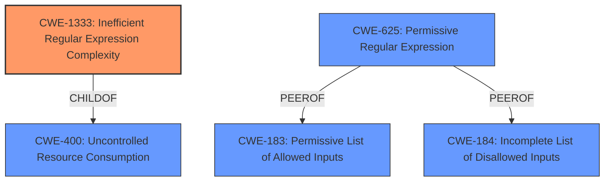

# Raw Analyzer Response for CVE-2021-33623

# Summary
| CWE ID   | CWE Name                                                          | Confidence | CWE Abstraction Level | CWE Vulnerability Mapping Label | CWE-Vulnerability Mapping Notes |
| :------- | :---------------------------------------------------------------- | :--------- | :-------------------- | :------------------------------ | :------------------------------ |
| CWE-1333 | Inefficient Regular Expression Complexity                         | 1          | Base                  | Allowed                       | Root cause                      |
| CWE-400  | Uncontrolled Resource Consumption                               | 0.7        | Class                 | Allowed-with-Review           | Impact                          |

## Evidence and Confidence

*   **Confidence Score:** 0.9
*   **Evidence Strength:** HIGH

## Relationship Analysis
The primary relationship influencing the CWE selection is the hierarchical relationship between CWE-1333 (Base) and its parent CWE-407 (Uncontrolled Resource Consumption). While CWE-1333 directly addresses the inefficient regular expression complexity, CWE-400 represents the broader impact of uncontrolled resource consumption leading to denial of service. Another important factor is the "PeerOf" relationship between CWE-625 and other input validation CWEs, like CWE-183 and CWE-184, suggesting related but distinct weaknesses concerning input handling.

## Vulnerability Chain
The vulnerability chain starts with the **inefficient regular expression** (CWE-1333) in the `.end()` method. When a specially crafted input with many trailing newlines is processed, the regex engine consumes excessive CPU cycles due to exponential backtracking. This leads to **uncontrolled resource consumption** (CWE-400), ultimately resulting in a Denial of Service (DoS) condition, making the application unavailable to legitimate users.

## Summary of Analysis
The primary CWE is CWE-1333 (Inefficient Regular Expression Complexity), which accurately represents the root cause of the vulnerability. This is based on the vulnerability description stating "**regular expression denial-of-service** (ReDoS) for the .end() method" and the CVE Reference Links Content Summary confirming "This vulnerability arises due to an inefficient regular expression used to remove newlines from the end of a string." The retriever results also listed CWE-1333 with the highest score. CWE-400 (Uncontrolled Resource Consumption) is included as a secondary CWE to represent the impact of the vulnerability, as the inefficient regex leads to excessive CPU usage, resulting in a denial-of-service.

CWE-625 (Permissive Regular Expression) was considered but not selected because the core issue isn't that the regular expression is too permissive, but rather that it's inefficient in terms of computational complexity. While a permissive regex *could* lead to ReDoS, in this specific case, the ReDoS stems directly from the regex's inefficient backtracking behavior. Similarly, CWE-185 (Incorrect Regular Expression) was considered, but CWE-1333 is more specific to the ReDoS vulnerability.

The selection of CWE-1333 is at the optimal level of specificity as it directly addresses the root cause of the vulnerability, which is the inefficient regular expression complexity leading to a ReDoS attack.

Relevant CWE Information:

# Enhanced Context (25 CWEs)
The following CWEs were identified as potentially relevant to this vulnerability:

## CWE-625: Permissive Regular Expression
**Abstraction Level**: Base
**Similarity Score**: 0.77
**Source**: dense

**Description**:
The product uses a regular expression that does not sufficiently restrict the set of allowed values.

**Mapping Guidance**:
- Usage: Allowed
- Rationale: This CWE entry is at the Base level of abstraction, which is a preferred level of abstraction for mapping to the root causes of vulnerabilities.

## CWE-185: Incorrect Regular Expression
**Abstraction Level**: Class
**Similarity Score**: 0.76
**Source**: dense

**Description**:
The product specifies a regular expression in a way that causes data to be improperly matched or compared.

**Mapping Guidance**:
- Usage: Allowed-with-Review
- Rationale: This CWE entry is a Class and might have Base-level children that would be more appropriate

## CWE-777: Regular Expression without Anchors
**Abstraction Level**: Variant
**Similarity Score**: 0.75
**Source**: dense

**Description**:
The product uses a regular expression to perform neutralization, but the regular expression is not anchored and may allow malicious or malformed data to slip through.

**Mapping Guidance**:
- Usage: Allowed
- Rationale: This CWE entry is at the Variant level of abstraction, which is a preferred level of abstraction for mapping to the root causes of vulnerabilities.

## CWE-1333: Inefficient Regular Expression Complexity
**Abstraction Level**: Base
**Similarity Score**: 0.74
**Source**: dense

**Description**:
The product uses a regular expression with an inefficient, possibly exponential worst-case computational complexity that consumes excessive CPU cycles.

**Mapping Guidance**:
- Usage: Allowed
- Rationale: This CWE entry is at the Base level of abstraction, which is a preferred level of abstraction for mapping to the root causes of vulnerabilities.

## CWE-1289: Improper Validation of Unsafe Equivalence in Input
**Abstraction Level**: Base
**Similarity Score**: 0.74
**Source**: dense

**Description**:
The product receives an input value that is used as a resource identifier or other type of reference, but it does not validate or incorrectly validates that the input is equivalent to a potentially-unsafe value.

**Mapping Guidance**:
- Usage: Allowed
- Rationale: This CWE entry is at the Base level of abstraction, which is a preferred level of abstraction for mapping to the root causes of vulnerabilities.

## CWE-138: Improper Neutralization of Special Elements
**Abstraction Level**: Class
**Similarity Score**: 0.74
**Source**: dense

**Description**:
The product receives input from an upstream component, but it does not neutralize or incorrectly neutralizes special elements that could be interpreted as control elements or syntactic markers when they are sent to a downstream component.

**Mapping Guidance**:
- Usage: Discouraged
- Rationale: This CWE entry is a level-1 Class (i.e., a child of a Pillar). It might have lower-level children that would be more appropriate

## CWE-668: Exposure of Resource to Wrong Sphere
**Abstraction Level**: Class
**Similarity Score**: 0.74
**Source**: dense

**Description**:
The product exposes a resource to the wrong control sphere, providing unintended actors with inappropriate access to the resource.

**Mapping Guidance**:
- Usage: Discouraged
- Rationale: CWE-668 is high-level and is often misused as a catch-all when lower-level CWE IDs might be applicable. It is sometimes used for low-information vulnerability reports [REF-1287]. It is a level-1 Class (i.e., a child of a Pillar). It is not useful for trend analysis.

## CWE-41: Improper Resolution of Path Equivalence
**Abstraction Level**: Base
**Similarity Score**: 0.74
**Source**: dense

**Description**:
The product is vulnerable to file system contents disclosure through path equivalence. Path equivalence involves the use of special characters in file and directory names. The associated manipulations are intended to generate multiple names for the same object.

**Mapping Guidance**:
- Usage: Allowed
- Rationale: This CWE entry is at the Base level of abstraction, which is a preferred level of abstraction for mapping to the root causes of vulnerabilities.

## CWE-703: Improper Check or Handling of Exceptional Conditions
**Abstraction Level**: Pillar
**Similarity Score**: 0.73
**Source**: dense

**Description**:
The product does not properly anticipate or handle exceptional conditions that rarely occur during normal operation of the product.

**Mapping Guidance**:
- Usage: Discouraged
- Rationale: This CWE entry is extremely high-level, a Pillar.

## CWE-184: Incomplete List of Disallowed Inputs
**Abstraction Level**: Base
**Similarity Score**: 0.73
**Source**: dense

**Description**:
The product implements a protection mechanism that relies on a list of inputs (or properties of inputs) that are not allowed by policy or otherwise require