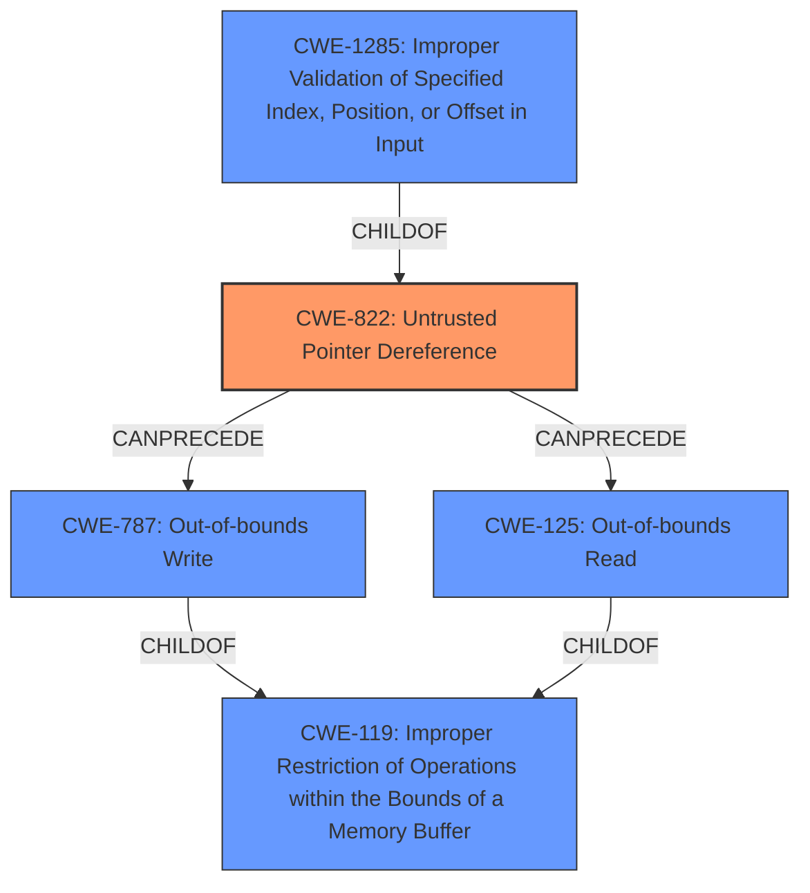

# Raw Analyzer Response for CVE-2021-33627

# Summary
| CWE ID  | CWE Name                      | Confidence | CWE Abstraction Level | CWE Vulnerability Mapping Label | CWE-Vulnerability Mapping Notes |
| :------- | :----------------------------- | :--------- | :--------------------- | :------------------------------ | :------------------------------ |
| CWE-822  | Untrusted Pointer Dereference | 0.95       | Base                  | Allowed                       | Primary CWE                   |
| CWE-787  | Out-of-bounds Write           | 0.75       | Base                  | Allowed                       | Secondary Candidate            |
| CWE-125  | Out-of-bounds Read            | 0.75       | Base                  | Allowed                       | Secondary Candidate            |
| CWE-1285 | Improper Validation of Specified Index, Position, or Offset in Input | 0.75 | Base | Allowed | Secondary Candidate |

## Evidence and Confidence

*   **Confidence Score:** 0.85
*   **Evidence Strength:** HIGH

## Relationship Analysis
The primary weakness is CWE-822 **Untrusted Pointer Dereference**, as the core issue is the lack of validation of the buffer address, leading to the dereferencing of potentially malicious pointers.

CWE-787 **Out-of-bounds Write** and CWE-125 **Out-of-bounds Read** are potential consequences of the untrusted pointer dereference. These are child of CWE-119 **Improper Restriction of Operations within the Bounds of a Memory Buffer**, indicating a memory safety issue. They are also related to CWE-822 through CANPRECEDE relationships, signifying that an untrusted pointer dereference could potentially lead to out-of-bounds reads or writes.

CWE-1285 **Improper Validation of Specified Index, Position, or Offset in Input** is related because the buffer address can be viewed as an offset, and the lack of validation on this offset is the root cause.

## Vulnerability Chain
The vulnerability chain starts with the **missing validation** of the buffer address, represented by CWE-822 **Untrusted Pointer Dereference**. This leads to the possibility of writing data out of bounds (CWE-787 **Out-of-bounds Write**) or reading data out of bounds (CWE-125 **Out-of-bounds Read**), potentially causing memory corruption and leading to information disclosure, denial of service, or arbitrary code execution.

## Summary of Analysis
Initial analysis focused on the **lack of address validation**, which pointed to issues related to pointer dereferencing and memory corruption. The key evidence supporting this is the vulnerability description stating that the services "**do not check whether the address of the buffer is valid**". The CVE reference links content summary also highlights the "**insufficient validation of the allocated buffer pointer**."

The selection of CWE-822 **Untrusted Pointer Dereference** as the primary CWE is based on the root cause being the failure to validate the buffer address before dereferencing it. The other CWEs are potential consequences of this **missing validation**.

The graph relationships, particularly the CANPRECEDE links from CWE-822 to CWE-787 and CWE-125, further solidify the understanding of the vulnerability chain. The selected CWEs are at the Base level of abstraction, providing the optimal level of specificity for describing the vulnerability.

The analysis is based on the evidence provided, with a focus on the root cause of the vulnerability. The relationships between CWEs helped refine the selection and ensure that the chosen CWEs accurately reflect the vulnerability and its potential consequences.

Relevant CWE Information:

# Enhanced Context (25 CWEs)
The following CWEs were identified as potentially relevant to this vulnerability:

## CWE-131: Incorrect Calculation of Buffer Size
**Abstraction Level**: Base
**Similarity Score**: 0.80
**Source**: dense

**Description**:
The product does not correctly calculate the size to be used when allocating a buffer, which could lead to a buffer overflow.

**Mapping Guidance**:
- Usage: Allowed
- Rationale: This CWE entry is at the Base level of abstraction, which is a preferred level of abstraction for mapping to the root causes of vulnerabilities.

## CWE-125: Out-of-bounds Read
**Abstraction Level**: Base
**Similarity Score**: 0.79
**Source**: dense

**Description**:
The product reads data past the end, or before the beginning, of the intended buffer.

**Mapping Guidance**:
- Usage: Allowed
- Rationale: This CWE entry is at the Base level of abstraction, which is a preferred level of abstraction for mapping to the root causes of vulnerabilities.

## CWE-667: Improper Locking
**Abstraction Level**: Class
**Similarity Score**: 0.79
**Source**: dense

**Description**:
The product does not properly acquire or release a lock on a resource, leading to unexpected resource state changes and behaviors.

**Mapping Guidance**:
- Usage: Allowed-with-Review
- Rationale: This CWE entry is a Class and might have Base-level children that would be more appropriate

## CWE-119: Improper Restriction of Operations within the Bounds of a Memory Buffer
**Abstraction Level**: Class
**Similarity Score**: 0.79
**Source**: dense

**Description**:
The product performs operations on a memory buffer, but it reads from or writes to a memory location outside the buffer's intended boundary. This may result in read or write operations on unexpected memory locations that could be linked to other variables, data structures, or internal program data.

**Mapping Guidance**:
- Usage: Discouraged
- Rationale: CWE-119 is commonly misused in low-information vulnerability reports when lower-level CWEs could be used instead, or when more details about the vulnerability are available.

## CWE-252: Unchecked Return Value
**Abstraction Level**: Base
**Similarity Score**: 0.79
**Source**: dense

**Description**:
The product does not check the return value from a method or function, which can prevent it from detecting unexpected states and conditions.

**Mapping Guidance**:
- Usage: Allowed
- Rationale: This CWE entry is at the Base level of abstraction, which is a preferred level of abstraction for mapping to the root causes of vulnerabilities.

## CWE-129: Improper Validation of Array Index
**Abstraction Level**: Variant
**Similarity Score**: 0.78
**Source**: dense

**Description**:
The product uses untrusted input when calculating or using an array index, but the product does not validate or incorrectly validates the index to ensure the index references a valid position within the array.

**Mapping Guidance**:
- Usage: Allowed
- Rationale: This CWE entry is at the Variant level of abstraction, which is a preferred level of abstraction for mapping to the root causes of vulnerabilities.

## CWE-754: Improper Check for Unusual or Exceptional Conditions
**Abstraction Level**: Class
**Similarity Score**: 0.78
**Source**: dense

**Description**:
The product does not check or incorrectly checks for unusual or exceptional conditions that are not expected to occur frequently during day to day operation of the product.

**Mapping Guidance**:
- Usage: Allowed-with-Review
- Rationale: This CWE entry is a Class and might have Base-level children that would be more appropriate

## CWE-755: Improper Handling of Exceptional Conditions
**Abstraction Level**: Class
**Similarity Score**: 0.78
**Source**: dense

**Description**:
The product does not handle or incorrectly handles an exceptional condition.

**Mapping Guidance**:
- Usage: Discouraged
- Rationale: This CWE entry is a level-1 Class (i.e., a child of a Pillar). It might have lower-level children that would be more appropriate

## CWE-1289: Improper Validation of Unsafe Equivalence in Input
**Abstraction Level**: Base
**Similarity Score**: 0.78
**Source**: dense

**Description**:
The product receives an input value that is used as a resource identifier or other type of reference, but it