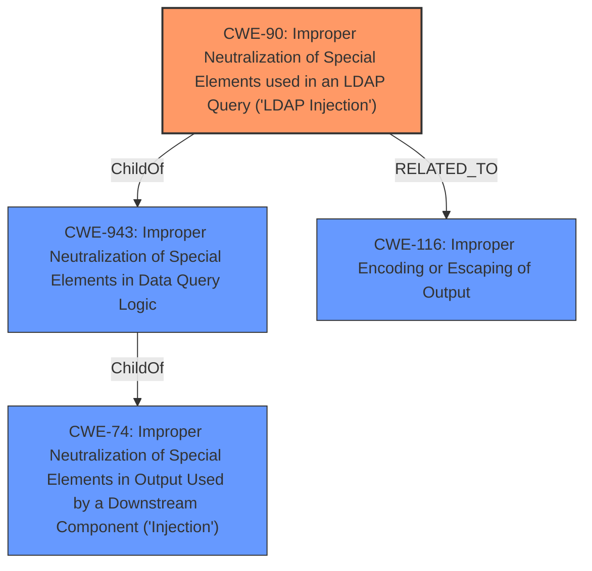

# Enhanced Analysis for CVE-2021-33668

# Summary
| CWE ID | CWE Name | Confidence | CWE Abstraction Level | CWE Vulnerability Mapping Label | CWE-Vulnerability Mapping Notes |
|---|---|---|---|---|---|
| CWE-90 | Improper Neutralization of Special Elements used in an LDAP Query ('LDAP Injection') | 1.0 | Base | Allowed | Primary CWE |
| CWE-20 | Improper Input Validation | 0.7 | Class | Discouraged | Secondary Candidate |

## Evidence and Confidence

*   **Confidence Score:** 0.9
*   **Evidence Strength:** HIGH

## Relationship Analysis
The primary CWE, CWE-90 [Improper Neutralization of Special Elements used in an LDAP Query ('LDAP Injection')], is a base-level CWE that falls under the class-level CWE, CWE-943 [Improper Neutralization of Special Elements in Data Query Logic]. CWE-943 itself is a child of CWE-74 [Improper Neutralization of Special Elements in Output Used by a Downstream Component ('Injection')]. CWE-90 is also related to CWE-116 [Improper Encoding or Escaping of Output] as seen in observed examples.



## Vulnerability Chain
The vulnerability chain starts with **improper input sanitization**, leading to the possibility of injecting specially crafted LDAP queries. The injection can impact the confidentiality of the application.

## Summary of Analysis
The vulnerability description clearly states that the root cause is **"improper input sanitization"** which allows for "specially crafted LDAP queries" to be injected. This directly aligns with CWE-90 [Improper Neutralization of Special Elements used in an LDAP Query ('LDAP Injection')].

The Retriever Results also lists CWE-90 as the top candidate.

CWE-20 [Improper Input Validation] was considered as a secondary CWE. While **improper input sanitization** is a form of **improper input validation**, CWE-90 provides a more specific classification related to LDAP injection. Therefore, CWE-90 is the more appropriate primary CWE. The Mapping Guidance for CWE-20 discourages its use when more specific CWEs are available.

Relevant CWE Information:
*   **CWE-90: Improper Neutralization of Special Elements used in an LDAP Query ('LDAP Injection')**
    *   **Description:** The product constructs all or part of an LDAP query using externally-influenced input from an upstream component, but it does not neutralize or incorrectly neutralizes special elements that could modify the intended LDAP query when it is sent to a downstream component.
    *   This CWE accurately describes the vulnerability where **improper input sanitization** allows the construction of malicious LDAP queries.
*   **CWE-20: Improper Input Validation**
    *   **Description:** The product receives input or data, but it does not validate or incorrectly validates that the input has the properties that are required to process the data safely and correctly.
    *   While this is a general description of what's happening, it's less specific than CWE-90. The guidance also states it is misused and that lower-level children should be considered.

I am confident in this assessment based on the direct evidence in the vulnerability description and the retriever results. The hierarchical relationships support the selection of the most specific CWE.


## CWE Relationship Analysis

Current CWEs represent these abstraction levels: .


### Vulnerability Chain Analysis

**Chain starting from CWE-943:**
- 943 (Improper Neutralization of Special Elements in Data Query Logic) - ROOT


**Chain starting from CWE-116:**
- 116 (Improper Encoding or Escaping of Output) - ROOT


### CWE Relationship Diagram

```mermaid
graph TD
    classDef primary fill:#f96,stroke:#333,stroke-width:2px
    classDef secondary fill:#69f,stroke:#333
    classDef tertiary fill:#9e9,stroke:#333
```