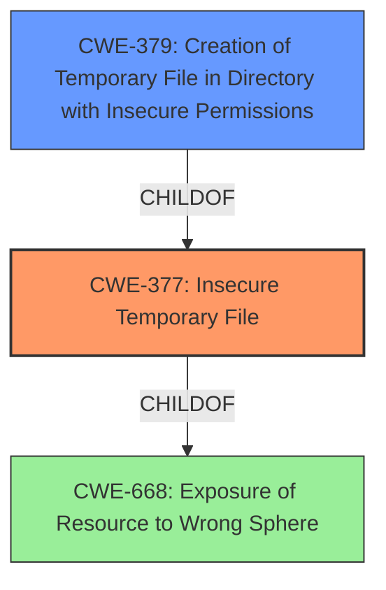

# Raw Analyzer Response for CVE-2021-33669

# Summary
| CWE ID | CWE Name | Confidence | CWE Abstraction Level | CWE Vulnerability Mapping Label | CWE-Vulnerability Mapping Notes |
|---|---|---|---|---|---|
| CWE-377 | Insecure Temporary File | 0.9 | Class | Allowed-with-Review | Primary CWE |
| CWE-379 | Creation of Temporary File in Directory with Insecure Permissions | 0.7 | Base | Allowed | Secondary Candidate |

## Evidence and Confidence

*   **Confidence Score:** 0.8
*   **Evidence Strength:** MEDIUM

## Relationship Analysis
The primary relationship that impacted the decision was the parent-child relationship between CWE-377 and CWE-379. CWE-377 is a class-level CWE that describes the general problem of insecure temporary files. CWE-379 is a base-level CWE that describes the specific case where the temporary file is created in a directory with insecure permissions. The vulnerability description indicates that the insecure temporary file storage is the root cause.

## Vulnerability Chain
The chain of root cause and weaknesses for the vulnerability description is as follows:
  1.  **Root Cause:** Insecure temporary file storage (**CWE-377**)
  2.  Impact: Complete compromise of confidentiality, integrity, and availability.

## Summary of Analysis
The initial analysis identified **insecure temporary file storage** as the root cause of the vulnerability. The retriever results and CWE specifications were then reviewed to determine the most appropriate CWE. The retriever results listed CWE-377 (Insecure Temporary File) as the top candidate. The vulnerability description key phrases also highlighted the insecure temporary file storage as a key factor.

The selection of CWE-377 is primarily based on the following evidence from the vulnerability description and CVE Reference Links Content Summary:

*   "**impact:** exploit insecure temporary file storage"
*   "**Root cause of vulnerability:** Insecure temporary file storage."
*   "**Weaknesses/vulnerabilities present:** The application uses temporary file storage insecurely."

CWE-377 (Insecure Temporary File) is a Class-level CWE, and the mapping guidance suggests examining children of this entry to see if there is a better fit. CWE-379 (Creation of Temporary File in Directory with Insecure Permissions) is a child of CWE-377. However, the description does not specifically mention insecure permissions on the directory where the temporary file is created, making CWE-377 a more suitable primary mapping.

CWE-379 (Creation of Temporary File in Directory with Insecure Permissions) was considered as a secondary mapping since it's a specific scenario of insecure temporary files. However, evidence is insufficient to confirm that the directory permissions are the root cause.

Other CWEs considered but not selected:

*   CWE-367 (Time-of-check Time-of-use (TOCTOU) Race Condition): While race conditions can be related to temporary file vulnerabilities, the description doesn't explicitly mention a race condition.
*   CWE-732 (Incorrect Permission Assignment for Critical Resource): This CWE is about incorrect permission assignments, but the primary issue here is the insecure use of temporary files, not necessarily a permission problem on an existing resource.
*   CWE-59 (Improper Link Resolution Before File Access ('Link Following')): This is about symlink attacks, which are not explicitly mentioned in the description.

The selected CWEs are at the optimal level of specificity because they accurately represent the weakness described in the vulnerability description.