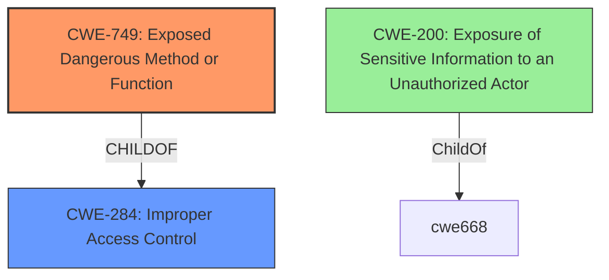

# Raw Analyzer Response for CVE-2021-33677

# Summary
| CWE ID | CWE Name | Confidence | CWE Abstraction Level | CWE Vulnerability Mapping Label | CWE-Vulnerability Mapping Notes |
|---|---|---|---|---|---|
| CWE-749 | Exposed Dangerous Method or Function | 0.8 | Base | Allowed | Primary CWE |
| CWE-200 | Exposure of Sensitive Information to an Unauthorized Actor | 0.5 | Class | Discouraged | Secondary Candidate |

## Evidence and Confidence

*   **Confidence Score:** 0.7
*   **Evidence Strength:** MEDIUM

## Relationship Analysis
The primary relationship that influenced my decision was the ChildOf relationship between CWE-749 and CWE-284 (Improper Access Control). This highlights that the exposed function bypasses intended access controls, leading to information disclosure.

## Vulnerability Chain
The chain starts with the **ROOTCAUSE** of exposing external functions without proper restrictions (CWE-749), which leads to the **IMPACT** of information disclosure.

## Summary of Analysis
The initial assessment identified CWE-749 as the most appropriate CWE because the vulnerability description states that the SAP NetWeaver ABAP Server and ABAP Platform expose functions to external actors, which can lead to information disclosure. This aligns with the description of CWE-749, which states that "The product provides an Applications Programming Interface (API) or similar interface for interaction with external actors, but the interface includes a dangerous method or function that is not properly restricted."

The vulnerability description highlights the **WEAKNESS** being that functions are exposed externally, which is the root cause, whereas "information disclosure" is a consequence of that **WEAKNESS**.

The retriever also listed CWE-200, but the description specifically states "The product exposes sensitive information to an actor that is not explicitly authorized to have access to that information" which is not directly the root cause of the vulnerability, so it is not a great fit. It also has a "Discouraged" usage.

CWE-749 is at the Base level of abstraction and has an Allowed usage. The evidence directly supports the mapping since the vulnerability description explicitly mentions exposed functions leading to information disclosure.

Relevant CWE Information:
# Enhanced Context (25 CWEs)
The following CWEs were identified as potentially relevant to this vulnerability:

## CWE-749: Exposed Dangerous Method or Function
**Abstraction:** Base
**Similarity Score**: 0.113
**Source**: sparse

**Description**:
The product provides an Applications Programming Interface (API) or similar interface for interaction with external actors, but the interface includes a dangerous method or function that is not properly restricted.

### Vulnerability Description Key Phrases
- **impact:** information disclosure
- **product:** SAP NetWeaver ABAP Server and ABAP Platform
- **version:** 700 and 702 and 730 and 731 and 804 and 740 and 750 and 784
- **component:** external functions