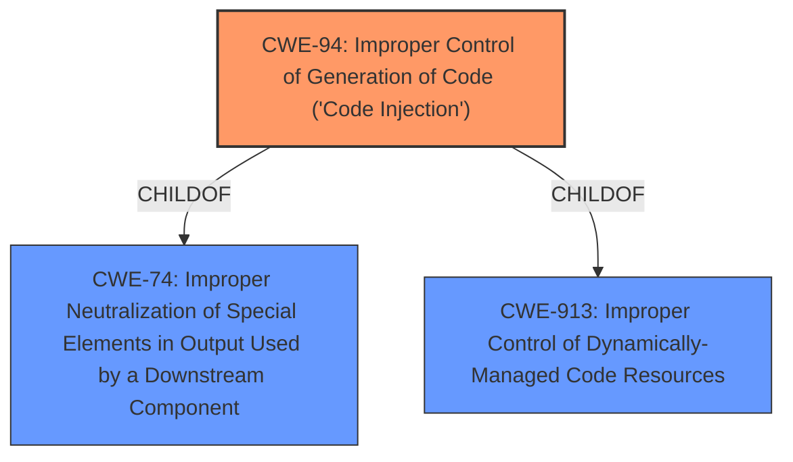

# Raw Analyzer Response for CVE-2021-33678

# Summary
| CWE ID | CWE Name | Confidence | CWE Abstraction Level | CWE Vulnerability Mapping Label | CWE-Vulnerability Mapping Notes |
|---|---|---|---|---|---|
| CWE-94 | Improper Control of Generation of Code ('Code Injection') | 1.0 | Base | Allowed-with-Review | Primary CWE |

## Evidence and Confidence

*   **Confidence Score:** 1.0
*   **Evidence Strength:** HIGH

## Relationship Analysis
The primary CWE is CWE-94, which is a base-level CWE. It is related to CWE-74 (Improper Neutralization of Special Elements in Output Used by a Downstream Component), indicating that the code injection occurs because special elements are not properly handled. There are no specific child CWEs which seem to fit better.

## Vulnerability Chain
The vulnerability chain starts with a **code injection** **weakness** due to the use of `GENERATE SUBROUTINE POOL` with source code dynamically created from untrusted user input. This leads to the ability to delete critical system tables and make the system unavailable.

## Summary of Analysis
The primary weakness is **code injection**, specifically CWE-94. The **Vulnerability Description Key Phrases** section lists "**weakness:** **code injection**". The **CVE Reference Links Content Summary** confirms this by stating, "The function module `CONVERT_FROM_CHAR_SORT_RFW` within the function group `FG_RFW` is vulnerable to code injection due to the use of `GENERATE SUBROUTINE POOL` with source code created dynamically from untrusted user input." The summary also mentions "**Insufficient input validation**" and "**Lack of output sanitization**".

CWE-94 (Improper Control of Generation of Code ('Code Injection')) is the most appropriate CWE.
- It is a base-level CWE.
- The description of CWE-94 closely matches the vulnerability: "The product constructs all or part of a code segment using externally-influenced input from an upstream component, but it does not neutralize or incorrectly neutralizes special elements that could modify the syntax or behavior of the intended code segment."

Other CWEs Considered:

- CWE-749 (Exposed Dangerous Method or Function): While the vulnerability involves a function module, the root cause is the **code injection** within that module, not simply the exposure of the method itself.
- CWE-668 (Exposure of Resource to Wrong Sphere): This is too high-level and doesn't accurately reflect the specific weakness.
- CWE-285 (Improper Authorization): Although the attacker needs privileges, the core issue is the **code injection**, not an authorization problem.
- CWE-20 (Improper Input Validation): While input validation is related, the **code injection** aspect is more precise.
- CWE-829 (Inclusion of Functionality from Untrusted Control Sphere): The **code injection** via user input is the main factor, not necessarily the inclusion of external functionality.
- CWE-22 (Improper Limitation of a Pathname to a Restricted Directory ('Path Traversal')): This is not related to path traversal.
- CWE-119 (Improper Restriction of Operations within the Bounds of a Memory Buffer): This is not a memory buffer issue.
- CWE-444 (Inconsistent Interpretation of HTTP Requests ('HTTP Request/Response Smuggling')): This is not related to HTTP request smuggling.
- CWE-269 (Improper Privilege Management): This is not primarily a privilege management issue.

Therefore, CWE-94 is the most accurate and specific CWE to represent this vulnerability.