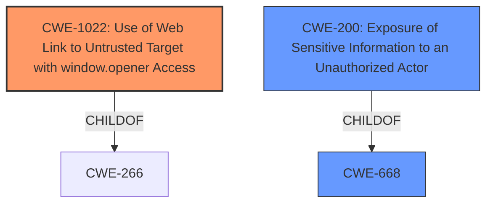

# Analysis for CVE-2021-33697

# Summary
| CWE ID | CWE Name | Confidence | CWE Abstraction Level | CWE Vulnerability Mapping Label | CWE-Vulnerability Mapping Notes |
|---|---|---|---|---|---|
| CWE-1022 | Use of Web Link to Untrusted Target with window.opener Access | 1.0 | Variant | Allowed | Primary CWE |
| CWE-200 | Exposure of Sensitive Information to an Unauthorized Actor | 0.4 | Class | Discouraged | Secondary Candidate |

## Evidence and Confidence

*   **Confidence Score:** 0.8
*   **Evidence Strength:** MEDIUM

## Relationship Analysis
The primary CWE, CWE-1022, is a Variant of CWE-266, indicating a more specific type of vulnerability related to the use of web links. The potential secondary CWE, CWE-200, is a Class and a child of CWE-668, suggesting a broader information exposure issue. The hierarchical structure helped identify the most specific CWE that fits the vulnerability.

## Vulnerability Chain
The vulnerability chain involves an unauthenticated attacker exploiting a **Reverse Tabnabbing vulnerability** due to the product's **failure to properly prevent untrusted sites from modifying security-critical properties of the window.opener object**. This leads to the redirection of users to a malicious site, potentially resulting in phishing or other attacks.

## Summary of Analysis
Initially, the vulnerability description points to a **Reverse Tabnabbing vulnerability** where an **unauthenticated attacker** can redirect users to a malicious site. The key aspect is the **improper handling of web links to untrusted targets**, which allows the target site to modify the `window.opener` object.

The primary assessment is based on the vulnerability description and the **Retriever Results**, particularly the top-ranked CWE-1022.

The provided evidence states: "Under certain conditions, SAP BusinessObjects Business Intelligence Platform (SAPUI5), versions - 420, 430, can allow an **unauthenticated attacker to redirect users to a malicious site due to Reverse Tabnabbing vulnerabilities**."

The graph relationships also influenced the final selection by illustrating the connection between CWE-1022 and its parent, reinforcing its relevance.

CWE-1022 is the most specific and appropriate classification because it directly addresses the root cause: **the use of web links to untrusted targets without proper protection against `window.opener` access**. This is a variant-level CWE, providing a granular view of the weakness.

Other CWEs, such as CWE-200, were considered but deemed less specific. While the redirection could lead to exposure of sensitive information, the primary issue is the **improper handling of the web link**, not the information exposure itself.

Relevant CWE Information:

# Enhanced Context (25 CWEs)

## CWE-1022: Use of Web Link to Untrusted Target with window.opener Access
**Abstraction:** Variant
**Status:** Incomplete

### Description
The web application produces links to untrusted external sites outside of its sphere of control, but it does not properly prevent the external site from modifying  security-critical properties of the window.opener object, such as the location property.

### Extended Description
When a user clicks a link to an external site ("target"), the target="_blank" attribute causes the target site's contents to be opened in a new window or tab, which runs in the same process as the original page. The window.opener object records information about the original page that offered the link. If an attacker can run script on the target page, then they could read or modify certain properties of the window.opener object, including the location property - even if the original and target site are not the same origin. An attacker can modify the location property to automatically redirect the user to a malicious site, e.g. as part of a phishing attack. Since this redirect happens in the original window/tab - which is not necessarily visible, since the browser is focusing the display on the new target page - the user might not notice any suspicious redirection.

### Alternative Terms
tabnabbing

### Relationships
ChildOf -> CWE-266

### Mapping Guidance
**Usage:** Allowed
**Rationale:** This CWE entry is at the Variant level of abstraction, which is a preferred level of abstraction for mapping to the root causes of vulnerabilities.
**Comments:** Carefully read both the name and description to ensure that this mapping is an appropriate fit. Do not try to 'force' a mapping to a lower-level Base/Variant simply to comply with this preferred level of abstraction.
**Reasons:**
- Acceptable-Use

### Observed Examples
- **CVE-2022-4927:** Library software does not use rel: "noopener noreferrer" setting, allowing tabnabbing attacks to redirect to a malicious page

## CWE-200: Exposure of Sensitive Information to an Unauthorized Actor
**Abstraction:** Class
**Status:** Draft

### Description
The product exposes sensitive information to an actor that is not explicitly authorized to have access to that information.

### Extended Description
There are many different kinds of mistakes that introduce information exposures. The severity of the error can range widely, depending on the context in which the product operates, the type of sensitive information that is revealed, and the benefits it may provide to an attacker.

Information might be sensitive to different parties, each of which may have their own expectations for whether the information should be protected.

Information exposures can occur in different ways:

  - the code  **explicitly inserts**  sensitive information into resources or messages that are intentionally made accessible to unauthorized actors, but should not contain the information - i.e., the information should have been "scrubbed" or "sanitized"

  - a different weakness or mistake  **indirectly inserts**  the sensitive information into resources, such as a web script error revealing the full system path of the program.

  - the code manages resources that intentionally contain sensitive information, but the resources are  **unintentionally made accessible**  to unauthorized actors. In this case, the information exposure is resultant - i.e., a different weakness enabled the access to the information in the first place.

### Alternative Terms
Information Disclosure

### Relationships
ChildOf -> CWE-668
CanPrecede -> CWE-200

### Mapping Guidance
**Usage:** Discouraged
**Rationale:** CWE-200 is commonly misused to represent the loss of confidentiality in a vulnerability, but confidentiality loss is a technical impact - not a root cause error.
**Comments:** If an error or mistake causes information to be disclosed, then use the CWE ID for that error.

### Observed Examples
- **CVE-2022-31162:** Rust library leaks Oauth client details in application debug logs
- **CVE-2021-25476:** Digital Rights Management (DRM) capability for mobile platform leaks pointer information, simplifying ASLR bypass
- **CVE-2001-1483:** Enumeration of valid usernames based on inconsistent responses