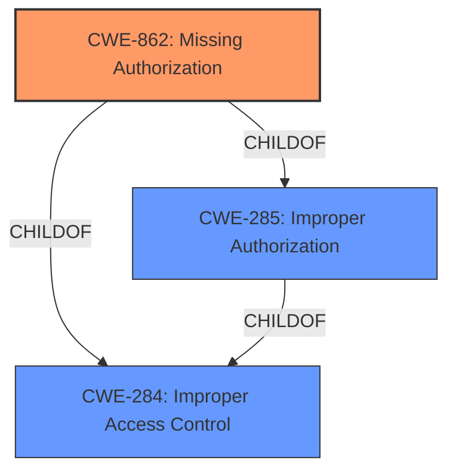

# Raw Analyzer Response for CVE-2021-33704

# Summary
| CWE ID | CWE Name | Confidence | CWE Abstraction Level | CWE Vulnerability Mapping Label | CWE-Vulnerability Mapping Notes |
|---|---|---|---|---|---|
| CWE-862 | Missing Authorization | 1.0 | Class | Allowed-with-Review | Primary CWE |

## Evidence and Confidence

*   **Confidence Score:** 1.0
*   **Evidence Strength:** HIGH

## Relationship Analysis
The primary CWE selected is CWE-862, **Missing Authorization**, which is a Class-level CWE. It is a child of CWE-285 (**Improper Authorization**) and CWE-284 (**Improper Access Control**). Since the vulnerability description explicitly mentions **missing authorization**, CWE-862 is the most appropriate choice. Although it is a Class-level CWE, the provided information does not allow for a more specific Base-level CWE to be selected.

## Vulnerability Chain
The vulnerability chain involves the following steps:
1.  **Root Cause:** **Missing Authorization** (CWE-862): The application lacks the necessary checks to ensure that users are authorized to perform specific actions.
2.  **Impact:** Abuse of functionality usually restricted to specific users. The attacker can invoke restricted functions and potentially read, modify, or delete sensitive data.

## Summary of Analysis
The primary weakness identified is CWE-862, **Missing Authorization**, based on the vulnerability description and key phrases that explicitly mention **missing authorization**. The description states that an authenticated attacker can invoke functions restricted to specific users, leading to potential data breaches. This aligns directly with the definition of CWE-862.

The Retriever Results also support this choice, with CWE-862 being ranked highly. While CWE-284 (**Improper Access Control**) is the top result, it is a Pillar-level CWE and is discouraged due to its high level of abstraction. CWE-862 is a more specific Class-level CWE, making it a better fit.

CWE-306 (**Missing Authentication for Critical Function**) was considered but is less appropriate because the attacker is already authenticated; the issue is the lack of authorization checks after authentication.

The final decision is based on the explicit mention of **missing authorization** in the vulnerability description, the support from Retriever Results, and the relationship analysis that identifies CWE-862 as the most specific and relevant CWE.
Relevant CWE Information: