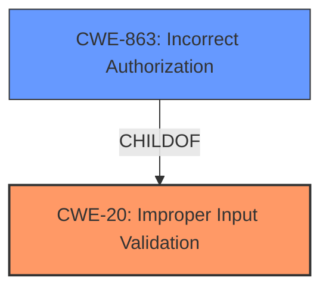

# Analysis for CVE-2021-33708

# Summary
| CWE ID | CWE Name | Confidence | CWE Abstraction Level | CWE Vulnerability Mapping Label | CWE-Vulnerability Mapping Notes |
|---|---|---|---|---|---|
| CWE-20 | Improper Input Validation | 0.9 | Class | Primary | Discouraged - Consider lower-level children |
| CWE-863 | Incorrect Authorization | 0.7 | Class | Secondary | Allowed-with-Review |

## Evidence and Confidence

*   **Confidence Score:** 0.8
*   **Evidence Strength:** HIGH

## Relationship Analysis
The primary relationship influencing the CWE selection is that CWE-20 [Improper Input Validation] is a broad class that can lead to various other weaknesses. The vulnerability stems from **insufficient input validation**, which directly aligns with the description of CWE-20. However, CWE-20 is a class-level CWE, and the mapping guidance discourages its use when more specific CWEs are available. CWE-863 [Incorrect Authorization] is considered as a secondary weakness, which aligns with impact described as "escalate privileges".

## Vulnerability Chain
The vulnerability chain starts with **insufficient input validation** (CWE-20), leading to an authenticated user being able to pass a crafted header, ultimately resulting in privilege escalation.

## Summary of Analysis
The initial analysis identified CWE-20 [Improper Input Validation] as a strong candidate due to the explicit mention of **insufficient input validation** in both the vulnerability description and the CVE Reference Links Content Summary. The summary states: "Insufficient input validation in Kyma's apiserver-proxy." The description also highlights that "authenticated users can pass a Header of their choice and escalate privileges," suggesting a potential authorization bypass.

The Retriever Results also support CWE-20 as the top candidate. However, the mapping guidance for CWE-20 discourages its use when more specific CWEs are available. The guidance suggests considering lower-level children such as CWE-1284 [Improper Validation of Specified Quantity in Input] or CWE-1289 [Improper Validation of Unsafe Equivalence in Input].

Given the information available, it is challenging to pinpoint a more specific CWE without further details on the exact nature of the input validation failure. The fact that it leads to privilege escalation suggests that CWE-863 [Incorrect Authorization] might also be relevant as a secondary weakness. Therefore, CWE-20 is selected as the primary CWE due to the direct evidence, and CWE-863 is considered a secondary CWE due to the impact of privilege escalation.

Relevant CWE Information:

# Enhanced Context (25 CWEs)
The following CWEs were identified as potentially relevant to this vulnerability:

## CWE-1289: Improper Validation of Unsafe Equivalence in Input
**Abstraction Level**: Base
**Similarity Score**: 0.76
**Source**: dense

**Description**:
The product receives an input value that is used as a resource identifier or other type of reference, but it does not validate or incorrectly validates that the input is equivalent to a potentially-unsafe value.

**Mapping Guidance**:
- Usage: Allowed
- Rationale: This CWE entry is at the Base level of abstraction, which is a preferred level of abstraction for mapping to the root causes of vulnerabilities.

## CWE-20: Improper Input Validation
**Abstraction:** Class
**Status:** Stable

### Description
The product receives input or data, but it does
        not validate or incorrectly validates that the input has the
        properties that are required to process the data safely and
        correctly.

### Mapping Guidance
**Usage:** Discouraged
**Rationale:** CWE-20 is commonly misused in low-information vulnerability reports when lower-level CWEs could be used instead, or when more details about the vulnerability are available [REF-1287]. It is not useful for trend analysis. It is also a level-1 Class (i.e., a child of a Pillar).
**Comments:** Consider lower-level children such as Improper Use of Validation Framework (CWE-1173) or improper validation involving specific types or properties of input such as Specified Quantity (CWE-1284); Specified Index, Position, or Offset (CWE-1285); Syntactic Correctness (CWE-1286); Specified Type (CWE-1287); Consistency within Input (CWE-1288); or Unsafe Equivalence (CWE-1289).
**Reasons:**
- Frequent Misuse
**Suggested Alternatives:**
- CWE-1284: Specified Quantity
- CWE-1285: Specified Index, Position, or Offset
- CWE-1286: Syntactic Correctness
- CWE-1287: Specified Type
- CWE-1288: Consistency within Input
- CWE-1289: Unsafe Equivalence
- CWE-116: Improper Encoding or Escaping of Output

## CWE-863: Incorrect Authorization
**Abstraction:** Class
**Status:** Incomplete

### Description
The product performs an authorization check when an actor attempts to access a resource or perform an action, but it does not correctly perform the check.

### Mapping Guidance
**Usage:** Allowed-with-Review
**Rationale:** This CWE entry is a Class and might have Base-level children that would be more appropriate
**Comments:** Examine children of this entry to see if there is a better fit
**Reasons:**
- Abstraction