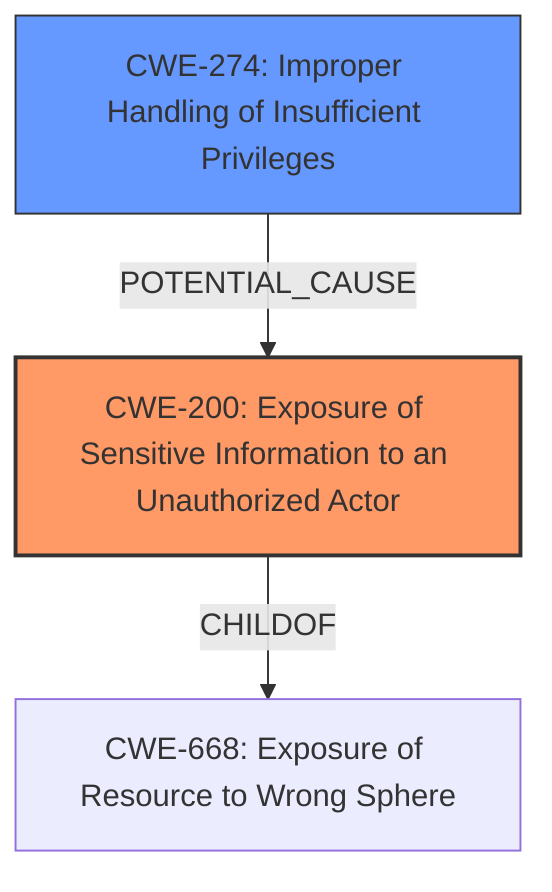

# Enhanced Analysis for CVE-2021-33709

# Summary
| CWE ID  | CWE Name | Confidence | CWE Abstraction Level | CWE Vulnerability Mapping Label | CWE-Vulnerability Mapping Notes |
| ----------- | ----------- | ----------- | ----------- | ----------- | ----------- |
| CWE-200 | Exposure of Sensitive Information to an Unauthorized Actor | 0.8 | Class | Allowed | The application's **improper error handling** leads to the leakage of an application token, directly exposing sensitive information. |
| CWE-274 | Improper Handling of Insufficient Privileges | 0.5 | Base | Discouraged | The system's **failure to handle errors** when processing malformed requests, which could be related to privilege checks, is a potential factor. |

## Evidence and Confidence

*   **Confidence Score:** 0.8
*   **Evidence Strength:** MEDIUM

## Relationship Analysis
The primary CWE is CWE-200, representing the direct exposure of sensitive information due to improper error handling. CWE-274 is a secondary consideration, as the **improper error handling** might be linked to insufficient privilege checks. CWE-200 is a Class-level CWE, while CWE-274 is a Base-level CWE. Though Base-level CWEs are preferred, the description aligns more closely with the broad impact of exposing sensitive information.



## Vulnerability Chain
The vulnerability chain starts with **improper error handling**, leading directly to the **exposure of sensitive information**.

`Improper Error Handling` -> `Exposure of Sensitive Information`

## Summary of Analysis
The initial analysis focused on the **improper error handling** as the root cause, leading to the leakage of the application token. The evidence provided from the "Vulnerability Description Key Phrases" confirms the rootcause: "**error not properly handled by the system**" and the impact: "leak an application token".

The retriever results suggested CWE-200 (Exposure of Sensitive Information to an Unauthorized Actor) as a potential candidate, which aligns well with the vulnerability's impact. While "Mapping Guidance" discourages the use of CWE-200 because "CWE-200 is commonly misused to represent the loss of confidentiality in a vulnerability, but confidentiality loss is a technical impact - not a root cause error", the root cause **"error not properly handled by the system"** results in the application token leaking. The description for CWE-200, "The product exposes sensitive information to an actor that is not explicitly authorized to have access to that information," accurately represents the outcome of the vulnerability. Therefore, CWE-200 is a relevant and accurate classification in this case.

CWE-274 (Improper Handling of Insufficient Privileges) was considered as a potential contributing factor. While not the primary cause, it's possible the **improper error handling** is related to privilege checks.

The selected CWEs are at the optimal level of specificity, addressing both the high-level impact (CWE-200) and a potential contributing factor (CWE-274).

Relevant CWE Information:

# Enhanced Context (25 CWEs)

## CWE-653: Improper Isolation or Compartmentalization
**Abstraction Level**: Class
**Similarity Score**: 0.77
**Source**: dense

**Description**:
The product does not properly compartmentalize or isolate functionality, processes, or resources that require different privilege levels, rights, or permissions.
**Rationale for not selecting**: While potentially related, the primary issue is the error handling leading to information exposure, not necessarily a lack of isolation.

## CWE-274: Improper Handling of Insufficient Privileges
**Abstraction Level**: Base
**Similarity Score**: 0.77
**Source**: dense

**Description**:
The product does not handle or incorrectly handles when it has insufficient privileges to perform an operation, leading to resultant weaknesses.
**Rationale for selecting**: Considered as a secondary factor. The improper error handling *could* be linked to issues with privilege checks when processing malformed requests.

## CWE-668: Exposure of Resource to Wrong Sphere
**Abstraction Level**: Class
**Similarity Score**: 0.76
**Source**: dense

**Description**:
The product exposes a resource to the wrong control sphere, providing unintended actors with inappropriate access to the resource.
**Rationale for not selecting**: CWE-200 is a more direct fit as it focuses on the exposure of sensitive information itself. CWE-668 is too broad.

## CWE-267: Privilege Defined With Unsafe Actions
**Abstraction Level**: Base
**Similarity Score**: 0.76
**Source**: dense

**Description**:
A particular privilege, role, capability, or right can be used to perform unsafe actions that were not intended, even when it is assigned to the correct entity.
**Rationale for not selecting**: The description doesn't indicate that a privilege is being misused; rather, it focuses on error handling.

## CWE-807: Reliance on Untrusted Inputs in a Security Decision
**Abstraction Level**: Base
**Similarity Score**: 0.76
**Source**: dense

**Description**:
The product uses a protection mechanism that relies on the existence or values of an input, but the input can be modified by an untrusted actor in a way that bypasses the protection mechanism.
**Rationale for not selecting**: The vulnerability stems from error handling, not a reliance on untrusted inputs for security decisions.

## CWE-41: Improper Resolution of Path Equivalence
**Abstraction Level**: Base
**Similarity Score**: 0.75
**Source**: dense

**Description**:
The product is vulnerable to file system contents disclosure through path equivalence. Path equivalence involves the use of special characters in file and directory names. The associated manipulations are intended to generate multiple names for the same object.
**Rationale for not selecting**: Not related to file system paths or path equivalence.

## CWE-280: Improper Handling of Insufficient Permissions or Privileges
**Abstraction Level**: Base
**Similarity Score**: 0.75
**Source**: dense

**Description**:
The product does not handle or incorrectly handles when it has insufficient privileges to access resources or functionality as specified by their permissions. This may cause it to follow unexpected code paths that may leave the product in an invalid state.
**Rationale for not selecting**: While the vulnerability involves improper handling, it is primarily related to error handling and information exposure, not specifically insufficient permissions.

## CWE-183: Permissive List of Allowed Inputs
**Abstraction Level**: Base
**Similarity Score**: 0.75
**Source**: dense

**Description**:
The product implements a protection mechanism that relies on a list of inputs (or properties of inputs) that are explicitly allowed by policy because the inputs are assumed to be safe, but the list is too permissive - that is, it allows an input that is unsafe, leading to resultant weaknesses.
**Rationale for not selecting**: Not related to overly permissive lists of allowed inputs.

## CWE-266: Incorrect Privilege Assignment
**Abstraction Level**: Base
**Similarity Score**: 0.75
**Source**: dense

**Description**:
A product incorrectly assigns a privilege to a particular actor, creating an unintended sphere of control for that actor.
**Rationale for not selecting**: Not related to incorrect privilege assignments.

## CWE-74: Improper Neutralization of Special Elements in Output Used by a Downstream Component ('Injection')
**Abstraction Level**: Class
**Similarity Score**: 0.75
**Source**: dense

**Description**:
The product constructs all or part of a command, data structure, or record using externally-influenced input from an upstream component, but it does not neutralize or incorrectly neutralizes special elements that could modify how it is parsed or interpreted when it is sent to a downstream component.
**Rationale for not selecting**: Not an injection vulnerability.

## CWE-184: Incomplete List of Disallowed Inputs
**Abstraction Level**: Base
**Similarity Score**: 6342.93
**Source**: sparse

**Description**:
The product implements a protection mechanism that relies on a list of inputs (or properties of inputs) that are not allowed by policy or otherwise require other action to neutralize before additional processing takes place, but the list is incomplete.
**Rationale for not selecting**: Not related to incomplete lists of disallowed inputs.

## CWE-200: Exposure of Sensitive Information to an Unauthorized Actor
**Abstraction Level**: Class
**Similarity Score**: 6256.21
**Source**: sparse

**Description**:
The product exposes sensitive information to an actor that is not explicitly authorized to have access to that information.
**Rationale for selecting**: Primary CWE. The **improper error handling** leads directly to the leakage of sensitive information (the application token).

## CWE-88: Improper Neutralization of


## CWE Relationship Analysis

Current CWEs represent these abstraction levels: .


### Vulnerability Chain Analysis

**Chain starting from CWE-88:**
- 88 (Improper Neutralization of Argument Delimiters in a Command ('Argument Injection')) - ROOT


**Chain starting from CWE-41:**
- 41 (Improper Resolution of Path Equivalence) - ROOT


### CWE Relationship Diagram

```mermaid
graph TD
    classDef primary fill:#f96,stroke:#333,stroke-width:2px
    classDef secondary fill:#69f,stroke:#333
    classDef tertiary fill:#9e9,stroke:#333
```