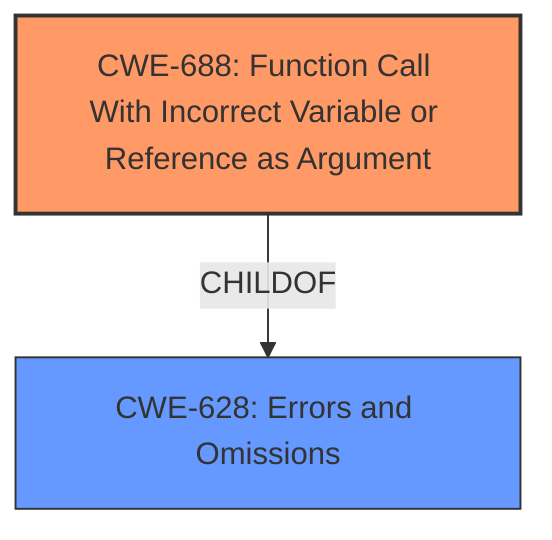

# Analysis Report for CVE-2021-33713

# Vulnerability Analysis Report: CVE-2021-33713

## Description


## Analysis (with Relationship Data)

# Summary
| CWE ID | CWE Name | Confidence | CWE Abstraction Level | CWE Vulnerability Mapping Label | CWE-Vulnerability Mapping Notes |
|---|---|---|---|---|---|
| CWE-688 | Function Call With Incorrect Variable or Reference as Argument | 1.0 | Variant | Allowed | Primary CWE |

## Evidence and Confidence

*   **Confidence Score:** 1.0
*   **Evidence Strength:** HIGH

## Relationship Analysis
The primary CWE, CWE-688, is a variant of CWE-628. This means that CWE-688 represents a specific type of problem that falls under the broader category of errors and omissions. The vulnerability involves a function call with an incorrect argument, which is a specific instance of something being wrong within the code. This Variant provides a more precise classification than its parent.



## Vulnerability Chain
The chain of events is as follows:
1.  A specially crafted JT file is parsed.
2.  A hash function is called with an incorrect argument (**CWE-688**).
3.  The application crashes, leading to a Denial-of-Service.

## Summary of Analysis
The primary focus is on identifying the root cause of the vulnerability, which is a function call with an incorrect argument. The vulnerability description states that "When parsing specially crafted JT files, a hash function is called with an incorrect argument leading the application to crash." The CVE Reference Links Content Summary explicitly mentions "Weaknesses/vulnerabilities present: CWE-688: Function Call With Incorrect Variable or Reference as Argument". This evidence strongly supports the selection of CWE-688.

CWE-787, CWE-457, and CWE-20 were considered but deemed less accurate. CWE-787 (Out-of-bounds Write) and CWE-457 (Use of Uninitialized Variable) are potential consequences of an incorrect function call, but the primary issue is the incorrect function call itself. CWE-20 (Improper Input Validation) is too general, as the specific problem is not a general input validation issue but a specific case of passing the wrong argument to a function.

CWE-688 is at the Variant level of abstraction, which is the preferred level for mapping root causes of vulnerabilities, and it accurately describes the **WEAKNESS**/**ROOTCAUSE** identified in the vulnerability description.

Relevant CWE Information:

# Enhanced Context (25 CWEs)
The following CWEs were identified as potentially relevant to this vulnerability:

## CWE-688: Function Call With Incorrect Variable or Reference as Argument
**Abstraction:** Variant
**Status:** Draft

### Description
The product calls a function, procedure, or routine, but the caller specifies the wrong variable or reference as one of the arguments, which may lead to undefined behavior and resultant weaknesses.

### Extended Description
Not provided

### Alternative Terms
None

### Relationships
ChildOf -> CWE-628

### Mapping Guidance
**Usage:** Allowed
**Rationale:** This CWE entry is at the Variant level of abstraction, which is a preferred level of abstraction for mapping to the root causes of vulnerabilities.
**Comments:** Carefully read both the name and description to ensure that this mapping is an appropriate fit. Do not try to 'force' a mapping to a lower-level Base/Variant simply to comply with this preferred level of abstraction.
**Reasons:**
- Acceptable-Use


### Observed Examples
- **CVE-2005-2548:** Kernel code specifies the wrong variable in first argument, leading to resultant NULL pointer dereference.


## CWE Relationship Analysis

Current CWEs represent these abstraction levels: .


### Vulnerability Chain Analysis

**Chain starting from CWE-787:**
- 787 (Out-of-bounds Write) - ROOT


**Chain starting from CWE-628:**
- 628 (Function Call with Incorrectly Specified Arguments) - ROOT


### CWE Relationship Diagram

```mermaid
graph TD
    classDef primary fill:#f96,stroke:#333,stroke-width:2px
    classDef secondary fill:#69f,stroke:#333
    classDef tertiary fill:#9e9,stroke:#333
```


*Report generated on 2025-04-01 22:04:10*
