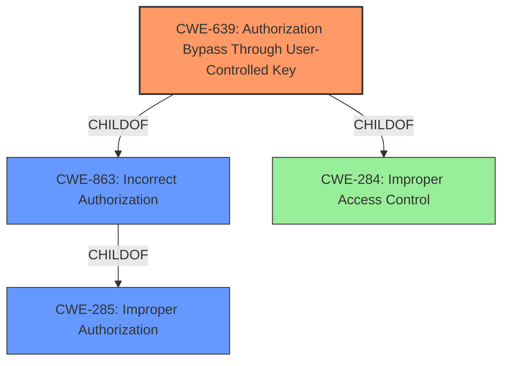

# Raw Analyzer Response for CVE-2021-33723

# Summary
| CWE ID | CWE Name | Confidence | CWE Abstraction Level | CWE Vulnerability Mapping Label | CWE-Vulnerability Mapping Notes |
|---|---|---|---|---|---|
| **CWE-639** | **Authorization Bypass Through User-Controlled Key** | 0.9 | Base | Primary | Allowed |
| CWE-863 | Incorrect Authorization | 0.6 | Class | Secondary | Allowed-with-Review |
| CWE-285 | Improper Authorization | 0.5 | Class | Secondary | Discouraged |

## Evidence and Confidence

*   **Confidence Score:** 0.9
*   **Evidence Strength:** HIGH

## Relationship Analysis
The primary CWE selected is CWE-639, which is a child of CWE-863 and CWE-284. This indicates a hierarchical relationship where CWE-639 is a more specific form of authorization bypass compared to the more general classes of Incorrect Authorization (CWE-863) and Improper Access Control (CWE-284). The abstraction levels influenced the decision, as the goal was to select the most specific base-level CWE that accurately describes the vulnerability.

## Vulnerability Chain
The vulnerability chain involves an authenticated attacker exploiting **improper authorization** to change user profiles. This **improper authorization** stems from a lack of proper access controls when modifying user profiles. The sequence is as follows:

1.  **Root Cause:** Lack of proper authorization checks when modifying user profiles. (CWE-639)
2.  **Weakness:** An authenticated attacker can modify a user profile with low privileges.
3.  **Impact:** Change user profile and password of any user, gaining unauthorized access.

## Summary of Analysis
The analysis is based on the provided vulnerability description and associated details. The primary CWE is CWE-639 (**Authorization Bypass Through User-Controlled Key**), because an authenticated attacker could change the user profile of any user without proper authorization.

The vulnerability description states, "An authenticated attacker could change the user profile of any user without proper authorization." The "CVE Reference Links Content Summary" reinforces this with "Root cause of vulnerability: **Improper authorization** when changing user profiles." and "Weaknesses/vulnerabilities present: **Improper authorization**, specifically a lack of proper access controls when modifying user profiles."

CWE-639's description matches this scenario: "The system's authorization functionality does not prevent one user from gaining access to another user's data or record by modifying the key value identifying the data." An authenticated user is able to modify another user's profile because the system does not properly validate if the authenticated user has sufficient privileges to modify the specified user profile. This is a key-based access issue, aligning well with CWE-639's definition.

CWE-863 (**Incorrect Authorization**) and CWE-285 (**Improper Authorization**) were also considered. While these are related, they are higher-level classes. CWE-639 is a more specific base-level CWE that best describes the vulnerability.

The decision to select CWE-639 is further supported by the retriever results, which listed CWE-639 as a relevant candidate.

The selected CWEs are at the optimal level of specificity because CWE-639 directly addresses the root cause.