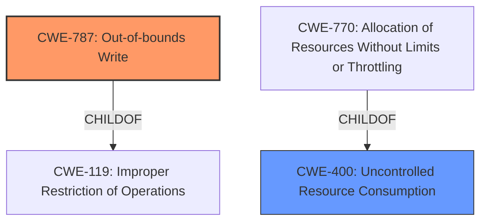

# Analysis for CVE-2021-33737

# Summary
| CWE ID | CWE Name | Confidence | CWE Abstraction Level | CWE Vulnerability Mapping Label | CWE-Vulnerability Mapping Notes |
|---|---|---|---|---|---|
| CWE-787 | Out-of-bounds Write | 0.75 | Base | Primary | Allowed |
| CWE-400 | Uncontrolled Resource Consumption | 0.5 | Class | Secondary | Discouraged |

## Evidence and Confidence

*   **Confidence Score:** 0.7
*   **Evidence Strength:** MEDIUM

## Relationship Analysis
The primary CWE is CWE-787, which is a Base level CWE and a child of CWE-119. CWE-119 is a Class-level CWE that is often misused when more specific CWEs are available. The secondary CWE is CWE-400, which is a Class-level CWE and is also often misused when more specific CWEs are available. CWE-400 is related to CWE-770 (Allocation of Resources Without Limits or Throttling), which is a Base-level CWE, and a child of CWE-400, but CWE-770 does not appear to be as good of a fit for the vulnerability description as CWE-400.

## Vulnerability Chain
The vulnerability chain starts with sending a **"specially crafted packet"** which leads to **"Improper Restriction of Operations within the Bounds of a Memory Buffer (CWE-119)"**. This results in a **"denial of service condition"**.

## Summary of Analysis
The primary weakness is an out-of-bounds write (CWE-787) caused by sending a specially crafted packet. The CVE reference links content summary explicitly states that **"Sending a specially crafted packet to port 102/tcp of an affected device can cause a denial of service condition."** and that the **"Weaknesses/vulnerabilities present"** is **"Improper Restriction of Operations within the Bounds of a Memory Buffer (CWE-119)"**. Because CWE-119 is a class level CWE, and the description mentions memory buffers, it is likely that a more specific CWE is available. The vulnerability description also states that the **"impact"** is a **"denial of service"**.

Based on the evidence, CWE-787 (Out-of-bounds Write) is the most appropriate primary CWE. It's a base-level CWE, which aligns with the goal of identifying the root cause. The "CVE Reference Links Content Summary" mentions **"Improper Restriction of Operations within the Bounds of a Memory Buffer (CWE-119)"**, which supports the idea of memory corruption due to the crafted packet. CWE-787 is a child of CWE-119, providing a more specific classification.

CWE-400 (Uncontrolled Resource Consumption) is a possible secondary CWE because the vulnerability results in a denial-of-service. However, the root cause is the memory corruption, not necessarily the consumption of resources.

Other CWEs considered but not used:

*   CWE-119: While mentioned in the CVE description, it's a class-level CWE, and CWE-787 provides more specificity. Also, the mapping guidance discourages its use.
*   CWE-116: Improper Encoding or Escaping of Output - This CWE is not a good fit because the vulnerability is not related to encoding or escaping of output.
*   CWE-770: Allocation of Resources Without Limits or Throttling - While the vulnerability results in a denial of service, the root cause is not related to allocation of resources without limits or throttling.
*   CWE-755: Improper Handling of Exceptional Conditions - This CWE is not a good fit because the vulnerability is not related to handling of exceptional conditions.
*   CWE-94: Improper Control of Generation of Code ('Code Injection') - This CWE is not a good fit because the vulnerability is not related to code injection.
*   CWE-326: Inadequate Encryption Strength - This CWE is not a good fit because the vulnerability is not related to encryption strength.
*   CWE-835: Loop with Unreachable Exit Condition ('Infinite Loop') - This CWE is not a good fit because the vulnerability is not related to an infinite loop.
*   CWE-1269: Product Released in Non-Release Configuration - This CWE is not a good fit because the vulnerability is not related to a product released in a non-release configuration.
*   CWE-522: Insufficiently Protected Credentials - This CWE is not a good fit because the vulnerability is not related to credentials.
*   CWE-20: Improper Input Validation - This CWE is not a good fit because the report is not lacking in information. It is also a discouraged CWE.