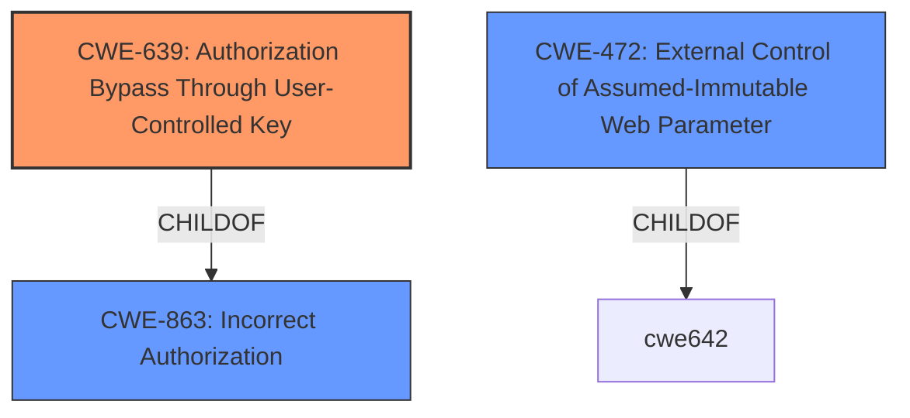

# Raw Analyzer Response for CVE-2021-3376

# Summary

| CWE ID | CWE Name | Confidence | CWE Abstraction Level | CWE Vulnerability Mapping Label | CWE-Vulnerability Mapping Notes |
|---|---|---|---|---|---|
| CWE-639 | Authorization Bypass Through User-Controlled Key | 0.9 | Base | Allowed | Primary CWE |
| CWE-863 | Incorrect Authorization | 0.7 | Class | Allowed-with-Review | Secondary Candidate |
| CWE-472 | External Control of Assumed-Immutable Web Parameter | 0.6 | Base | Allowed | Secondary Candidate |

## Evidence and Confidence

*   **Confidence Score:** 0.9
*   **Evidence Strength:** HIGH

## Relationship Analysis
The primary CWE selected is CWE-639, which falls under the broader category of CWE-863 (Incorrect Authorization). CWE-639 represents a more specific case where authorization bypass occurs due to user-controlled keys. The vulnerability description explicitly mentions the manipulation of the `user_group_id_field` parameter to escalate privileges, aligning directly with the concept of user-controlled keys influencing authorization decisions. The high retriever score for CWE-639 reinforces this selection. CWE-472 (External Control of Assumed-Immutable Web Parameter) is also relevant as the `user_group_id_field` is assumed to be immutable but is externally controllable.

## Vulnerability Chain
The vulnerability chain starts with **insufficient privilege validation** in the Profile function. This allows an attacker to manipulate the `user_group_id_field` parameter (an **externally controlled key**). The **incorrect authorization** check then fails to prevent the privilege escalation, ultimately granting the attacker Super Admin access.

## Summary of Analysis
The initial analysis focused on identifying the root cause of the privilege escalation. The **Vulnerability Description** and **CVE Reference Links Content Summary** clearly indicate that the application **does not properly validate user privileges** when processing POST requests to modify user profiles. This **insufficient validation** allows an attacker to manipulate the `user_group_id_field` parameter to escalate their privileges.

CWE-639 (Authorization Bypass Through User-Controlled Key) directly addresses this scenario, where the attacker modifies a key value (`user_group_id_field`) to gain unauthorized access. This is supported by the **CVE Reference Links Content Summary**: "The application does not properly check the user's privileges before updating profile information, allowing low-privilege users to escalate their rights." The **Vulnerability Description Key Phrases** also highlight the **impact** of "gain escalated privileges" and the **component** involved: "user_group_id_field parameter."

While CWE-863 (Incorrect Authorization) is a broader category, CWE-639 provides a more precise description of the vulnerability. CWE-472 (External Control of Assumed-Immutable Web Parameter) is also considered because the `user_group_id_field` is treated as immutable but is controllable by the user.

I am confident in this assessment, as the evidence directly supports the selection of CWE-639 as the primary weakness, with CWE-863 and CWE-472 as contributing factors. The selection is at the optimal level of specificity, as CWE-639 accurately describes the mechanism of authorization bypass through user-controlled keys.

Relevant CWE Information:

# Enhanced Context (25 CWEs)

## CWE-74: Improper Neutralization of Special Elements in Output Used by a Downstream Component ('Injection')
**Abstraction Level**: Class
**Similarity Score**: 0.77
**Source**: dense

**Description**:
The product constructs all or part of a command, data structure, or record using externally-influenced input from an upstream component, but it does not neutralize or incorrectly neutralizes special elements that could modify how it is parsed or interpreted when it is sent to a downstream component.

**Mapping Guidance**:
- Usage: Discouraged
- Rationale: CWE-74 is high-level and often misused when lower-level weaknesses are more appropriate.
*Not Selected:* This CWE is too generic and doesn't accurately describe the authorization bypass.

## CWE-184: Incomplete List of Disallowed Inputs
**Abstraction Level**: Base
**Similarity Score**: 0.76
**Source**: dense

**Description**:
The product implements a protection mechanism that relies on a list of inputs (or properties of inputs) that are not allowed by policy or otherwise require other action to neutralize before additional processing takes place, but the list is incomplete.

**Mapping Guidance**:
- Usage: Allowed
- Rationale: This CWE entry is at the Base level of abstraction, which is a preferred level of abstraction for mapping to the root causes of vulnerabilities.
*Not Selected:* This CWE doesn't fit the scenario as the vulnerability is not due to an incomplete list of disallowed inputs.

## CWE-99: Improper Control of Resource Identifiers ('Resource Injection')
**Abstraction Level**: Class
**Similarity Score**: 0.75
**Source**: dense

**Description**:
The product receives input from an upstream component, but it does not restrict or incorrectly restricts the input before it is used as an identifier for a resource that may be outside the intended sphere of control.

**Mapping Guidance**:
- Usage: Allowed-with-Review
- Rationale: This CWE entry is a Class and might have Base-level children that would be more appropriate
*Not Selected:* While related to resource control, it doesn't specifically address the authorization bypass using user-controlled keys.

## CWE-917: Improper Neutralization of Special Elements used in an Expression Language Statement ('Expression Language Injection')
**Abstraction Level**: Base
**Similarity Score**: 0.75
**Source**: dense

**Description**:
The product constructs all or part of an expression language (EL) statement in a framework such as a Java Server Page (JSP) using externally-influenced input from an upstream component, but it does not neutralize or incorrectly neutralizes special elements that could modify the intended EL statement before it is executed.

**Mapping Guidance**:
- Usage: Allowed
- Rationale: This CWE entry is at the Base level of abstraction, which is a preferred level of abstraction for mapping to the root causes of vulnerabilities.
*Not Selected:* Not relevant as it relates to expression language injection, which is not the case here.

## CWE-472: External Control of Assumed-Immutable Web Parameter
**Abstraction Level**: Base
**Similarity Score**: 0.75
**Source**: dense

**Description**:
The web application does not sufficiently verify inputs that are assumed to be immutable but are actually externally controllable, such as hidden form fields.

**Mapping Guidance**:
- Usage: Allowed
- Rationale: This CWE entry is at the Base level of abstraction, which is a preferred level of abstraction for mapping to the root causes of vulnerabilities.
*Considered:* Included as a secondary CWE because `user_group_id_field` is externally controllable and assumed to be immutable.

## CWE-915: Improperly Controlled Modification of Dynamically-Determined Object Attributes
**Abstraction Level**: Base
**Similarity Score**: 0.75
**Source**: dense

**Description**:
The product receives input from an upstream component that specifies multiple attributes, properties, or fields that are to be initialized or updated in an object, but it does not properly control which attributes can be modified.

**Mapping Guidance**:
- Usage: Allowed
- Rationale: This CWE entry is at the Base level of abstraction, which is a preferred level of abstraction for mapping to the root causes of vulnerabilities.
*Not Selected:* While related to modification of attributes, it's not as precise as CWE-639 in describing the authorization bypass.

## CWE-1289: Improper Validation of Unsafe Equivalence in Input
**Abstraction Level**: Base
**Similarity Score**: 0.75
**Source**: dense

**Description**:
The product receives an input value that is used as a resource identifier or other type of reference, but it does not validate or incorrectly validates that the input is equivalent to a potentially-unsafe value.

**Mapping Guidance**:
- Usage: Allowed
- Rationale: This CWE entry is at the Base level of abstraction, which is a preferred level of abstraction for mapping to the root causes of vulnerabilities.
*Not Selected:* Not relevant as the vulnerability is not about validating equivalence of inputs.

## CWE-807: Reliance on Untrusted Inputs in a Security Decision
**Abstraction Level**: Base
**Similarity Score**: 0.74
**Source**: dense

**Description**:
The product uses a protection mechanism that relies on the existence or values of an input, but the input can be modified by an untrusted actor in a way that