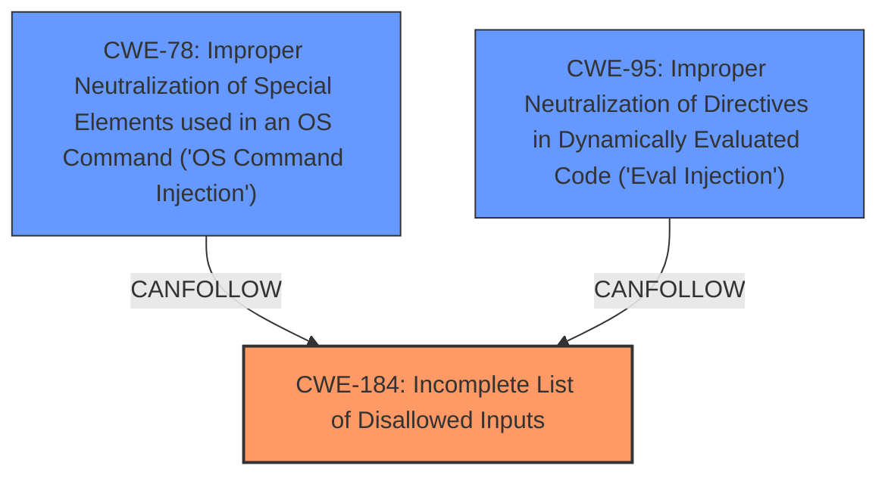

# Analysis Report for CVE-2021-33816

# Vulnerability Analysis Report: CVE-2021-33816

## Description


## Analysis (with Relationship Data)

# Summary
| CWE ID | CWE Name | Confidence | CWE Abstraction Level | CWE Vulnerability Mapping Label | CWE-Vulnerability Mapping Notes |
|---|---|---|---|---|---|
| CWE-184 | Incomplete List of Disallowed Inputs | 0.9 | Base | Allowed | Primary CWE |
| CWE-78 | Improper Neutralization of Special Elements used in an OS Command ('OS Command Injection') | 0.6 | Base | Allowed | Secondary Candidate |
| CWE-95 | Improper Neutralization of Directives in Dynamically Evaluated Code ('Eval Injection') | 0.6 | Variant | Allowed | Secondary Candidate |

## Evidence and Confidence

*   **Confidence Score:** 0.8
*   **Evidence Strength:** HIGH

## Relationship Analysis
The primary relationship influencing the decision is the parent-child relationship. CWE-184 (Incomplete List of Disallowed Inputs) is a base CWE. The vulnerability description and CVE reference link content summary clearly indicate that the root cause is an **incomplete protection mechanism**, where backticks were not blocked, leading to command injection.

CWE-78 (Improper Neutralization of Special Elements used in an OS Command) and CWE-95 (Improper Neutralization of Directives in Dynamically Evaluated Code) are related because the **incomplete list of disallowed inputs** allows for OS command injection or Eval injection.



## Vulnerability Chain
The vulnerability chain starts with the **incomplete protection mechanism** (CWE-184), which allows for the injection of shell commands via backticks (``), leading to remote PHP code execution.
  - **Root Cause:** CWE-184 (**incomplete protection mechanism**)
  - **Weakness:** Injection of shell commands
  - **Impact:** Remote PHP code execution

## Summary of Analysis
The initial analysis focused on identifying the root cause of the vulnerability, which is the **incomplete protection mechanism** in Dolibarr's website builder module. The evidence from the vulnerability description and CVE Reference Links Content Summary strongly supports this: "The website builder module in Dolibarr 13.0.2 allows remote PHP code execution because of an **incomplete protection mechanism** in which system, exec, and shell_exec are blocked but backticks are not blocked." The CVE Reference Links Content Summary also confirms that the application's attempt to block specific dangerous functions is circumvented by the use of backticks.

The graph relationships influenced the final selection by highlighting the potential chain of events: an **incomplete list** allows for command or code injection.

The selected CWE, CWE-184, is at the optimal level of specificity because it directly addresses the **root cause**, which is the **incomplete list of disallowed inputs**. While CWE-78 and CWE-95 are potential consequences of this weakness, CWE-184 represents the fundamental flaw that enables the vulnerability.

Relevant CWE Information:

# Enhanced Context (25 CWEs)
The following CWEs were identified as potentially relevant to this vulnerability:

## CWE-1289: Improper Validation of Unsafe Equivalence in Input
**Abstraction Level**: Base
**Similarity Score**: 0.78
**Source**: dense

**Description**:
The product receives an input value that is used as a resource identifier or other type of reference, but it does not validate or incorrectly validates that the input is equivalent to a potentially-unsafe value.
*Not Selected*: While input validation is related, the core issue is that there is an incomplete list of what is disallowed.

## CWE-184: Incomplete List of Disallowed Inputs
**Abstraction Level**: Base
**Similarity Score**: 0.78
**Source**: dense

**Description**:
The product implements a protection mechanism that relies on a list of inputs (or properties of inputs) that are not allowed by policy or otherwise require other action to neutralize before additional processing takes place, but the list is incomplete.

**Mapping Guidance**:
- Usage: Allowed
- Rationale: This CWE entry is at the Base level of abstraction, which is a preferred level of abstraction for mapping to the root causes of vulnerabilities.

## CWE-345: Insufficient Verification of Data Authenticity
**Abstraction Level**: Class
**Similarity Score**: 0.78
**Source**: dense

**Description**:
The product does not sufficiently verify the origin or authenticity of data, in a way that causes it to accept invalid data.
*Not Selected*: Data authenticity isn't the issue. The issue is input validation.

## CWE-74: Improper Neutralization of Special Elements in Output Used by a Downstream Component ('Injection')
**Abstraction Level**: Class
**Similarity Score**: 0.77
**Source**: dense

**Description**:
The product constructs all or part of a command, data structure, or record using externally-influenced input from an upstream component, but it does not neutralize or incorrectly neutralizes special elements that could modify how it is parsed or interpreted when it is sent to a downstream component.
*Not Selected*: Too general, the root cause is the incomplete list of disallowed inputs.

## CWE-807: Reliance on Untrusted Inputs in a Security Decision
**Abstraction Level**: Base
**Similarity Score**: 0.77
**Source**: dense

**Description**:
The product uses a protection mechanism that relies on the existence or values of an input, but the input can be modified by an untrusted actor in a way that bypasses the protection mechanism.
*Not Selected*: The protection mechanism is broken due to an incomplete list, not because of reliance on untrusted inputs.

## CWE-41: Improper Resolution of Path Equivalence
**Abstraction Level**: Base
**Similarity Score**: 0.76
**Source**: dense

**Description**:
The product is vulnerable to file system contents disclosure through path equivalence. Path equivalence involves the use of special characters in file and directory names. The associated manipulations are intended to generate multiple names for the same object.
*Not Selected*: This is not related to pathnames.

## CWE-138: Improper Neutralization of Special Elements
**Abstraction Level**: Class
**Similarity Score**: 0.76
**Source**: dense

**Description**:
The product receives input from an upstream component, but it does not neutralize or incorrectly neutralizes special elements that could be interpreted as control elements or syntactic markers when they are sent to a downstream component.
*Not Selected*: Too general, the root cause is the incomplete list of disallowed inputs.

## CWE-303: Incorrect Implementation of Authentication Algorithm
**Abstraction Level**: Base
**Similarity Score**: 0.76
**Source**: dense

**Description**:
The requirements for the product dictate the use of an established authentication algorithm, but the implementation of the algorithm is incorrect.
*Not Selected*: Authentication is not the issue.

## CWE-212: Improper Removal of Sensitive Information Before Storage or Transfer
**Abstraction Level**: Base
**Similarity Score**: 0.76
**Source**: dense

**Description**:
The product stores, transfers, or shares a resource that contains sensitive information, but it does not properly remove that information before the product makes the resource available to unauthorized actors.
*Not Selected*: The issue isn't about sensitive information.

## CWE-639: Authorization Bypass Through User-Controlled Key
**Abstraction Level**: Base
**Similarity Score**: 0.76
**Source**: dense

**Description**:
The system's authorization functionality does not prevent one user from gaining access to another user's data or record by modifying the key value identifying the data.
*Not Selected*: Authorization is not the issue.

## CWE-95: Improper Neutralization of Directives in Dynamically Evaluated Code ('Eval Injection')
**Abstraction Level**: Variant
**Similarity Score**: 5811.34
**Source**: sparse

**Description**:
The product receives input from an upstream component, but it does not neutralize or incorrectly neutralizes code syntax before using the input in a dynamic evaluation call (e.g. "eval").
*Selected as secondary* This could be a consequence of the incomplete list, as backticks lead to code execution.

## CWE-78: Improper Neutralization of Special Elements used in an OS Command ('OS Command Injection')
**Abstraction Level**: base
**Similarity Score**: 5.03
**Source**: graph

**Description**:
CWE-78: Improper Neutralization of Special Elements used in an OS Command ('OS Command Injection')
*Selected as secondary* This could be a consequence of the incomplete list, as backticks lead to OS command injection.

## CWE-88: Improper Neutralization of Argument Delimiters in a Command


## CWE Relationship Analysis

Current CWEs represent these abstraction levels: .


### Vulnerability Chain Analysis

**Chain starting from CWE-303:**
- 303 (Incorrect Implementation of Authentication Algorithm) - ROOT


**Chain starting from CWE-88:**
- 88 (Improper Neutralization of Argument Delimiters in a Command ('Argument Injection')) - ROOT


### CWE Relationship Diagram

```mermaid
graph TD
    classDef primary fill:#f96,stroke:#333,stroke-width:2px
    classDef secondary fill:#69f,stroke:#333
    classDef tertiary fill:#9e9,stroke:#333
```


*Report generated on 2025-04-02 14:34:39*
