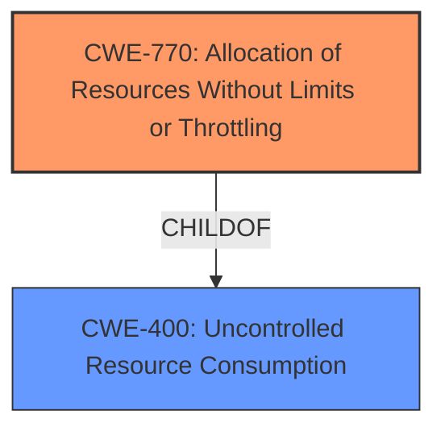

# Raw Analyzer Response for CVE-2021-33822

# Summary
| CWE ID | CWE Name | Confidence | CWE Abstraction Level | CWE Vulnerability Mapping Label | CWE-Vulnerability Mapping Notes |
|---|---|---|---|---|---|
| CWE-770 | Allocation of Resources Without Limits or Throttling | 0.9 | Base | Allowed | Primary CWE |
| CWE-400 | Uncontrolled Resource Consumption | 0.7 | Class | Discouraged | Secondary Candidate |

## Evidence and Confidence

*   **Confidence Score:** 0.9
*   **Evidence Strength:** HIGH

## Relationship Analysis
The primary CWE selected, CWE-770, is a child of CWE-400, indicating a hierarchical relationship where CWE-770 is a more specific case of uncontrolled resource consumption. While CWE-400 was considered, CWE-770 was chosen because it more accurately reflects the specific weakness of allocating resources without limits or throttling.

## Vulnerability Chain
The vulnerability chain starts with the **lack of limits on resource allocation** (CWE-770), leading to **resource exhaustion**, and culminating in a **denial-of-service** (DoS) impact.
- **Root Cause:** CWE-770 Allocation of Resources Without Limits or Throttling
- **Impact:** Denial of Service

## Summary of Analysis
The initial assessment identified several candidate CWEs, including CWE-400, CWE-770, and CWE-401. However, based on the vulnerability description and the CVE reference content summary, the most accurate mapping is CWE-770. This is because the **root cause** of the vulnerability is the **allocation of resources without limits or throttling**, which directly leads to resource exhaustion and denial of service.

The vulnerability description states that "Attackers can use slowhttptest tool to send incomplete HTTP request, which could make server keep waiting for the packet to finish the connection, until its resource exhausted. Then the web server is denial-of-service." The CVE Reference Links Content Summary further supports this by noting "The vulnerability is a result of the 4GEE ROUTER HH70VB's web server not properly handling incomplete HTTP requests. The server keeps waiting for the completion of the request, consuming resources," and "The server's resources are exhausted by waiting for incomplete requests, leading to a denial of service."

CWE-770 aligns perfectly with this description, as it specifically addresses the scenario where a product allocates resources without imposing restrictions on the size or number of resources that can be allocated.

CWE-400 was considered but ultimately deemed less specific. While it describes uncontrolled resource consumption, it doesn't pinpoint the exact mechanism of **unlimited resource allocation** as precisely as CWE-770 does. The mapping guidance for CWE-400 also suggests considering more specific children like CWE-770.

CWE-401 (Missing Release of Memory after Effective Lifetime) was also considered because resource exhaustion is a similar symptom, but the root cause is different.

The selected CWE is at the optimal level of specificity because it directly addresses the **root cause** of the vulnerability.

Relevant CWE Information:

# Enhanced Context (25 CWEs)

## CWE-404: Improper Resource Shutdown or Release
**Abstraction Level**: Class
**Similarity Score**: 0.79

**Description**:
The product does not release or incorrectly releases a resource before it is made available for re-use.

**Mapping Guidance**:
- Usage: Allowed-with-Review
- Rationale: This CWE entry is a Class and might have Base-level children that would be more appropriate

*This CWE was not selected because the issue is not about improper release of resources, but rather about improper allocation of resources without limits.*

## CWE-1289: Improper Validation of Unsafe Equivalence in Input
**Abstraction Level**: Base
**Similarity Score**: 0.77

**Description**:
The product receives an input value that is used as a resource identifier or other type of reference, but it does not validate or incorrectly validates that the input is equivalent to a potentially-unsafe value.

**Mapping Guidance**:
- Usage: Allowed
- Rationale: This CWE entry is at the Base level of abstraction, which is a preferred level of abstraction for mapping to the root causes of vulnerabilities.

*This CWE was not selected because the issue is not directly related to input validation but rather to resource allocation.*

## CWE-226: Sensitive Information in Resource Not Removed Before Reuse
**Abstraction Level**: Base
**Similarity Score**: 0.77

**Description**:
The product releases a resource such as memory or a file so that it can be made available for reuse, but it does not clear or "zeroize" the information contained in the resource before the product performs a critical state transition or makes the resource available for reuse by other entities.

**Mapping Guidance**:
- Usage: Allowed
- Rationale: This CWE entry is at the Base level of abstraction, which is a preferred level of abstraction for mapping to the root causes of vulnerabilities.

*This CWE was not selected because the issue is not related to sensitive information but to resource allocation.*

## CWE-668: Exposure of Resource to Wrong Sphere
**Abstraction Level**: Class
**Similarity Score**: 0.76

**Description**:
The product exposes a resource to the wrong control sphere, providing unintended actors with inappropriate access to the resource.

**Mapping Guidance**:
- Usage: Discouraged
- Rationale: CWE-668 is high-level and is often misused as a catch-all when lower-level CWE IDs might be applicable. It is sometimes used for low-information vulnerability reports [REF-1287]. It is a level-1 Class (i.e., a child of a Pillar). It is not useful for trend analysis.

*This CWE was not selected because the issue is about improper resource allocation, not exposure to the wrong sphere.*

## CWE-405: Asymmetric Resource Consumption (Amplification)
**Abstraction Level**: Class
**Similarity Score**: 0.76

**Description**:
The product does not properly control situations in which an adversary can cause the product to consume or produce excessive resources without requiring the adversary to invest equivalent work or otherwise prove authorization, i.e., the adversary's influence is "asymmetric."

**Mapping Guidance**:
- Usage: Allowed-with-Review
- Rationale: This CWE entry is a Class and might have Base-level children that would be more appropriate

*This CWE was not selected because the issue is not directly about asymmetric resource consumption, but rather about allocation without limits.*

## CWE-667: Improper Locking
**Abstraction Level**: Class
**Similarity Score**: 0.76

**Description**:
The product does not properly acquire or release a lock on a resource, leading to unexpected resource state changes and behaviors.

**Mapping Guidance**:
- Usage: Allowed-with-Review
- Rationale: This CWE entry is a Class and might have Base-level children that would be more appropriate

*This CWE was not selected because the issue is about resource allocation, not locking mechanisms.*

## CWE-664: Improper Control of a Resource Through its Lifetime
**Abstraction Level**: Pillar
**Similarity Score**: 0.76

**Description**:
The product does not maintain or incorrectly maintains control over a resource throughout its lifetime of creation, use, and release.

**Mapping Guidance**:
- Usage: Discouraged
- Rationale: This CWE entry is high-level when lower-level children are available.

*This CWE was not selected because it is a high-level CWE. Lower-level children, like CWE-770, are more applicable.*

## CWE-754: Improper Check for Unusual or Exceptional Conditions
**Abstraction Level**: Class
**Similarity Score**: 0.76

**Description**:
The product does not check or incorrectly checks for unusual or exceptional conditions that are not expected to occur frequently during day to day operation of the product.

**Mapping Guidance**:
- Usage: Allowed-with-Review
- Rationale: This CWE entry is a Class and might have Base-level children that would be more appropriate

*This CWE was not selected because the issue is not primarily about checking for unusual conditions, but about resource allocation.*

## CWE-617: Reachable Assertion
**Abstraction Level**: Base
**Similarity Score**: 0.76

**Description**:
The product contains an assert() or similar statement that can be triggered by an attacker, which leads to an application exit or other behavior that is more severe than necessary.

**Mapping Guidance**:
- Usage: Allowed
- Rationale: This CWE entry is at the Base level of abstraction, which is a preferred level of abstraction for mapping to the root causes of vulnerabilities.

*This CWE was not selected because the issue is not about assertions but about resource allocation.*

## CWE-755: Improper Handling of Exceptional Conditions
**Abstraction Level