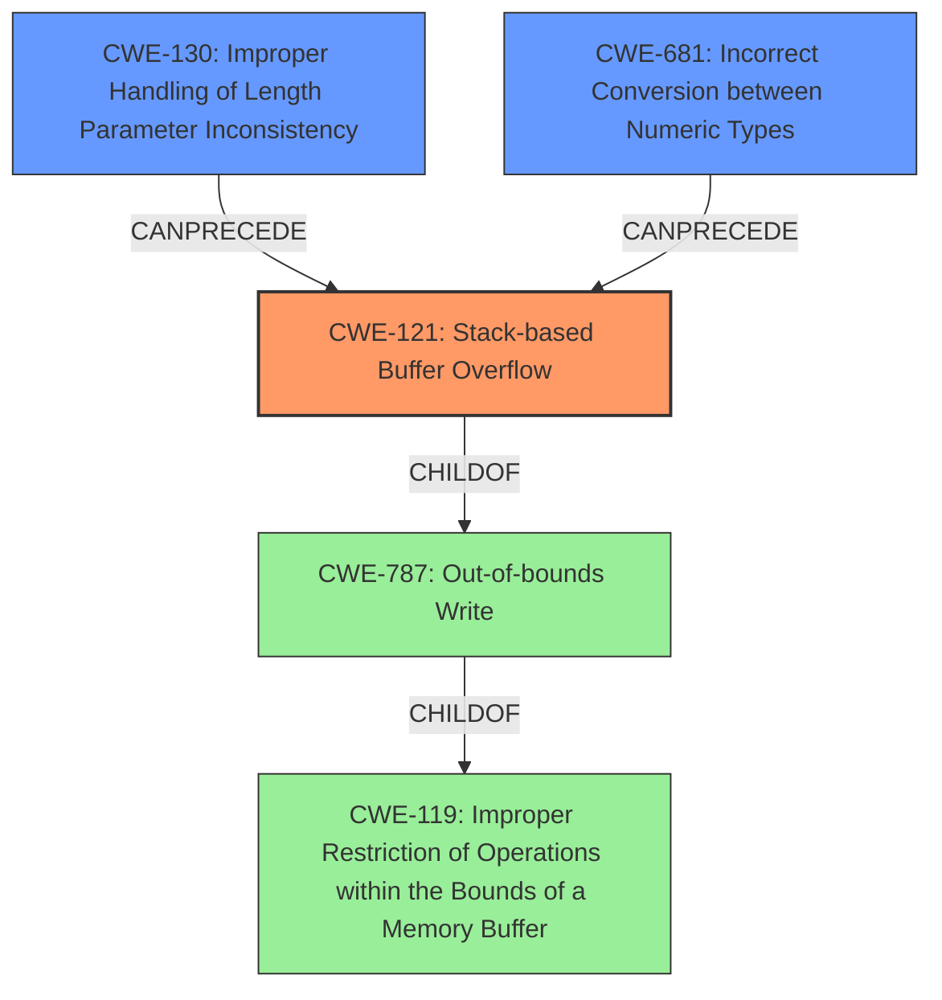

# Raw Analyzer Response for CVE-2021-33889

# Summary
| CWE ID | CWE Name | Confidence | CWE Abstraction Level | CWE Vulnerability Mapping Label | CWE-Vulnerability Mapping Notes |
|---|---|---|---|---|---|
| CWE-121 | Stack-based Buffer Overflow | 0.9 | Variant | Allowed | Primary CWE |
| CWE-130 | Improper Handling of Length Parameter Inconsistency | 0.8 | Base | Allowed | Secondary Candidate |
| CWE-681 | Incorrect Conversion between Numeric Types | 0.7 | Base | Allowed | Secondary Candidate |

## Evidence and Confidence

*   **Confidence Score:** 0.8
*   **Evidence Strength:** HIGH

## Relationship Analysis
The primary weakness is a stack-based buffer overflow (CWE-121), which is a variant of the more general out-of-bounds write (CWE-787), which in turn is a specialization of improper restriction of operations within the bounds of a memory buffer (CWE-119). The root cause stems from an inconsistency in how the `metric_len` variable is defined across different source files. It is treated as an `unsigned short` in one place and an `unsigned int` in another. This type mismatch during conversion (CWE-681) directly leads to the buffer overflow because the code writes more data than the allocated buffer size. This also involves improper handling of length parameter (CWE-130) because the length used for writing is different than the buffer allocated.

## Vulnerability Chain
The vulnerability chain starts with the **inconsistency in integer data type for metric_len**. This **type mismatch** (CWE-681 and CWE-130) then leads to a **stack-based buffer overflow** (CWE-121). The final impact could be code execution or denial of service.

## Summary of Analysis
The initial assessment clearly points to a **stack-based buffer overflow** (CWE-121) due to a type mismatch. The vulnerability description explicitly mentions a **stack-based buffer overflow** and an **inconsistency in the integer data type for metric_len.**

The CVE Reference Links Content Summary provides strong evidence:
*   "The vulnerability stems from an **inconsistency in how the `metric_len` variable is defined** and used...`metric_len` is defined as `unsigned short`. However...it's treated as an `unsigned int`. This mismatch leads to a buffer overflow."
*   "The core vulnerability is a **stack-based buffer overflow**. When writing to `metric_len`, the code uses the size of an `unsigned int` (larger) while the allocated buffer on the stack is for an `unsigned short` (smaller). This causes a write beyond the bounds of the allocated stack memory"

CWE-121 is the most specific and accurate representation of the vulnerability. CWE-130 (Improper Handling of Length Parameter Inconsistency) and CWE-681 (Incorrect Conversion between Numeric Types) are contributing factors, but the primary issue is the resulting buffer overflow on the stack.

Relevant CWE Information:

# Enhanced Context (25 CWEs)
The following CWEs were identified as potentially relevant to this vulnerability:

## CWE-191: Integer Underflow (Wrap or Wraparound)
**Abstraction Level**: Base
**Similarity Score**: 0.82
**Source**: dense

**Description**:
The product subtracts one value from another, such that the result is less than the minimum allowable integer value, which produces a value that is not equal to the correct result.
**NOT USED:** This CWE does not apply as there is no subtraction occurring.

## CWE-197: Numeric Truncation Error
**Abstraction Level**: Base
**Similarity Score**: 0.81
**Source**: dense

**Description**:
Truncation errors occur when a primitive is cast to a primitive of a smaller size and data is lost in the conversion.
**NOT USED:** This CWE does not apply because the type conversion causes an overflow, not a truncation. The data written is larger than the allocated space.

## CWE-131: Incorrect Calculation of Buffer Size
**Abstraction Level**: Base
**Similarity Score**: 0.78
**Source**: dense

**Description**:
The product does not correctly calculate the size to be used when allocating a buffer, which could lead to a buffer overflow.
**NOT USED:** While a buffer overflow occurs, the root cause isn't an explicit incorrect calculation of buffer size, but a type mismatch.

## CWE-681: Incorrect Conversion between Numeric Types
**Abstraction Level**: Base
**Similarity Score**: 0.78
**Source**: dense

**Description**:
When converting from one data type to another, such as long to integer, data can be omitted or translated in a way that produces unexpected values. If the resulting values are used in a sensitive context, then dangerous behaviors may occur.
**USED:** This CWE is relevant because the inconsistency in the integer data type for `metric_len` across different source files caused the overflow.

## CWE-124: Buffer Underwrite ('Buffer Underflow')
**Abstraction Level**: Base
**Similarity Score**: 0.78
**Source**: dense

**Description**:
The product writes to a buffer using an index or pointer that references a memory location prior to the beginning of the buffer.
**NOT USED:** This CWE does not apply because there is an overwrite of memory after the allocated buffer, not before.

## CWE-805: Buffer Access with Incorrect Length Value
**Abstraction Level**: Base
**Similarity Score**: 0.77
**Source**: dense

**Description**:
The product uses a sequential operation to read or write a buffer, but it uses an incorrect length value that causes it to access memory that is outside of the bounds of the buffer.
**NOT USED:** While the buffer access uses an incorrect length, the root cause is the type mismatch (CWE-681).

## CWE-680: Integer Overflow to Buffer Overflow
**Abstraction Level**: Compound
**Similarity Score**: 0.76
**Source**: dense

**Description**:
The product performs a calculation to determine how much memory to allocate, but an integer overflow can occur that causes less memory to be allocated than expected, leading to a buffer overflow.
**NOT USED:** This is a compound CWE and not appropriate because there isn't a calculation that leads to the overflow, but a type conversion issue.

## CWE-190: Integer Overflow or Wraparound
**Abstraction Level**: Base
**Similarity Score**: 0.76
**Source**: dense

**Description**:
The product performs a calculation that can produce an integer overflow or wraparound when the logic assumes that the resulting value will always be larger than the original value.
**NOT USED:** There isn't an integer overflow in the sense that a value becomes too large for its type, but a type conversion that leads to writing more data than allocated.

## CWE-130: Improper Handling of Length Parameter Inconsistency
**Abstraction Level**: Base
**Similarity Score**: 0.75
**Source**: dense

**Description**:
The product parses a formatted message or structure, but it does not handle or incorrectly handles a length field that is inconsistent with the actual length of the associated data.
**USED:** This CWE is applicable because the different sizes of the `metric_len` variable (unsigned short vs. unsigned int) represent an inconsistency in the length parameter.

## CWE-126: Buffer Over-read
**Abstraction Level**: Variant
**Similarity Score**: 0.75
**Source**: dense

**Description**:
The product reads from a buffer using buffer access mechanisms such as indexes or pointers that reference memory locations after the targeted buffer.
**NOT USED:** This is an over-write, not an over-read.

## CWE-190: Integer Overflow or Wraparound
**Abstraction Level**: Base
**Similarity Score**: 6844.12
**Source**: sparse

**Description**:
The product performs a calculation that can produce an integer overflow or wraparound when the logic assumes that the resulting value will always be larger than the original value.
**NOT USED:** This CWE