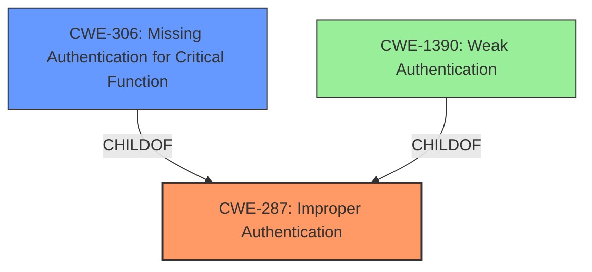

# Analysis for CVE-2021-33895

# Summary
| CWE ID | CWE Name | Confidence | CWE Abstraction Level | CWE Vulnerability Mapping Label | CWE-Vulnerability Mapping Notes |
|---|---|---|---|---|---|
| CWE-287 | Improper Authentication | 0.8 | Class | Primary | Discouraged |
| CWE-306 | Missing Authentication for Critical Function | 0.7 | Base | Secondary | Allowed |

## Evidence and Confidence

*   **Confidence Score:** 0.8
*   **Evidence Strength:** MEDIUM

## Relationship Analysis
The primary CWE selected is CWE-287, which is a Class-level weakness. While it's generally preferred to map to Base or Variant levels, the specifics of the vulnerability description don't clearly indicate a more specific child CWE. CWE-287 is a parent of CWE-306 (Missing Authentication for Critical Function) and CWE-1390 (Weak Authentication). CWE-306 was considered as a secondary CWE since the authentication check is completely missing when the user is not running the XYGate application.

## Vulnerability Chain
The chain starts with the **mismanagement of password access control**, leading to a bypass of authentication. The root cause is that the system procedure returns 0 (no error) when the user is not running the XYGate application, causing the system to assume the password is correct. This allows a user to **login to the Backbox UI application** without proper authentication.
- **Root Cause:** **Mismanagement of password access control**
- **Weakness:** CWE-287 Improper Authentication, CWE-306 Missing Authentication for Critical Function
- **Impact:** Login to Backbox UI application

## Summary of Analysis
The initial assessment focused on identifying the most accurate CWE to represent the **mismanagement of password access control** in ETINET BACKBOX. The vulnerability description highlights that the system **fails to properly verify the password** when a user uses the User ID of the process running BBSV to login to the Backbox UI application. The system procedure returns 0 (no error) because the user is not running the XYGate application, leading BBSV to assume the Password is correct.

The Retriever Results suggested several potential CWEs, including CWE-287 (Improper Authentication), CWE-209 (Generation of Error Message Containing Sensitive Information), CWE-923 (Improper Restriction of Communication Channel to Intended Endpoints), CWE-1390 (Weak Authentication), and CWE-306 (Missing Authentication for Critical Function).

CWE-287 (Improper Authentication) was selected as the primary CWE because it directly addresses the core issue of the system failing to properly prove the user's identity. The description of CWE-287 states: "When an actor claims to have a given identity, the product does not prove or insufficiently proves that the claim is correct." This aligns closely with the vulnerability description, where the system assumes the password is correct without proper verification.

CWE-306 (Missing Authentication for Critical Function) was considered as a secondary mapping to emphasize the complete lack of authentication under certain conditions.

CWE-1390 (Weak Authentication) was considered, but the authentication mechanism is bypassed rather than being weak.

CWE-209 (Generation of Error Message Containing Sensitive Information), CWE-923 (Improper Restriction of Communication Channel to Intended Endpoints) and CWE-732 (Incorrect Permission Assignment for Critical Resource) were deemed less relevant as the primary issue isn't about error messages, communication channels, or permission assignments, but about the authentication process itself.

The selection of CWE-287 and CWE-306 is based on the provided evidence, particularly the description of the **mismanagement of password access control** and the resulting bypass of authentication. The relationship graph highlights the connection between CWE-287 and its children, supporting the decision to consider more specific CWEs where applicable.

Relevant CWE Information:

# Enhanced Context (25 CWEs)
The following CWEs were identified as potentially relevant to this vulnerability:

## CWE-303: Incorrect Implementation of Authentication Algorithm
**Abstraction Level**: Base
**Similarity Score**: 0.77
**Source**: dense

**Description**:
The requirements for the product dictate the use of an established authentication algorithm, but the implementation of the algorithm is incorrect.

**Mapping Guidance**:
- Usage: Allowed
- Rationale: This CWE entry is at the Base level of abstraction, which is a preferred level of abstraction for mapping to the root causes of vulnerabilities.

## CWE-1390: Weak Authentication
**Abstraction Level**: Class
**Similarity Score**: 0.76
**Source**: dense

**Description**:
The product uses an authentication mechanism to restrict access to specific users or identities, but the mechanism does not sufficiently prove that the claimed identity is correct.

**Mapping Guidance**:
- Usage: Allowed-with-Review
- Rationale: This CWE entry is a Class and might have Base-level children that would be more appropriate

## CWE-807: Reliance on Untrusted Inputs in a Security Decision
**Abstraction Level**: Base
**Similarity Score**: 0.75
**Source**: dense

**Description**:
The product uses a protection mechanism that relies on the existence or values of an input, but the input can be modified by an untrusted actor in a way that bypasses the protection mechanism.

**Mapping Guidance**:
- Usage: Allowed
- Rationale: This CWE entry is at the Base level of abstraction, which is a preferred level of abstraction for mapping to the root causes of vulnerabilities.

## CWE-1391: Use of Weak Credentials
**Abstraction Level**: Class
**Similarity Score**: 0.75
**Source**: dense

**Description**:
The product uses weak credentials (such as a default key or hard-coded password) that can be calculated, derived, reused, or guessed by an attacker.

**Mapping Guidance**:
- Usage: Allowed-with-Review
- Rationale: This CWE entry is a Class and might have Base-level children that would be more appropriate

## CWE-288: Authentication Bypass Using an Alternate Path or Channel
**Abstraction Level**: Base
**Similarity Score**: 0.74
**Source**: dense

**Description**:
The product requires authentication, but the product has an alternate path or channel that does not require authentication.

**Mapping Guidance**:
- Usage: Allowed
- Rationale: This CWE entry is at the Base level of abstraction, which is a preferred level of abstraction for mapping to the root causes of vulnerabilities.

## CWE-274: Improper Handling of Insufficient Privileges
**Abstraction Level**: Base
**Similarity Score**: 0.74
**Source**: dense

**Description**:
The product does not handle or incorrectly handles when it has insufficient privileges to perform an operation, leading to resultant weaknesses.

**Mapping Guidance**:
- Usage: Discouraged
- Rationale: This CWE entry could be deprecated in a future version of CWE.

## CWE-668: Exposure of Resource to Wrong Sphere
**Abstraction Level**: Class
**Similarity Score**: 0.74
**Source**: dense

**Description**:
The product exposes a resource to the wrong control sphere, providing unintended actors with inappropriate access to the resource.

**Mapping Guidance**:
- Usage: Discouraged
- Rationale: CWE-668 is high-level and is often misused as a catch-all when lower-level CWE IDs might be applicable. It is sometimes used for low-information vulnerability reports [REF-1287]. It is a level-1 Class (i.e., a child of a Pillar). It is not useful for trend analysis.

## CWE-280: Improper Handling of Insufficient Permissions or Privileges 
**Abstraction Level**: Base
**Similarity Score**: 0.74
**Source**: dense

**Description**:
The product does not handle or incorrectly handles when it has insufficient privileges to access resources or functionality as specified by their permissions. This may cause it to follow unexpected code paths that may leave the product in an invalid state.

**Mapping Guidance**:
- Usage: Allowed
- Rationale: This CWE entry is at the Base level of abstraction, which is a preferred level of abstraction for mapping to the root causes of vulnerabilities.

## CWE-345: Insufficient Verification of Data Authenticity
**Abstraction Level**: Class
**Similarity Score**: 0.74
**Source**: dense

**Description**:
The product does not sufficiently verify the origin or authenticity of data, in a way that causes it to accept invalid data.

**Mapping Guidance**:
- Usage: Discouraged
- Rationale: This