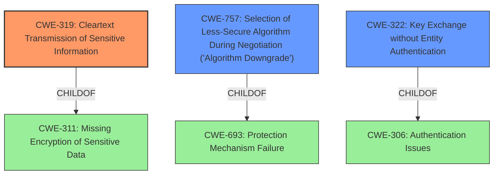

# Analysis Report for CVE-2021-33900

# Vulnerability Analysis Report: CVE-2021-33900

## Description


## Analysis (with Relationship Data)

# Summary
| CWE ID | CWE Name | Confidence | CWE Abstraction Level | CWE Vulnerability Mapping Label | CWE-Vulnerability Mapping Notes |
|---|---|---|---|---|---|
| CWE-319 | Cleartext Transmission of Sensitive Information | 0.9 | Base | Allowed | Primary CWE |
| CWE-757 | Selection of Less-Secure Algorithm During Negotiation ('Algorithm Downgrade') | 0.7 | Base | Allowed | Secondary Candidate |
| CWE-322 | Key Exchange without Entity Authentication | 0.6 | Base | Allowed | Secondary Candidate |

## Evidence and Confidence

*   **Confidence Score:** 0.8
*   **Evidence Strength:** MEDIUM

## Relationship Analysis
The primary CWE selected is CWE-319, which is at the Base level. It has a parent CWE of CWE-311, which is "Missing Encryption of Sensitive Data". CWE-757 and CWE-322 were also considered. CWE-757 is a base level CWE and has a parent of CWE-693 "Protection Mechanism Failure". CWE-322 is a base level CWE and has a parent of CWE-306 "Authentication Issues". These relationships helped to narrow down the most appropriate CWE by considering the context of encryption and authentication.



## Vulnerability Chain
The vulnerability chain starts with a **misconfiguration** where **StartTLS encryption is not applied** when using SASL authentication mechanisms. This leads to sensitive information being transmitted in cleartext.

## Summary of Analysis
The initial analysis focused on the **weakness** of **StartTLS encryption not being applied**, leading to cleartext transmission. The retriever results suggested CWE-319 (Cleartext Transmission of Sensitive Information) as the top candidate. The evidence from the vulnerability description key phrases indicates a **misconfiguration** leading to encryption not being applied.

CWE-319 directly addresses the core issue of transmitting sensitive information in cleartext. The vulnerability description explicitly mentions that StartTLS encryption was not applied when SASL authentication was used, which falls under the scope of CWE-319.

CWE-757 (Selection of Less-Secure Algorithm During Negotiation) was considered because the **misconfiguration** could be interpreted as a form of algorithm downgrade, but the description focuses more on negotiation between actors, which is not explicitly mentioned in the vulnerability description.

CWE-322 (Key Exchange without Entity Authentication) was considered because the SASL authentication mechanisms are involved but the vulnerability is not directly about the key exchange itself, but more about the lack of encryption.

Therefore, CWE-319 is the most accurate and specific representation of the vulnerability.

Relevant CWE Information:

# Enhanced Context (25 CWEs)

## CWE-319: Cleartext Transmission of Sensitive Information
**Abstraction Level**: Base
**Similarity Score**: 0.79
**Source**: dense

**Description**:
The product transmits sensitive or security-critical data in cleartext in a communication channel that can be sniffed by unauthorized actors.

**Mapping Guidance**:
- Usage: Allowed
- Rationale: This CWE entry is at the Base level of abstraction, which is a preferred level of abstraction for mapping to the root causes of vulnerabilities.


## CWE Relationship Analysis

Current CWEs represent these abstraction levels: .


### Vulnerability Chain Analysis

**Chain starting from CWE-306:**
- 306 (Missing Authentication for Critical Function) - ROOT


**Chain starting from CWE-311:**
- 311 (Missing Encryption of Sensitive Data) - ROOT


### CWE Relationship Diagram

```mermaid
graph TD
    classDef primary fill:#f96,stroke:#333,stroke-width:2px
    classDef secondary fill:#69f,stroke:#333
    classDef tertiary fill:#9e9,stroke:#333
```


*Report generated on 2025-04-01 17:12:14*
