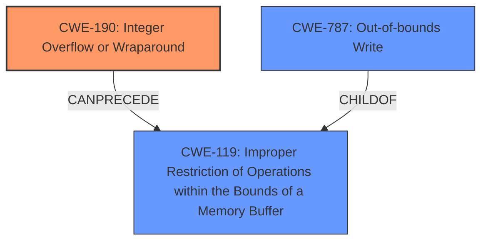

# Enhanced Analysis for CVE-2021-33909

# Summary
| CWE ID | CWE Name | Confidence | CWE Abstraction Level | CWE Vulnerability Mapping Label | CWE-Vulnerability Mapping Notes |
|---|---|---|---|---|---|
| CWE-190 | Integer Overflow or Wraparound | 0.9 | Base | Primary | Allowed |
| CWE-787 | Out-of-bounds Write | 0.8 | Base | Secondary | Allowed |

## Evidence and Confidence

*   **Confidence Score:** 0.85
*   **Evidence Strength:** MEDIUM

## Relationship Analysis
The primary weakness is identified as CWE-190, which is a Base level CWE and can precede CWE-119 (Improper Restriction of Operations within the Bounds of a Memory Buffer). CWE-787 (Out-of-bounds Write) is a child of CWE-119, representing a more specific type of buffer error. The relationships suggest that an integer overflow can lead to improper buffer handling, which then results in an out-of-bounds write.



## Vulnerability Chain
The vulnerability chain starts with an **integer overflow** (CWE-190) due to **improper** restriction of seq buffer allocations. This leads to an out-of-bounds write (CWE-787), which can then escalate to root privileges. The chain is: CWE-190 -> CWE-787 -> Privilege Escalation.

## Summary of Analysis
The initial analysis identified **integer overflow** as the primary **weakness**, leading to an out-of-bounds write and subsequent escalation to root. The provided vulnerability description directly mentions "**integer overflow**" and "Out-of-bounds Write" as key aspects of the vulnerability: "fs/seq_file.c in the Linux kernel 3.16 through 5.13.x before 5.13.4 does not properly restrict seq buffer allocations, leading to an **integer overflow**, an Out-of-bounds Write, and escalation to root by an unprivileged user, aka CID-8cae8cd89f05."

CWE-190 is selected as the primary CWE because the **integer overflow** is the root cause explicitly mentioned in the vulnerability description. CWE-787 is a direct consequence of the **integer overflow** because the **incorrect** calculation could lead to writing outside the intended buffer boundaries.

Other CWEs considered but not selected:

*   CWE-682 (Incorrect Calculation): While related, it's a more general Pillar. CWE-190 (Integer Overflow or Wraparound) is a specific type of incorrect calculation and thus more appropriate.
*   CWE-197 (Numeric Truncation Error): Not directly applicable, as the vulnerability description focuses on overflow rather than truncation.
*   CWE-119 (Improper Restriction of Operations within the Bounds of a Memory Buffer): Too general; CWE-787 (Out-of-bounds Write) is a more specific consequence of the overflow.
*   CWE-191 (Integer Underflow (Wrap or Wraparound)): The vulnerability description specifies an *overflow*, not an underflow.
*   CWE-805 (Buffer Access with Incorrect Length Value): Related, but the root cause is the integer overflow that leads to the **incorrect** length value, making CWE-190 a better fit for the root cause.
*   CWE-1339 (Insufficient Precision or Accuracy of a Real Number): Not applicable, as the vulnerability involves integer arithmetic, not real numbers.
*   CWE-122 (Heap-based Buffer Overflow): While this could be the location of the overflow, the description focuses on the integer overflow itself, not the heap allocation details.
*   CWE-1284 (Improper Validation of Specified Quantity in Input): Relevant, but the **integer overflow** is the more direct cause.
*   CWE-125 (Out-of-bounds Read): The description specifies an *out-of-bounds write*, not a read.

The selected CWEs are at the optimal level of specificity because they accurately capture the root cause (CWE-190) and the immediate consequence (CWE-787) of the vulnerability, as described in the vulnerability description.

Relevant CWE Information:

# Enhanced Context (25 CWEs)
The following CWEs were identified as potentially relevant to this vulnerability:

## CWE-191: Integer Underflow (Wrap or Wraparound)
**Abstraction Level**: Base
**Similarity Score**: 0.80
**Source**: dense

**Description**:
The product subtracts one value from another, such that the result is less than the minimum allowable integer value, which produces a value that is not equal to the correct result.

**Mapping Guidance**:
- Usage: Allowed
- Rationale: This CWE entry is at the Base level of abstraction, which is a preferred level of abstraction for mapping to the root causes of vulnerabilities.


## CWE-805: Buffer Access with Incorrect Length Value
**Abstraction Level**: Base
**Similarity Score**: 0.78
**Source**: dense

**Description**:
The product uses a sequential operation to read or write a buffer, but it uses an incorrect length value that causes it to access memory that is outside of the bounds of the buffer.

**Mapping Guidance**:
- Usage: Allowed
- Rationale: This CWE entry is at the Base level of abstraction, which is a preferred level of abstraction for mapping to the root causes of vulnerabilities.


## CWE-197: Numeric Truncation Error
**Abstraction Level**: Base
**Similarity Score**: 0.78
**Source**: dense

**Description**:
Truncation errors occur when a primitive is cast to a primitive of a smaller size and data is lost in the conversion.

**Mapping Guidance**:
- Usage: Allowed
- Rationale: This CWE entry is at the Base level of abstraction, which is a preferred level of abstraction for mapping to the root causes of vulnerabilities.


## CWE-131: Incorrect Calculation of Buffer Size
**Abstraction Level**: Base
**Similarity Score**: 0.77
**Source**: dense

**Description**:
The product does not correctly calculate the size to be used when allocating a buffer, which could lead to a buffer overflow.

**Mapping Guidance**:
- Usage: Allowed
- Rationale: This CWE entry is at the Base level of abstraction, which is a preferred level of abstraction for mapping to the root causes of vulnerabilities.


## CWE-124: Buffer Underwrite ('Buffer Underflow')
**Abstraction Level**: Base
**Similarity Score**: 0.76
**Source**: dense

**Description**:
The product writes to a buffer using an index or pointer that references a memory location prior to the beginning of the buffer.

**Mapping Guidance**:
- Usage: Allowed
- Rationale: This CWE entry is at the Base level of abstraction, which is a preferred level of abstraction for mapping to the root causes of vulnerabilities.


## CWE-681: Incorrect Conversion between Numeric Types
**Abstraction Level**: Base
**Similarity Score**: 0.76
**Source**: dense

**Description**:
When converting from one data type to another, such as long to integer, data can be omitted or translated in a way that produces unexpected values. If the resulting values are used in a sensitive context, then dangerous behaviors may occur.

**Mapping Guidance**:
- Usage: Allowed
- Rationale: This CWE entry is at the Base level of abstraction, which is a preferred level of abstraction for mapping to the root causes of vulnerabilities.


## CWE-127: Buffer Under-read
**Abstraction Level**: Variant
**Similarity Score**: 0.75
**Source**: dense

**Description**:
The product reads from a buffer using buffer access mechanisms such as indexes or pointers that reference memory locations prior to the targeted buffer.

**Mapping Guidance**:
- Usage: Allowed
- Rationale: This CWE entry is at the Variant level of abstraction, which is a preferred level of abstraction for mapping to the root causes of vulnerabilities.


## CWE-680: Integer Overflow to Buffer Overflow
**Abstraction Level**: Compound
**Similarity Score**: 0.75
**Source**: dense

**Description**:
The product performs a calculation to determine how much memory to allocate, but an integer overflow can occur that causes less memory to be allocated than expected, leading to a buffer overflow.

**Mapping Guidance**:
- Usage: Discouraged
- Rationale: This CWE entry is a named chain, which combines multiple weaknesses.


## CWE-126: Buffer Over-read
**Abstraction Level**: Variant
**Similarity Score**: 0.75
**Source**: dense


## CWE Relationship Analysis

Current CWEs represent these abstraction levels: .


### Vulnerability Chain Analysis

**Chain starting from CWE-787:**
- 787 (Out-of-bounds Write) - ROOT


**Chain starting from CWE-680:**
- 680 (Integer Overflow to Buffer Overflow) - ROOT


### CWE Relationship Diagram

```mermaid
graph TD
    classDef primary fill:#f96,stroke:#333,stroke-width:2px
    classDef secondary fill:#69f,stroke:#333
    classDef tertiary fill:#9e9,stroke:#333
```