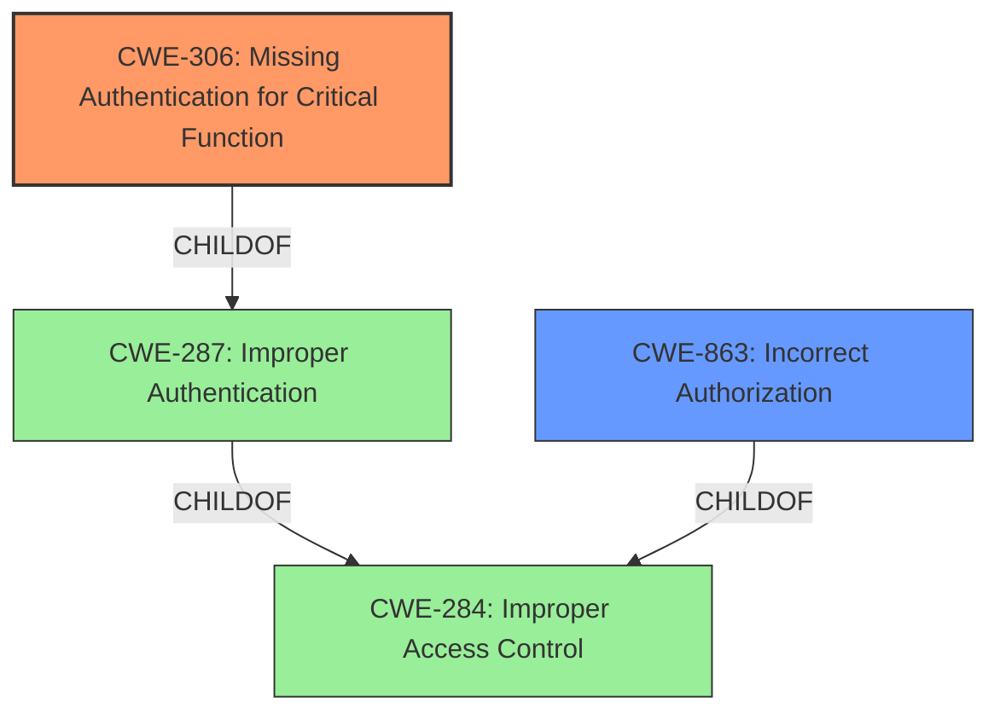

# Analysis for CVE-2021-33924

# Summary
| CWE ID | CWE Name | Confidence | CWE Abstraction Level | CWE Vulnerability Mapping Label | CWE-Vulnerability Mapping Notes |
|---|---|---|---|---|---|
| CWE-306 | Missing Authentication for Critical Function | 0.9 | Base | Primary | Allowed |
| CWE-863 | Incorrect Authorization | 0.6 | Class | Secondary | Allowed-with-Review |

## Evidence and Confidence

*   **Confidence Score:** 0.9
*   **Evidence Strength:** HIGH

## Relationship Analysis
The primary CWE is CWE-306, which is a child of CWE-287 (Improper Authentication). CWE-287 is itself a child of CWE-284 (Improper Access Control). This hierarchical relationship indicates that the vulnerability stems from a failure in authentication. CWE-863 (Incorrect Authorization) is a peer of CWE-862 (Missing Authorization) and a child of CWE-284 (Improper Access Control). The abstraction levels influenced the choice of CWE-306 as the base level CWE, with CWE-863 used as a class-level secondary CWE.

## Vulnerability Chain
The vulnerability chain starts with the **missing authentication** for a critical function, leading to information disclosure and potential privilege escalation.
  - **Root Cause:** Missing Authentication (CWE-306)
  - **Weakness:** Incorrect Authorization (CWE-863)
  - **Impact:** Information Disclosure, Privilege Escalation

## Summary of Analysis
The initial assessment identified **incorrect access control** as the primary issue. After reviewing the "CVE Reference Links Content Summary," the root cause was identified as a **missing authentication** mechanism on an auxiliary management component. This aligns with CWE-306 (Missing Authentication for Critical Function). The summary states, "The primary weakness is the **lack of authentication** on an auxiliary management component. This allows unauthorized access." This direct quote provides strong evidence for selecting CWE-306.

CWE-863 (Incorrect Authorization) was considered as a secondary weakness because authorization checks were either missing or incorrectly implemented, given the component was exposed without authentication.

The hierarchical relationships between CWE-306, CWE-287, and CWE-284 support the choice of CWE-306 as the most specific base-level CWE. While CWE-284 (Improper Access Control) is a general category, CWE-306 pinpoints the specific failure of not requiring authentication.

The selected CWEs are at the optimal level of specificity because CWE-306 directly reflects the root cause (missing authentication), and CWE-863 captures the consequence of the missing authentication (incorrect authorization).

Relevant CWE Information:

# Enhanced Context (25 CWEs)
The following CWEs were identified as potentially relevant to this vulnerability:

## CWE-668: Exposure of Resource to Wrong Sphere
**Abstraction Level**: Class
**Similarity Score**: 0.74
**Source**: dense

**Description**:
The product exposes a resource to the wrong control sphere, providing unintended actors with inappropriate access to the resource.

**Mapping Guidance**:
- Usage: Discouraged
- Rationale: CWE-668 is high-level and is often misused as a catch-all when lower-level CWE IDs might be applicable. It is sometimes used for low-information vulnerability reports [REF-1287]. It is a level-1 Class (i.e., a child of a Pillar). It is not useful for trend analysis.

*CWE-668 was not selected as it is too high-level and lower-level CWEs are more appropriate.*

## CWE-639: Authorization Bypass Through User-Controlled Key
**Abstraction Level**: Base
**Similarity Score**: 0.74
**Source**: dense

**Description**:
The system's authorization functionality does not prevent one user from gaining access to another user's data or record by modifying the key value identifying the data.

**Mapping Guidance**:
- Usage: Allowed
- Rationale: This CWE entry is at the Base level of abstraction, which is a preferred level of abstraction for mapping to the root causes of vulnerabilities.

*CWE-639 was not selected because the vulnerability doesn't specifically involve a user-controlled key to bypass authorization.*

## CWE-807: Reliance on Untrusted Inputs in a Security Decision
**Abstraction Level**: Base
**Similarity Score**: 0.74
**Source**: dense

**Description**:
The product uses a protection mechanism that relies on the existence or values of an input, but the input can be modified by an untrusted actor in a way that bypasses the protection mechanism.

**Mapping Guidance**:
- Usage: Allowed
- Rationale: This CWE entry is at the Base level of abstraction, which is a preferred level of abstraction for mapping to the root causes of vulnerabilities.

*CWE-807 was not selected because the vulnerability doesn't involve reliance on untrusted inputs in a security decision.*

## CWE-274: Improper Handling of Insufficient Privileges
**Abstraction Level**: Base
**Similarity Score**: 0.74
**Source**: dense

**Description**:
The product does not handle or incorrectly handles when it has insufficient privileges to perform an operation, leading to resultant weaknesses.

**Mapping Guidance**:
- Usage: Discouraged
- Rationale: This CWE entry could be deprecated in a future version of CWE.

*CWE-274 was not selected due to its discouraged usage and lack of direct relevance to the missing authentication issue.*

## CWE-1390: Weak Authentication
**Abstraction Level**: Class
**Similarity Score**: 0.73
**Source**: dense

**Description**:
The product uses an authentication mechanism to restrict access to specific users or identities, but the mechanism does not sufficiently prove that the claimed identity is correct.

**Mapping Guidance**:
- Usage: Allowed-with-Review
- Rationale: This CWE entry is a Class and might have Base-level children that would be more appropriate

*CWE-1390 was not selected because the issue is not a weak authentication mechanism, but rather the complete absence of one (missing authentication).*

## CWE-41: Improper Resolution of Path Equivalence
**Abstraction Level**: Base
**Similarity Score**: 0.73
**Source**: dense

**Description**:
The product is vulnerable to file system contents disclosure through path equivalence. Path equivalence involves the use of special characters in file and directory names. The associated manipulations are intended to generate multiple names for the same object.

**Mapping Guidance**:
- Usage: Allowed
- Rationale: This CWE entry is at the Base level of abstraction, which is a preferred level of abstraction for mapping to the root causes of vulnerabilities.

*CWE-41 was not selected because the vulnerability is unrelated to path equivalence or file system disclosure.*

## CWE-1220: Insufficient Granularity of Access Control
**Abstraction Level**: Base
**Similarity Score**: 0.73
**Source**: dense

**Description**:
The product implements access controls via a policy or other feature with the intention to disable or restrict accesses (reads and/or writes) to assets in a system from untrusted agents. However, implemented access controls lack required granularity, which renders the control policy too broad because it allows accesses from unauthorized agents to the security-sensitive assets.

**Mapping Guidance**:
- Usage: Allowed
- Rationale: This CWE entry is at the Base level of abstraction, which is a preferred level of abstraction for mapping to the root causes of vulnerabilities.

*CWE-1220 was not selected because the problem is the lack of access control, not the granularity of existing controls.*

## CWE-664: Improper Control of a Resource Through its Lifetime
**Abstraction Level**: Pillar
**Similarity Score**: 0.73
**Source**: dense

**Description**:
The product does not maintain or incorrectly maintains control over a resource throughout its lifetime of creation, use, and release.

**Mapping Guidance**:
- Usage: Discouraged
- Rationale: This CWE entry is high-level when lower-level children are available.

*CWE-664 was not selected as it is a high-level pillar and a more specific CWE is available.*

## CWE-653: Improper Isolation or Compartmentalization
**Abstraction Level**: Class
**Similarity Score**: 0.73
**Source**: dense

**Description