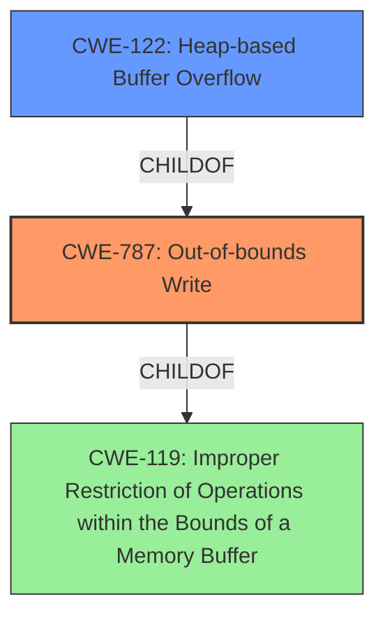

# Raw Analyzer Response for CVE-2021-3404

# Summary
| CWE ID | CWE Name | Confidence | CWE Abstraction Level | CWE Vulnerability Mapping Label | CWE-Vulnerability Mapping Notes |
|---|---|---|---|---|---|
| CWE-787 | Out-of-bounds Write | 1.0 | Base | Allowed | Primary CWE. The vulnerability is a heap buffer overflow, which leads to an out-of-bounds write. |
| CWE-122 | Heap-based Buffer Overflow | 0.8 | Variant | Allowed | Secondary CWE. This is a specific type of buffer overflow that occurs in the heap. |
| CWE-119 | Improper Restriction of Operations within the Bounds of a Memory Buffer | 0.6 | Class | Discouraged | Secondary CWE. This is a more general CWE that encompasses buffer overflows. While technically correct, it is less specific than CWE-787 or CWE-122. |

## Evidence and Confidence

*   **Confidence Score:** 0.9
*   **Evidence Strength:** HIGH

## Relationship Analysis
The primary CWE is CWE-787 **Out-of-bounds Write**, which is the direct result of the **heap buffer overflow**. CWE-122 **Heap-based Buffer Overflow** is a variant of CWE-787, providing more specific context, but the root cause is still the out-of-bounds write. CWE-119 **Improper Restriction of Operations within the Bounds of a Memory Buffer** is a class-level CWE that is too general, as it doesn't specify the type of buffer overflow (heap) or the nature of the write.

## Vulnerability Chain
The vulnerability chain starts with the application's **lack of input validation** on the version field size, which leads to a **heap buffer overflow** in the `SwapWord` function, and finally results in an **out-of-bounds write**.

## Summary of Analysis
The initial analysis identified a **heap buffer overflow** due to a crafted file, leading to potential denial-of-service and code execution. The root cause is an **improper size check** in the `TNEFVersion` function, causing `SwapWord` to read beyond the allocated buffer.

The primary CWE, CWE-787 **Out-of-bounds Write**, accurately represents the vulnerability because it is the direct consequence of the **heap buffer overflow**. The evidence from the CVE Reference Links Content Summary clearly states that the `SwapWord` function reads 2 bytes based on a potentially corrupted version field size, leading to an out-of-bounds memory access.

CWE-122 **Heap-based Buffer Overflow** is a more specific variant that is also relevant, but CWE-787 captures the core weakness: writing outside the bounds of the allocated memory.

CWE-119 **Improper Restriction of Operations within the Bounds of a Memory Buffer** is a class-level CWE that is too general and doesn't provide enough detail about the specific type of buffer overflow or the nature of the operation. The MITRE mapping guidance discourages the use of CWE-119 when more specific CWEs are available.

Therefore, CWE-787 **Out-of-bounds Write** is the most appropriate CWE, supplemented by CWE-122 **Heap-based Buffer Overflow** to provide more context. This decision is based on the provided evidence, the CWE relationships, and the MITRE mapping guidance.

Relevant CWE Information:

# Enhanced Context (25 CWEs)
The following CWEs were identified as potentially relevant to this vulnerability:

## CWE-124: Buffer Underwrite ('Buffer Underflow')
**Abstraction Level**: Base
**Similarity Score**: 0.78

## CWE-191: Integer Underflow (Wrap or Wraparound)
**Abstraction Level**: Base
**Similarity Score**: 0.77

## CWE-131: Incorrect Calculation of Buffer Size
**Abstraction Level**: Base
**Similarity Score**: 0.76

## CWE-193: Off-by-one Error
**Abstraction Level**: Base
**Similarity Score**: 0.76

## CWE-805: Buffer Access with Incorrect Length Value
**Abstraction Level**: Base
**Similarity Score**: 0.75

## CWE-126: Buffer Over-read
**Abstraction Level**: Variant
**Similarity Score**: 0.75

## CWE-127: Buffer Under-read
**Abstraction Level**: Variant
**Similarity Score**: 0.75

## CWE-125: Out-of-bounds Read
**Abstraction Level**: Base
**Similarity Score**: 0.74

## CWE-197: Numeric Truncation Error
**Abstraction Level**: Base
**Similarity Score**: 0.74

## CWE-786: Access of Memory Location Before Start of Buffer
**Abstraction Level**: Base
**Similarity Score**: 0.73

## CWE-190: Integer Overflow or Wraparound
**Abstraction Level**: Base
**Similarity Score**: 7696.78

## CWE-125: Out-of-bounds Read
**Abstraction Level**: Base
**Similarity Score**: 7387.34

## CWE-193: Off-by-one Error
**Abstraction Level**: Base
**Similarity Score**: 7239.78

## CWE-119: Improper Restriction of Operations within the Bounds of a Memory Buffer
**Abstraction Level**: Class
**Similarity Score**: 7064.11

## CWE-124: Buffer Underwrite ('Buffer Underflow')
**Abstraction Level**: Base
**Similarity Score**: 7018.15

## CWE-123: Write-what-where Condition
**Abstraction Level**: base
**Similarity Score**: 5.03

## CWE-170: Improper Null Termination
**Abstraction Level**: base
**Similarity Score**: 5.03

## CWE-120: Buffer Copy without Checking Size of Input ('Classic Buffer Overflow')
**Abstraction Level**: base
**Similarity Score**: 4.82

## CWE-416: Use After Free
**Abstraction Level**: variant
**Similarity Score**: 4.53

## CWE-787: Out-of-bounds Write
**Abstraction Level**: base
**Similarity Score**: 4.33

## CWE-825: Expired Pointer Dereference
**Abstraction Level**: base
**Similarity Score**: 4.33

## CWE-1284: Improper Validation of Specified Quantity in Input
**Abstraction Level**: base
**Similarity Score**: 4.33

## CWE-617: Reachable Assertion
**Abstraction Level**: base
**Similarity Score**: 4.33

## CWE-1341: Multiple Releases of Same Resource or Handle
**Abstraction Level**: base
**Similarity Score**: 4.33

## CWE-415: Double Free
**Abstraction Level**: variant
**Similarity Score**: 4.01

CWEs considered but not used:

*   CWE-120 **Buffer Copy without Checking Size of Input ('Classic Buffer Overflow')**: This CWE was considered because the vulnerability involves a buffer overflow. However, it is not the most accurate CWE because it focuses on the lack of size checking during a buffer copy, while the described vulnerability involves an incorrect size check that leads to an out-of-bounds write. Also, it's discouraged to select CWE-120 simply because it mentions "buffer overflow" - and this case has more information than just that.
*   CWE-125 **Out-of-bounds Read**: This CWE was considered because the `SwapWord` function attempts to read 2 bytes based on a potentially incorrect size field. However, the vulnerability results in an out-of-bounds write due to the heap buffer overflow, making CWE-787 the more appropriate choice.
*   CWE-190 **Integer Overflow or Wraparound**: While an integer overflow *could* be involved in calculating the size of the buffer or the index, the core issue is the **heap buffer overflow** leading to an **out-of-bounds write**. The description doesn't provide explicit evidence of an integer overflow being the root cause.
*   CWE-193 **Off-by-one Error**: This CWE was considered because the vulnerability involves an incorrect size check. However, the issue is not simply an off-by-one error, but a more general **heap buffer overflow** that leads to an **out-of-