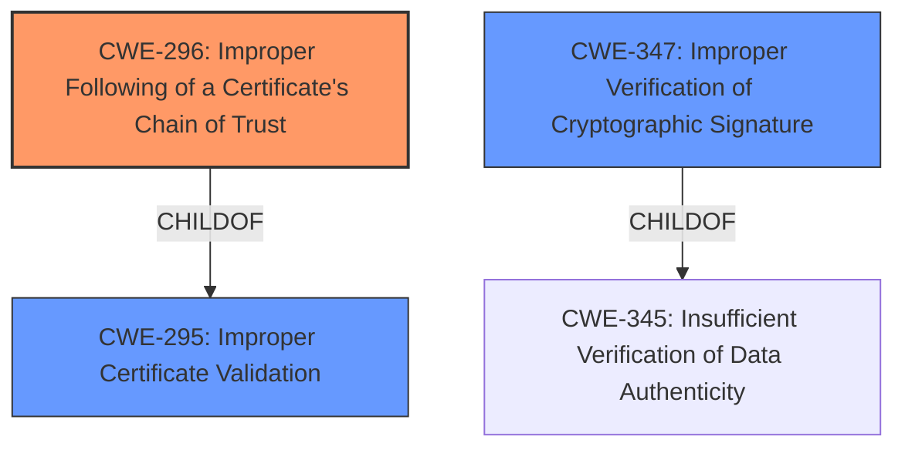

# Analysis for CVE-2021-3406

# Summary
| CWE ID | CWE Name | Confidence | CWE Abstraction Level | CWE Vulnerability Mapping Label | CWE-Vulnerability Mapping Notes |
|---|---|---|---|---|---|
| CWE-296 | Improper Following of a Certificate's Chain of Trust | 1.0 | Base | Allowed | Primary CWE |
| CWE-295 | Improper Certificate Validation | 0.7 | Base | Allowed | Secondary Candidate |
| CWE-347 | Improper Verification of Cryptographic Signature | 0.6 | Base | Allowed | Secondary Candidate |

## Evidence and Confidence

*   **Confidence Score:** 0.9
*   **Evidence Strength:** HIGH

## Relationship Analysis
The primary CWE, CWE-296, is a child of CWE-295 (Improper Certificate Validation), indicating a hierarchical relationship where CWE-296 is a more specific case of CWE-295. This informed the decision to prioritize CWE-296 as the main classification. The Retriever Results also suggested that CWE-347 (Improper Verification of Cryptographic Signature) might be relevant, but it was considered less directly applicable than CWE-296. All three of these CWEs are at the Base abstraction level, which is preferred.

## Vulnerability Chain
The vulnerability chain starts with the **invalid cryptographic chain of trust** in the Keylime agent and registrar code (root cause). This leads to the potential for an attacker to bypass the cryptographic chain of trust. The final impact could be unauthorized access or manipulation of the system.

## Summary of Analysis
Initially, the vulnerability description and the CVE reference links highlight that the Keylime agent and registrar code **did not properly validate the cryptographic chain of trust**. This directly corresponds to **CWE-296 [Improper Following of a Certificate's Chain of Trust]**, which describes situations where a product "does not follow, or incorrectly follows, the chain of trust for a certificate back to a trusted root certificate, resulting in incorrect trust of any resource that is associated with that certificate." The description and observed examples for CWE-296 align well with the vulnerability.

The CVE reference links content summary provides further evidence. It explicitly mentions that the 'ek_tpm' used for encryption was not verified against the public key in 'ek' or 'ekcert'. It also states that no checks were performed between 'pub_aik' and 'aik_name', and no checks on the object attributes of the Attestation Key were performed. These omissions directly relate to failing to properly follow the chain of trust.

**CWE-295 [Improper Certificate Validation]** was considered because **CWE-296 [Improper Following of a Certificate's Chain of Trust]** is a child of **CWE-295 [Improper Certificate Validation]**. While **CWE-295 [Improper Certificate Validation]** could apply, **CWE-296 [Improper Following of a Certificate's Chain of Trust]** is more specific and accurately captures the **rootcause** of the issue.

**CWE-347 [Improper Verification of Cryptographic Signature]** was also considered because the vulnerability involves the validation of cryptographic elements. However, the core issue is not necessarily with the signature itself, but rather with the validation of the chain of trust.

Other CWEs such as **CWE-798 [Use of Hard-coded Credentials]**, **CWE-259 [Use of Hard-coded Password]**, and **CWE-321 [Use of Hard-coded Cryptographic Key]** were not selected because the vulnerability description does not indicate the use of hard-coded credentials or keys. The issue is about failing to validate the existing cryptographic chain of trust.

**CWE-300 [Channel Accessible by Non-Endpoint]** and **CWE-345 [Insufficient Verification of Data Authenticity]** were not considered primary because they are high-level and do not directly address the **rootcause** as specifically as **CWE-296 [Improper Following of a Certificate's Chain of Trust]**.

The decision to use **CWE-296 [Improper Following of a Certificate's Chain of Trust]** is based on the explicit mention of the **invalid cryptographic chain of trust** in the vulnerability description and the details provided in the CVE reference links content summary. This provides high confidence in the mapping.