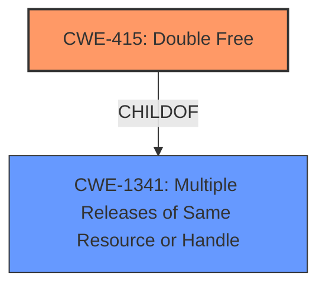

# Enhanced Analysis for CVE-2021-3407

# Summary
| CWE ID | CWE Name | Confidence | CWE Abstraction Level | CWE Vulnerability Mapping Label | CWE-Vulnerability Mapping Notes |
|---|---|---|---|---|---|
| CWE-415 | Double Free | 1.0 | Variant | Allowed | Primary CWE |
| CWE-1341 | Multiple Releases of Same Resource or Handle | 0.7 | Base | Allowed | Secondary CWE |

## Evidence and Confidence

*   **Confidence Score:** 1.0
*   **Evidence Strength:** HIGH

## Relationship Analysis
The primary relationship influencing the CWE selection is the ChildOf relationship between CWE-415 (Double Free) and CWE-1341 (Multiple Releases of Same Resource or Handle). CWE-415 is a specific type of CWE-1341. The vulnerability description clearly indicates a **double free**, making CWE-415 the most specific and appropriate choice.



## Vulnerability Chain
The vulnerability chain is relatively straightforward:

1.  **Root Cause:** A logic error in object handling during linearization of PDF documents, specifically when parsing an illegal object and assigning it to object 0, which is defined to be free.
2.  **Weakness:** **Double Free** (CWE-415)
3.  **Impact:** Memory corruption, potentially leading to denial of service or other unspecified consequences.

## Summary of Analysis
The initial analysis identified **Double Free** as the primary weakness, which aligns directly with CWE-415. The evidence from the "CVE Reference Links Content Summary" confirms this: "A double-free vulnerability exists in MuPDF during the linearization process of PDF documents." and "The core issue is that the same memory location is freed twice, leading to memory corruption."

The Retriever Results also support this, with CWE-415 being the top-ranked CWE. The mapping guidance for CWE-415 states: "This CWE entry is at the Variant level of abstraction, which is a preferred level of abstraction for mapping to the root causes of vulnerabilities."

CWE-1341 (Multiple Releases of Same Resource or Handle) was considered as a broader category, but since the vulnerability is specifically a **double free**, CWE-415 is the more precise and therefore more appropriate choice.

The relationship analysis reinforces this decision. CWE-415 is a ChildOf CWE-1341, making it a more specific instance of releasing a resource multiple times.

The final decision is based on the explicit mention of "**double free**" in the vulnerability description and the supporting evidence in the CVE Reference Links Content Summary. This makes CWE-415 the most accurate and specific representation of the vulnerability.

Relevant CWE Information:

# Enhanced Context (25 CWEs)
The following CWEs were identified as potentially relevant to this vulnerability:

## CWE-364: Signal Handler Race Condition
**Abstraction Level**: Base
**Similarity Score**: 0.78
**Source**: dense

**Description**:
The product uses a signal handler that introduces a race condition.

**Mapping Guidance**:
- Usage: Allowed
- Rationale: This CWE entry is at the Base level of abstraction, which is a preferred level of abstraction for mapping to the root causes of vulnerabilities.

**Why it was not selected:** This CWE is related to race conditions in signal handlers, which is not the case for this vulnerability. The provided information indicates the vulnerability is due to object handling during linearization.

## CWE-828: Signal Handler with Functionality that is not Asynchronous-Safe
**Abstraction Level**: Variant
**Similarity Score**: 0.75
**Source**: dense

**Description**:
The product defines a signal handler that contains code sequences that are not asynchronous-safe, i.e., the functionality is not reentrant, or it can be interrupted.

**Mapping Guidance**:
- Usage: Allowed
- Rationale: This CWE entry is at the Variant level of abstraction, which is a preferred level of abstraction for mapping to the root causes of vulnerabilities.

**Why it was not selected:** The vulnerability is not related to signal handlers or asynchronous-safe code. It is related to object handling during linearization.

## CWE-366: Race Condition within a Thread
**Abstraction Level**: Base
**Similarity Score**: 0.75
**Source**: dense

**Description**:
If two threads of execution use a resource simultaneously, there exists the possibility that resources may be used while invalid, in turn making the state of execution undefined.

**Mapping Guidance**:
- Usage: Allowed
- Rationale: This CWE entry is at the Base level of abstraction, which is a preferred level of abstraction for mapping to the root causes of vulnerabilities.

**Why it was not selected:** The vulnerability is not directly related to race conditions within a thread. The provided information indicates the vulnerability is due to object handling during linearization.

## CWE-226: Sensitive Information in Resource Not Removed Before Reuse
**Abstraction Level**: Base
**Similarity Score**: 0.75
**Source**: dense

**Description**:
The product releases a resource such as memory or a file so that it can be made available for reuse, but it does not clear or "zeroize" the information contained in the resource before the product performs a critical state transition or makes the resource available for reuse by other entities.

**Mapping Guidance**:
- Usage: Allowed
- Rationale: This CWE entry is at the Base level of abstraction, which is a preferred level of abstraction for mapping to the root causes of vulnerabilities.

**Why it was not selected:** The vulnerability is not related to leaving sensitive information in a resource before reuse. It is a double free issue.

## CWE-404: Improper Resource Shutdown or Release
**Abstraction Level**: Class
**Similarity Score**: 0.75
**Source**: dense

**Description**:
The product does not release or incorrectly releases a resource before it is made available for re-use.

**Mapping Guidance**:
- Usage: Allowed-with-Review
- Rationale: This CWE entry is a Class and might have Base-level children that would be more appropriate

**Why it was not selected:** CWE-404 is a class-level CWE. There is a more specific CWE available.

## CWE-667: Improper Locking
**Abstraction Level**: Class
**Similarity Score**: 0.74
**Source**: dense

**Description**:
The product does not properly acquire or release a lock on a resource, leading to unexpected resource state changes and behaviors.

**Mapping Guidance**:
- Usage: Allowed-with-Review
- Rationale: This CWE entry is a Class and might have Base-level children that would be more appropriate

**Why it was not selected:** The vulnerability is not related to locking mechanisms. It is a **double free** issue.

## CWE-415: Double Free
**Abstraction Level**: Variant
**Similarity Score**: 0.74
**Source**: dense

**Description**:
The product calls free() twice on the same memory address, potentially leading to modification of unexpected memory locations.

**Mapping Guidance**:
- Usage: Allowed
- Rationale: This CWE entry is at the Variant level of abstraction, which is a preferred level of abstraction for mapping to the root causes of vulnerabilities.

**Why it was selected:** This is the primary CWE. The issue is that the same memory address is freed twice.

## CWE-362: Concurrent Execution using Shared Resource with Improper Synchronization ('Race Condition')
**Abstraction Level**: Class
**Similarity Score**: 0.74
**Source**: dense

**Description**:
The product contains a concurrent code sequence that requires temporary, exclusive access to a shared resource, but a timing window exists in which the shared resource can be modified by another code sequence operating concurrently.

**Mapping Guidance**:
- Usage: Allowed-with-Review
- Rationale: This CWE entry is a Class and might have Base-level children that would be more appropriate

**Why it was not selected:** The vulnerability is not directly related to concurrent execution or synchronization issues. It is a **double free** issue.

## CWE-131: Incorrect Calculation of Buffer Size
**Abstraction Level**: Base
**Similarity Score**: 0.72
**Source**: dense

**Description**:
The product does not correctly calculate the size to be used when allocating a buffer, which could lead to a buffer overflow.

**Mapping Guidance**:
- Usage: Allowed
- Rationale: This CWE entry is at the Base level of abstraction, which is a preferred level of abstraction for mapping to the root causes of vulnerabilities.

**Why it was not selected:** The vulnerability is not related to incorrect buffer size calculation. It is a **double free** issue.

## CWE-789: Memory Allocation with Excessive Size Value
**Abstraction Level**: Variant
**Similarity Score**: 0.72
**Source**: dense

**Description**:
The product allocates memory based on an untrusted, large size value, but it does not ensure that


## CWE Relationship Analysis

Current CWEs represent these abstraction levels: .


### Vulnerability Chain Analysis

**Chain starting from CWE-667:**
- 667 (Improper Locking) - ROOT


**Chain starting from CWE-415:**
- 415 (Double Free) - ROOT


### CWE Relationship Diagram

```mermaid
graph TD
    classDef primary fill:#f96,stroke:#333,stroke-width:2px
    classDef secondary fill:#69f,stroke:#333
    classDef tertiary fill:#9e9,stroke:#333
```