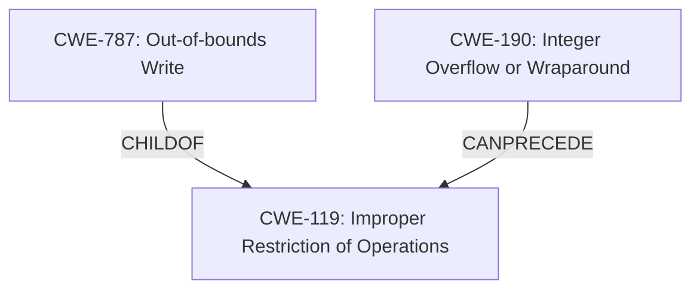

# Analysis for CVE-2021-3410

# Summary
| CWE ID  | CWE Name  | Confidence | CWE Abstraction Level | CWE Vulnerability Mapping Label | CWE-Vulnerability Mapping Notes |
|--------------|-------------------------------------------------------------------|------------|-------------------------|-----------------------------------|-----------------------------------------------------------------|
| CWE-787 | Out-of-bounds Write | 1.0 | Base | Allowed | Primary CWE |
| CWE-190 | Integer Overflow or Wraparound | 0.9 | Base | Allowed | Secondary Candidate CWE |

## Evidence and Confidence

*   **Confidence Score:** 0.95
*   **Evidence Strength:** HIGH

## Relationship Analysis
The primary relationship influencing the decision is the "CanPrecede" relationship between CWE-190 and CWE-119, and the ChildOf relationship between CWE-787 and CWE-119. The vulnerability involves an integer overflow (CWE-190) that leads to an out-of-bounds write (CWE-787). CWE-787 is a child of CWE-119 (Improper Restriction of Operations within the Bounds of a Memory Buffer), indicating a more specific type of buffer-related weakness. CWE-119 is a class level and the guideline recommends using a lower level CWE.

## Vulnerability Chain
The vulnerability chain starts with:
1.  **Integer Overflow (CWE-190):** A calculation of the new canvas size results in an integer overflow.
2.  **Out-of-bounds Write (CWE-787):** The integer overflow leads to a smaller buffer being allocated than required, causing an out-of-bounds write during the resize operation.
3.  **Arbitrary Code Execution:** The out-of-bounds write allows for potential arbitrary code execution.

## Summary of Analysis
The initial analysis identified a **buffer overflow** in the `caca_resize` function. The detailed information in the "CVE Reference Links Content Summary" section indicates the root cause is an integer overflow during the calculation of the canvas size. This integer overflow leads to the allocation of a smaller buffer, which in turn causes an out-of-bounds write when the resize operation occurs.

The supporting evidence is:
- "A **buffer overflow** issue in caca_resize function in libcaca/caca/canvas.c may lead to local execution of arbitrary code in the user context."
- "A buffer overflow vulnerability exists within the `caca_resize` function located in `libcaca/caca/canvas.c`. This overflow can occur due to an integer overflow when calculating the new size of the canvas."
- "The overflow occurs during the calculation of the new canvas size, leading to a smaller buffer than needed."

Based on this evidence, CWE-787 (Out-of-bounds Write) is the most appropriate primary CWE because it directly describes the **writing of data past the end of the intended buffer**. CWE-190 (Integer Overflow or Wraparound) is included as a secondary CWE because it is the root cause that leads to the out-of-bounds write. The retriever results also support the selection of CWE-190.

Other CWEs considered but not used:
- CWE-119 (Improper Restriction of Operations within the Bounds of a Memory Buffer): While related, CWE-119 is a class-level CWE and the guideline recommends using a lower level CWE. The vulnerability details allow for a more specific mapping to CWE-787.
- CWE-120 (Buffer Copy without Checking Size of Input): This CWE is relevant to classic buffer overflows where input size isn't validated before copying. However, the provided information indicates the buffer overflow occurs due to an integer overflow during buffer size calculation, making CWE-120 less suitable.
- CWE-125 (Out-of-bounds Read): This CWE describes reading data past the buffer boundaries, which isn't the primary issue in this case. The vulnerability involves writing data past the buffer.

The selected CWEs are at the optimal level of specificity because they accurately represent the vulnerability's root cause (integer overflow) and the resulting weakness (out-of-bounds write).