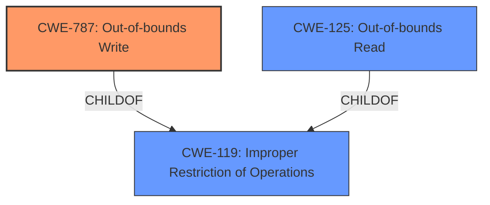

# Enhanced Analysis for CVE-2021-3411

# Summary
| CWE ID  | CWE Name                                                                                                    | Confidence | CWE Abstraction Level | CWE Vulnerability Mapping Label | CWE-Vulnerability Mapping Notes |
|---------|-------------------------------------------------------------------------------------------------------------|------------|-----------------------|---------------------------------|-------------------------------|
| CWE-787 | Out-of-bounds Write                                                                                         | 0.85       | Base                  | Primary                           | Allowed                       |
| CWE-125 | Out-of-bounds Read                                                                                          | 0.70       | Base                  | Secondary                         | Allowed                       |
| CWE-119 | Improper Restriction of Operations within the Bounds of a Memory Buffer | 0.50       | Class                  | Secondary                         | Discouraged                        |

## Evidence and Confidence

*   **Confidence Score:** 0.80
*   **Evidence Strength:** HIGH

## Relationship Analysis
The primary CWE is CWE-787 Out-of-bounds Write, which is a child of CWE-119 Improper Restriction of Operations within the Bounds of a Memory Buffer. CWE-125 Out-of-bounds Read is also a child of CWE-119. The vulnerability involves a memory access violation due to incorrect handling of INT3 padding, potentially leading to out-of-bounds read or write operations. The relationship analysis highlights the hierarchical structure, with the base CWEs (CWE-787, CWE-125) providing more specific classifications than the class CWE (CWE-119).



## Vulnerability Chain
The vulnerability chain involves the following steps:
1.  The kernel's KPROBE optimizer **fails to properly handle** functions padded with INT3 opcodes due to incorrect logic in the `can_optimize` function.
2.  This leads to a **violation of memory access** when detecting the padding.
3.  The memory access violation can potentially manifest as an out-of-bounds write or read.
4.  The impact includes system instability, bypassing kernel integrity checks, and threats to data confidentiality and integrity.

The root cause is the improper handling of INT3 padding, and the resulting weakness is the memory access violation, which can lead to out-of-bounds operations.

## Summary of Analysis
The initial analysis focused on the **violation of memory access** and the surrounding context, specifically the incorrect handling of INT3 padding in the kernel's KPROBE optimizer. The CVE description and reference links clearly indicate a **failure to properly handle** memory boundaries, leading to potential out-of-bounds read or write operations.

The primary evidence is:
-   "A flaw was found in the Linux kernel in versions prior to 5.10. A **violation of memory access** was found while detecting a padding of int3 in the linking state."
-   "The kernel's KPROBE optimizer **fails to properly handle** functions padded with INT3 opcodes (0xcc), which became default padding in later kernels due to a change in the linker script. The optimizer's `can_optimize()` function incorrectly identifies the INT3 padding as a breakpoint set by another subsystem and thus fails to convert to the more efficient FTRACE-based KPROBE."

Based on this evidence, CWE-787 Out-of-bounds Write is the most appropriate primary CWE, as it directly addresses the **writing data past the end, or before the beginning, of the intended buffer**, which is a potential consequence of the memory access violation. CWE-125 Out-of-bounds Read is considered a secondary candidate, as the memory access violation could also potentially lead to reading data outside the intended buffer.

CWE-119 Improper Restriction of Operations within the Bounds of a Memory Buffer is a higher-level class that encompasses both out-of-bounds read and write operations. While applicable, it is less specific than CWE-787 and CWE-125. The MITRE mapping guidance discourages the use of CWE-119 when more specific CWEs are available.

The final selection of CWE-787 as the primary CWE and CWE-125 as a secondary CWE provides the optimal level of specificity, accurately reflecting the potential consequences of the memory access violation.

Relevant CWE Information:

# Enhanced Context (25 CWEs)
The following CWEs were identified as potentially relevant to this vulnerability:

## CWE-226: Sensitive Information in Resource Not Removed Before Reuse
**Abstraction Level**: Base
**Similarity Score**: 0.79
**Source**: dense

**Description**:
The product releases a resource such as memory or a file so that it can be made available for reuse, but it does not clear or "zeroize" the information contained in the resource before the product performs a critical state transition or makes the resource available for reuse by other entities.

**Mapping Guidance**:
- Usage: Allowed
- Rationale: This CWE entry is at the Base level of abstraction, which is a preferred level of abstraction for mapping to the root causes of vulnerabilities.

*This CWE was not selected because the vulnerability isn't about releasing a resource without clearing it.*

## CWE-404: Improper Resource Shutdown or Release
**Abstraction Level**: Class
**Similarity Score**: 0.79
**Source**: dense

**Description**:
The product does not release or incorrectly releases a resource before it is made available for re-use.

**Mapping Guidance**:
- Usage: Allowed-with-Review
- Rationale: This CWE entry is a Class and might have Base-level children that would be more appropriate

*This CWE was not selected because the vulnerability isn't about improper resource release.*

## CWE-667: Improper Locking
**Abstraction Level**: Class
**Similarity Score**: 0.79
**Source**: dense

**Description**:
The product does not properly acquire or release a lock on a resource, leading to unexpected resource state changes and behaviors.

**Mapping Guidance**:
- Usage: Allowed-with-Review
- Rationale: This CWE entry is a Class and might have Base-level children that would be more appropriate

*This CWE was not selected because the vulnerability isn't about improper locking.*

## CWE-909: Missing Initialization of Resource
**Abstraction Level**: Class
**Similarity Score**: 0.77
**Source**: dense

**Description**:
The product does not initialize a critical resource.

**Mapping Guidance**:
- Usage: Allowed-with-Review
- Rationale: This CWE entry is a Class and might have Base-level children that would be more appropriate

*This CWE was not selected because the vulnerability isn't about missing initialization.*

## CWE-824: Access of Uninitialized Pointer
**Abstraction Level**: Base
**Similarity Score**: 0.76
**Source**: dense

**Description**:
The product accesses or uses a pointer that has not been initialized.

**Mapping Guidance**:
- Usage: Allowed
- Rationale: This CWE entry is at the Base level of abstraction, which is a preferred level of abstraction for mapping to the root causes of vulnerabilities.

*This CWE was not selected because the vulnerability isn't about access of uninitialized pointers.*

## CWE-362: Concurrent Execution using Shared Resource with Improper Synchronization ('Race Condition')
**Abstraction Level**: Class
**Similarity Score**: 0.76
**Source**: dense

**Description**:
The product contains a concurrent code sequence that requires temporary, exclusive access to a shared resource, but a timing window exists in which the shared resource can be modified by another code sequence operating concurrently.

**Mapping Guidance**:
- Usage: Allowed-with-Review
- Rationale: This CWE entry is a Class and might have Base-level children that would be more appropriate

*This CWE was not selected because the vulnerability isn't primarily a race condition, though concurrency might play a role.*

## CWE-665: Improper Initialization
**Abstraction Level**: Class
**Similarity Score**: 0.76
**Source**: dense

**Description**:
The product does not initialize or incorrectly initializes a resource, which might leave the resource in an unexpected state when it is accessed or used.

**Mapping Guidance**:
- Usage: Discouraged
- Rationale: This CWE entry is a level-1 Class (i.e., a child of a Pillar). It might have lower-level children that would be more appropriate

*This CWE was not selected because the vulnerability isn't about improper initialization in general.*

## CWE-367: Time-of-check Time-of-use (TOCTOU) Race Condition
**Abstraction Level**: Base
**Similarity Score**: 0.76
**Source**: dense

**Description


## CWE Relationship Analysis

Current CWEs represent these abstraction levels: .


### Vulnerability Chain Analysis

**Chain starting from CWE-667:**
- 667 (Improper Locking) - ROOT


**Chain starting from CWE-787:**
- 787 (Out-of-bounds Write) - ROOT


### CWE Relationship Diagram

```mermaid
graph TD
    classDef primary fill:#f96,stroke:#333,stroke-width:2px
    classDef secondary fill:#69f,stroke:#333
    classDef tertiary fill:#9e9,stroke:#333
```