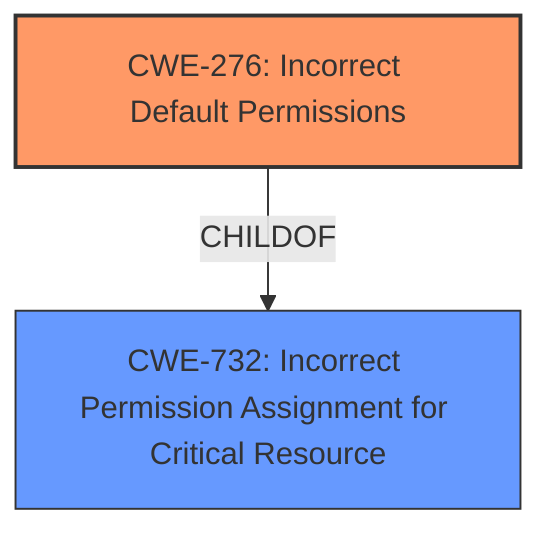

# Enhanced Analysis for CVE-2021-34110

# Summary
| CWE ID | CWE Name | Confidence | CWE Abstraction Level | CWE Vulnerability Mapping Label | CWE-Vulnerability Mapping Notes |
|---|---|---|---|---|---|
| CWE-276 | Incorrect Default Permissions | 1.0 | Base | Allowed | Primary CWE |
| CWE-732 | Incorrect Permission Assignment for Critical Resource | 0.8 | Class | Allowed-with-Review | Secondary CWE |

## Evidence and Confidence

*   **Confidence Score:** 0.9
*   **Evidence Strength:** HIGH

## Relationship Analysis
The primary CWE selected is CWE-276, which is a child of CWE-732. CWE-732 is a Class-level CWE, while CWE-276 is a Base-level CWE, making it more specific. The vulnerability description clearly states that the **incorrect permissions** are present during installation, which aligns with CWE-276's description. Therefore, selecting the base CWE-276 over the class CWE-732 provides a better description of the vulnerability.



## Vulnerability Chain
The chain of events is:
1.  **Root Cause:** **Incorrect Permissions** (CWE-276) during installation.
2.  Local unprivileged user replaces the executable with a malicious file
3.  The malicious file is executed with LocalSystem privileges.

## Summary of Analysis
The initial assessment focused on the **incorrect permissions** as the root cause. The evidence from the vulnerability description and CVE reference links content summary strongly supports this. Specifically, the "Vulnerability Description Key Phrases" list "**incorrect permissions**" as the root cause. The "CVE Reference Links Content Summary" details "**Insecure File Permissions**" on the `WinWasteService.exe` executable, with "Everyone" having modify permissions. This allows an unprivileged user to replace the executable with a malicious one, which then executes with `LocalSystem` privileges, leading to privilege escalation.

The graph relationships show that CWE-276 is a child of CWE-732. While CWE-732 (Incorrect Permission Assignment for Critical Resource) is a broader category, the vulnerability description specifically mentions that the **incorrect permissions** are present during installation, which matches CWE-276 (Incorrect Default Permissions) more accurately. Therefore, CWE-276 is selected as the primary CWE due to its specificity.

Relevant CWE Information:

# Enhanced Context (25 CWEs)

## CWE-427: Uncontrolled Search Path Element
**Abstraction Level**: Base
**Similarity Score**: 0.82
**Source**: dense

**Description**:
The product uses a fixed or controlled search path to find resources, but one or more locations in that path can be under the control of unintended actors.
- This CWE was considered, but it does not directly apply to this vulnerability. The issue is not related to the search path, but is related to the file permissions.

## CWE-59: Improper Link Resolution Before File Access ('Link Following')
**Abstraction Level**: Base
**Similarity Score**: 0.81
**Source**: dense

**Description**:
The product attempts to access a file based on the filename, but it does not properly prevent that filename from identifying a link or shortcut that resolves to an unintended resource.
- This CWE was considered, but it does not directly apply to this vulnerability. The issue is not related to link resolution.

## CWE-73: External Control of File Name or Path
**Abstraction Level**: Base
**Similarity Score**: 0.79
**Source**: dense

**Description**:
The product allows user input to control or influence paths or file names that are used in filesystem operations.
- This CWE was considered, but it does not directly apply to this vulnerability. The issue is not related to user control of the file name or path.

## CWE-41: Improper Resolution of Path Equivalence
**Abstraction Level**: Base
**Similarity Score**: 0.78
**Source**: dense

**Description**:
The product is vulnerable to file system contents disclosure through path equivalence. Path equivalence involves the use of special characters in file and directory names. The associated manipulations are intended to generate multiple names for the same object.
- This CWE was considered, but it does not directly apply to this vulnerability. The issue is not related to path equivalence.

## CWE-426: Untrusted Search Path
**Abstraction Level**: Base
**Similarity Score**: 0.77
**Source**: dense

**Description**:
The product searches for critical resources using an externally-supplied search path that can point to resources that are not under the product's direct control.
- This CWE was considered, but it does not directly apply to this vulnerability. The issue is not related to the search path.

## CWE-1386: Insecure Operation on Windows Junction / Mount Point
**Abstraction Level**: Base
**Similarity Score**: 0.77
**Source**: dense

**Description**:
The product opens a file or directory, but it does not properly prevent the name from being associated with a junction or mount point to a destination that is outside of the intended control sphere.
- This CWE was considered, but it does not directly apply to this vulnerability. The issue is not related to Windows Junction / Mount Point.

## CWE-23: Relative Path Traversal
**Abstraction Level**: Base
**Similarity Score**: 0.76
**Source**: dense

**Description**:
The product uses external input to construct a pathname that should be within a restricted directory, but it does not properly neutralize sequences such as ".." that can resolve to a location that is outside of that directory.
- This CWE was considered, but it does not directly apply to this vulnerability. The issue is not related to relative path traversal.

## CWE-668: Exposure of Resource to Wrong Sphere
**Abstraction Level**: Class
**Similarity Score**: 0.76
**Source**: dense

**Description**:
The product exposes a resource to the wrong control sphere, providing unintended actors with inappropriate access to the resource.
- This CWE was considered, but is too general. CWE-276 is a better and more specific match.

## CWE-184: Incomplete List of Disallowed Inputs
**Abstraction Level**: Base
**Similarity Score**: 0.76
**Source**: dense

**Description**:
The product implements a protection mechanism that relies on a list of inputs (or properties of inputs) that are not allowed by policy or otherwise require other action to neutralize before additional processing takes place, but the list is incomplete.
- This CWE was considered, but it does not directly apply to this vulnerability. The issue is not related to an incomplete list of disallowed inputs.

## CWE-276: Incorrect Default Permissions
**Abstraction Level**: Base
**Similarity Score**: 0.76
**Source**: dense

**Description**:
During installation, installed file permissions are set to allow anyone to modify those files.
- This CWE directly applies to the vulnerability. The **incorrect permissions** during installation allow unauthorized modification of the executable.

## CWE-732: Incorrect Permission Assignment for Critical Resource
**Abstraction Level**: Class
**Similarity Score**: 6166.27
**Source**: sparse

**Description**:
The product specifies permissions for a security-critical resource in a way that allows that resource to be read or modified by unintended actors.
- This CWE applies to the vulnerability as **incorrect permissions** were assigned to the executable which allowed it to be modified by an unintended actor.

## CWE-367: Time-of-check Time-of-use (TOCTOU) Race Condition
**Abstraction Level**: Base
**Similarity Score**: 6015.38
**Source**: sparse

**Description**:
The product checks the state of a resource before using that resource, but the resource's state can change between the check and the use in a way that invalidates the results of the check. This can cause the product to perform invalid actions when the resource is in an unexpected state.
- This CWE was considered, but it does not directly apply to this vulnerability. The issue is not related to a race condition.

I am confident that the selected CWEs are at the optimal level of specificity and accurately represent the root cause and contributing factors of the vulnerability based on the provided evidence.


## CWE Relationship Analysis

Current CWEs represent these abstraction levels: .


### Vulnerability Chain Analysis

**Chain starting from CWE-732:**
- 732 (Incorrect Permission Assignment for Critical Resource) - ROOT


**Chain starting from CWE-73:**
- 73 (External Control of File Name or Path) - ROOT


### CWE Relationship Diagram

```mermaid
graph TD
    classDef primary fill:#f96,stroke:#333,stroke-width:2px
    classDef secondary fill:#69f,stroke:#333
    classDef tertiary fill:#9e9,stroke:#333
```