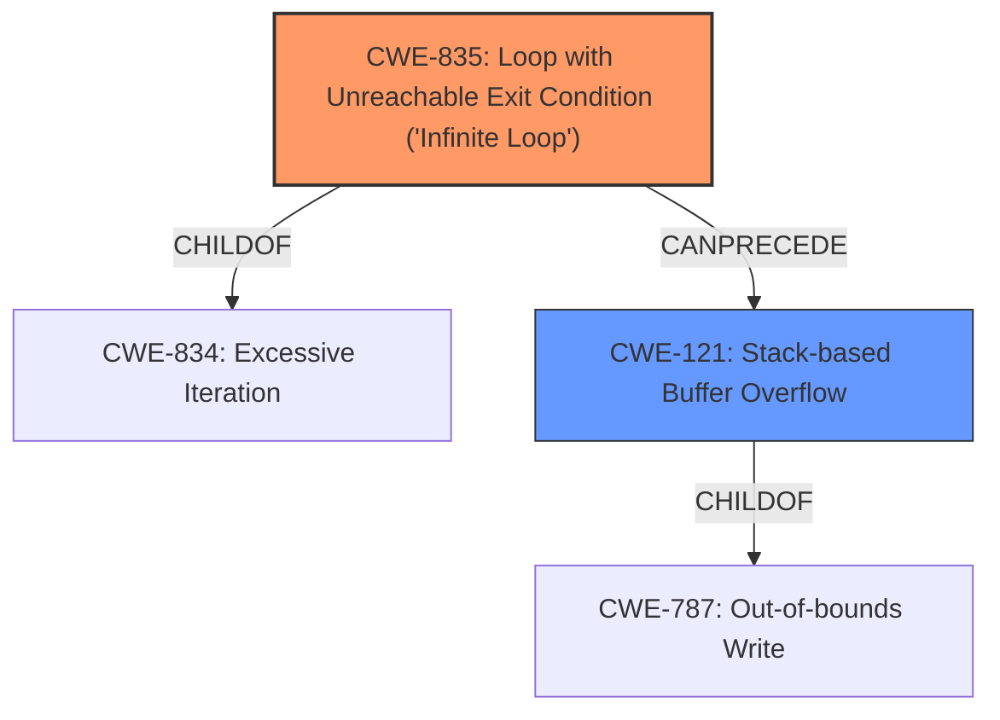

# Analysis Report for CVE-2021-3416

# Vulnerability Analysis Report: CVE-2021-3416

## Description


## Analysis (with Relationship Data)

# Summary
| CWE ID | CWE Name | Confidence | CWE Abstraction Level | CWE Vulnerability Mapping Label | CWE-Vulnerability Mapping Notes |
|---|---|---|---|---|---|
| CWE-835 | Loop with Unreachable Exit Condition ('Infinite Loop') | 0.9 | Base | Allowed | Primary CWE: The vulnerability is caused by an **infinite loop** due to bypassed reentrancy checks. |
| CWE-121 | Stack-based Buffer Overflow | 0.7 | Variant | Allowed | Secondary CWE: The **infinite loop** can lead to a **stack overflow**, making this a contributing factor. |

## Evidence and Confidence

*   **Confidence Score:** 0.8
*   **Evidence Strength:** HIGH

## Relationship Analysis
The primary weakness is the **infinite loop** (CWE-835), which can then lead to a **stack overflow** (CWE-121). CWE-835 is a child of CWE-834 (Excessive Iteration). CWE-121 is a variant of CWE-787 (Out-of-bounds Write).



## Vulnerability Chain
1.  **Root Cause:** Bypassed reentrancy checks in the NIC loopback mode.
2.  **Weakness:** **Infinite Loop** (CWE-835) due to the missing reentrancy checks.
3.  **Weakness:** **Stack Overflow** (CWE-121) caused by the **infinite loop**.
4.  **Impact:** Denial of Service (DoS) by crashing the QEMU process or consuming excessive CPU cycles.

## Summary of Analysis
The primary vulnerability is the **infinite loop** (CWE-835), triggered by bypassed reentrancy checks in the NIC loopback mode of QEMU. This can then lead to a **stack overflow** (CWE-121), ultimately resulting in a denial-of-service.

The vulnerability description states: "A potential **stack overflow** via **infinite loop** issue was found in various NIC emulators of QEMU... The issue occurs in loopback mode of a NIC wherein reentrant DMA checks get bypassed. A guest user/process may use this flaw to consume CPU cycles or crash the QEMU process on the host resulting in DoS scenario."

The evidence from "CVE Reference Links Content Summary" confirms that the root cause is the bypassed reentrancy check leading to a potential **infinite loop** and subsequent **stack overflow**.

CWE-835 is chosen as the primary CWE because the **infinite loop** is the direct result of the **missing** reentrancy checks. While the **stack overflow** is a consequence of the **infinite loop**, the **infinite loop** is the more immediate and direct result of the flaw.

CWE-121 is selected as a secondary CWE because the **infinite loop** leads to a **stack overflow**.

The selected CWEs are at the optimal level of specificity. CWE-835 is a Base-level CWE and directly describes the **infinite loop** condition. CWE-121 is a Variant-level CWE and describes the **stack-based buffer overflow** that can result from the **infinite loop**.

Relevant CWE Information:
-   **CWE-835: Loop with Unreachable Exit Condition ('Infinite Loop')**: This is a Base level CWE and perfectly describes the **infinite loop** condition in the vulnerability.
-   **CWE-121: Stack-based Buffer Overflow**: This is a Variant level CWE and describes the **stack overflow** condition that can result from the **infinite loop**.
-   **CWE-834: Excessive Iteration**: This is a Class level CWE and is a parent of CWE-835. It is less specific than CWE-835 and therefore not as appropriate.
-   **CWE-674: Uncontrolled Recursion**: While recursion can cause stack exhaustion, the issue here is specifically related to a loop, not recursion.
-   **CWE-789: Memory Allocation with Excessive Size Value**: This CWE is not relevant because the vulnerability is not directly related to memory allocation size.


## CWE Relationship Analysis

Current CWEs represent these abstraction levels: .


### Vulnerability Chain Analysis

**Chain starting from CWE-121:**
- 121 (Stack-based Buffer Overflow) - ROOT


**Chain starting from CWE-787:**
- 787 (Out-of-bounds Write) - ROOT


### CWE Relationship Diagram

```mermaid
graph TD
    classDef primary fill:#f96,stroke:#333,stroke-width:2px
    classDef secondary fill:#69f,stroke:#333
    classDef tertiary fill:#9e9,stroke:#333
```


*Report generated on 2025-04-02 07:46:32*
