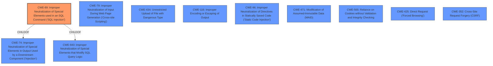

# Analysis Report for CVE-2021-34166

# Vulnerability Analysis Report: CVE-2021-34166

## Description


## Analysis (with Relationship Data)

# Summary
| CWE ID | CWE Name | Confidence | CWE Abstraction Level | CWE Vulnerability Mapping Label | CWE-Vulnerability Mapping Notes |
|---|---|---|---|---|---|
| CWE-89 | Improper Neutralization of Special Elements used in an SQL Command ('SQL Injection') | 1.0 | Base | Allowed | Primary CWE. The application constructs an SQL command using externally-influenced input without proper neutralization of special elements, allowing modification of the intended SQL command. |

## Evidence and Confidence

*   **Confidence Score:** 1.0
*   **Evidence Strength:** HIGH

## Relationship Analysis
The primary CWE is CWE-89, which is a base-level CWE. The other CWEs are not direct parents or children of CWE-89, but they are related by the common theme of improper neutralization of input.



## Vulnerability Chain
The vulnerability chain starts with **improper input sanitization** leading to **SQL injection**, which then allows an attacker to bypass authentication and gain administrative access.

## Summary of Analysis
The primary vulnerability is an **SQL injection** (CWE-89) due to **improper input sanitization**. The application fails to neutralize special elements in user-supplied input, allowing an attacker to modify the SQL query and bypass authentication.

The selection of CWE-89 is based on the following evidence:

-   **Vulnerability Description Key Phrases:** "**rootcause:** **improper input sanitization**", "**weakness:** **SQL injection**", "**impact:** bypass authentication and become admin"
-   **CVE Reference Links Content Summary:** "The application is vulnerable to SQL injection due to unsanitized user input in the login process." and "The application directly uses user-supplied input (username) within an SQL query without proper sanitization or parameterization, allowing for SQL injection."
-   **Retriever Results:** CWE-89 is the top-ranked CWE with a score of 1.0.
-   **CWE-89 Description:** "The product constructs all or part of an SQL command using externally-influenced input from an upstream component, but it does not neutralize or incorrectly neutralizes special elements that could modify the intended SQL command when it is sent to a downstream component." This directly matches the vulnerability description.

The selected CWE is at the optimal level of specificity (Base) as it accurately represents the root cause of the vulnerability, which is the failure to neutralize special elements in SQL commands.

Other CWEs Considered:

*   CWE-79 (Improper Neutralization of Input During Web Page Generation ('Cross-site Scripting')): While improper neutralization is a common theme, this is specific to web page generation, not SQL commands.
*   CWE-434 (Unrestricted Upload of File with Dangerous Type): This is not relevant to the described vulnerability.
*   CWE-116 (Improper Encoding or Escaping of Output): This is a broader category, and CWE-89 is a more specific fit for SQL injection.
*   CWE-96 (Improper Neutralization of Directives in Statically Saved Code ('Static Code Injection')): This is related to code injection in static code, which is not relevant to the SQL injection vulnerability.
* CWE-74 (Improper Neutralization of Special Elements in Output Used by a Downstream Component ('Injection')) - This is a class level CWE and parent of CWE-89. It's less specific than CWE-89.


## CWE Relationship Analysis

Current CWEs represent these abstraction levels: .


### Vulnerability Chain Analysis

**Chain starting from CWE-79:**
- 79 (Improper Neutralization of Input During Web Page Generation ('Cross-site Scripting')) - ROOT


**Chain starting from CWE-943:**
- 943 (Improper Neutralization of Special Elements in Data Query Logic) - ROOT


### CWE Relationship Diagram

```mermaid
graph TD
    classDef primary fill:#f96,stroke:#333,stroke-width:2px
    classDef secondary fill:#69f,stroke:#333
    classDef tertiary fill:#9e9,stroke:#333
```


*Report generated on 2025-04-02 08:07:38*
