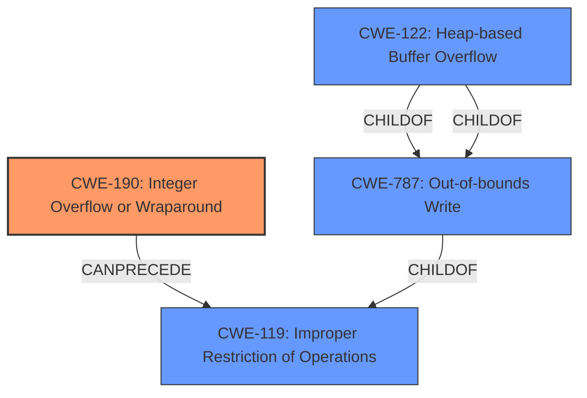

# Enhanced Analysis for CVE-2021-3420

# Summary
| CWE ID | CWE Name | Confidence | CWE Abstraction Level | CWE Vulnerability Mapping Label | CWE-Vulnerability Mapping Notes |
|---|---|---|---|---|---|
| CWE-190 | Integer Overflow or Wraparound | 1.0 | Base | Allowed | Primary CWE |
| CWE-122 | Heap-based Buffer Overflow | 0.8 | Variant | Allowed | Secondary Candidate |

## Evidence and Confidence

*   **Confidence Score:** 0.9
*   **Evidence Strength:** HIGH

## Relationship Analysis
The primary weakness is **CWE-190 (Integer Overflow or Wraparound)**, which can **CanPrecede** **CWE-119 (Improper Restriction of Operations within the Bounds of a Memory Buffer)** and subsequently lead to **CWE-122 (Heap-based Buffer Overflow)**. **CWE-190** is a base level weakness, providing a good balance of specificity and generality for this vulnerability. The child-parent relationship clarifies how an integer overflow can lead to memory corruption issues. The chain helps to explain how the integer overflow can cause a heap-based buffer overflow.



## Vulnerability Chain
The vulnerability chain starts with **improper overflow validation** leading to an **integer overflow (CWE-190)**, which results in the allocation of a small buffer, and ultimately leads to a **heap-based buffer overflow (CWE-122)**.

## Summary of Analysis
The initial assessment identified **CWE-190 (Integer Overflow or Wraparound)** as the primary root cause, supported by the description stating "**Improper overflow validation** in the memory allocation functions ... could cause an **integer overflow**, leading to an allocation of a small buffer and then to a heap-based buffer overflow." The **Vulnerability Description Key Phrases** also highlight "**weakness: integer overflow**" and "**impact: heap-based buffer overflow**".

The **CVE Reference Links Content Summary** reinforces this assessment:
"**Weaknesses**: ['Integer Overflow', 'Heap-based buffer overflow']"
"**Impact**: Heap-based buffer overflow due to small buffer allocation after integer overflow."

Based on this evidence, **CWE-190 (Integer Overflow or Wraparound)** is the most appropriate primary CWE. The follow-on impact of **CWE-122 (Heap-based Buffer Overflow)** is also included, but it is secondary to the root cause.

Other CWEs considered but not used:
*   CWE-120: Buffer Copy without Checking Size of Input ('Classic Buffer Overflow') - While a buffer overflow is the end result, the root cause is the integer overflow, not a missing size check during a buffer copy. Therefore, CWE-120 is less appropriate.
*   CWE-197: Numeric Truncation Error - There's no explicit mention of truncation in the description.
*   CWE-1284: Improper Validation of Specified Quantity in Input - While **improper overflow validation** is mentioned, the direct result is an integer overflow. This CWE is too general.
*   CWE-195: Signed to Unsigned Conversion Error - No mention of signed/unsigned conversion issues.
*   CWE-128: Wrap-around Error - Very similar to CWE-190, but CWE-190 is more specific and commonly used.
*   CWE-839: Numeric Range Comparison Without Minimum Check - The description doesn't mention missing minimum value checks.
*   CWE-193: Off-by-one Error - Not applicable as the issue is not related to off-by-one errors.
*   CWE-125: Out-of-bounds Read - The issue is about an out-of-bounds *write*, not read.

The selected CWEs are at the optimal level of specificity because **CWE-190 (Integer Overflow or Wraparound)** accurately describes the **weakness** and root cause, and **CWE-122 (Heap-based Buffer Overflow)** describes the impact of this overflow.


## CWE Relationship Analysis

Current CWEs represent these abstraction levels: .


### Vulnerability Chain Analysis

**Chain starting from CWE-787:**
- 787 (Out-of-bounds Write) - ROOT


**Chain starting from CWE-839:**
- 839 (Numeric Range Comparison Without Minimum Check) - ROOT


### CWE Relationship Diagram

```mermaid
graph TD
    classDef primary fill:#f96,stroke:#333,stroke-width:2px
    classDef secondary fill:#69f,stroke:#333
    classDef tertiary fill:#9e9,stroke:#333
```