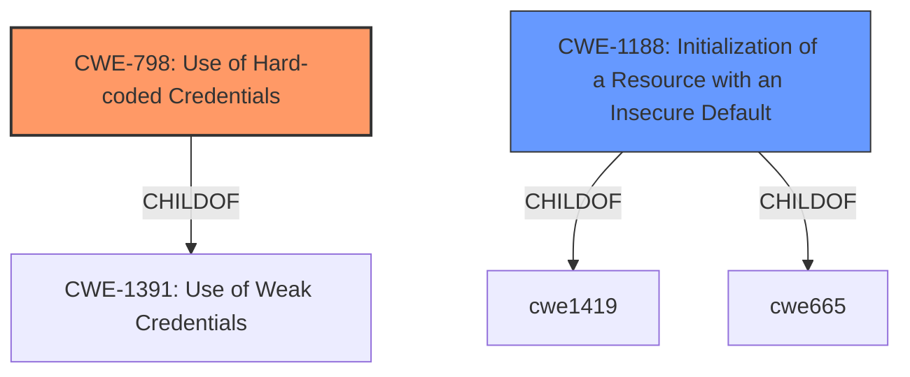

# Raw Analyzer Response for CVE-2021-34203

# Summary
| CWE ID | CWE Name | Confidence | CWE Abstraction Level | CWE Vulnerability Mapping Label | CWE-Vulnerability Mapping Notes |
|---|---|---|---|---|---|
| CWE-798 | Use of Hard-coded Credentials | 0.9 | Base | Allowed | Primary CWE |
| CWE-1188 | Initialization of a Resource with an Insecure Default | 0.7 | Base | Allowed | Secondary CWE |

## Evidence and Confidence

*   **Confidence Score:** 0.8
*   **Evidence Strength:** HIGH

## Relationship Analysis
The primary weakness is the **use of hard-coded credentials** (CWE-798). This is further supported by the related weakness of **initialization of a resource with an insecure default** (CWE-1188), as the Quagga process starts with default credentials that are insecure. CWE-798 is a *ChildOf* CWE-1391 (Use of Weak Credentials), but CWE-798 is more specific.

## Vulnerability Chain
The vulnerability chain starts with the **initialization of the Quagga process with insecure default credentials** (CWE-1188), leading to the **use of hard-coded credentials for authentication** (CWE-798). An attacker can then exploit these credentials to gain unauthorized access, leading to **routing manipulation, traffic monitoring, DNS hijacking, and phishing attacks**.

## Summary of Analysis
The initial assessment identified the primary weakness as the **use of hard-coded credentials** (CWE-798) and a secondary weakness of **initialization of a resource with an insecure default** (CWE-1188). The evidence supports this classification, as the vulnerability description clearly states that the Quagga process starts with a default password and port, and an attacker can easily log in using telnet.

The evidence supporting CWE-798 is: "Router ac2600 (dir-2640-us), when setting PPPoE, will start quagga process in the way of whole network monitoring, and this function **uses the original default password and port**. An attacker can easily use telnet to log in, modify routing information, monitor the traffic of all devices under the router, hijack DNS and phishing attacks."

The evidence supporting CWE-1188 is: "the Quagga routing process is accessible via telnet using a default username and password that are not changed."

The relationship graph shows that CWE-798 is a child of CWE-1391, and CWE-1188 is a child of CWE-1419 and CWE-665. While CWE-1391 could be considered, CWE-798 is more specific and accurately reflects the vulnerability. Both CWE-798 and CWE-1188 are at the Base level of abstraction, which is the preferred level.

Relevant CWE Information:

# Enhanced Context (25 CWEs)
The following CWEs were identified as potentially relevant to this vulnerability:

## CWE-798: Use of Hard-coded Credentials
**CWE-798 (Use of Hard-coded Credentials)** is the primary CWE because the vulnerability's root cause is the **use of default credentials** for the Quagga process. The "CVE Reference Links Content Summary" states: "**Insecure Default Credentials:** The Quagga routing process is accessible via telnet using a default username and password that are not changed." The description of CWE-798 directly matches this scenario. "The product contains hard-coded credentials, such as a password or cryptographic key." Confidence: 0.9

## CWE-1188: Initialization of a Resource with an Insecure Default
**CWE-1188 (Initialization of a Resource with an Insecure Default)** is a secondary CWE because the Quagga process is initialized with an insecure default password and port. The "CVE Reference Links Content Summary" notes that "The Quagga routing process is accessible via telnet using a default username and password that are not changed." This matches CWE-1188's description: "The product initializes or sets a resource with a default that is intended to be changed by the administrator, but the default is not secure." Confidence: 0.7

## Other CWE Considerations:

*   **CWE-259 (Use of Hard-coded Password)** is a Variant of CWE-798. While technically accurate, CWE-798 is broader and better captures the essence of the vulnerability, as it includes both passwords and cryptographic keys.
*   **CWE-306 (Missing Authentication for Critical Function)** was considered but is not as precise as CWE-798. The problem isn't the *absence* of authentication, but the *presence* of authentication that relies on insecure default credentials.
*   **CWE-78 (Improper Neutralization of Special Elements used in an OS Command ('OS Command Injection'))** and **CWE-77 (Improper Neutralization of Special Elements used in a Command ('Command Injection'))** are not applicable because the vulnerability is not related to command injection.
*   **CWE-184 (Incomplete List of Disallowed Inputs)** is not applicable because the vulnerability is not about an incomplete list of disallowed inputs.
*   **CWE-923 (Improper Restriction of Communication Channel to Intended Endpoints)** is not a good fit, even though the Quagga interface is unnecessarily exposed to the entire network. The core issue is the insecure default credentials, not the improper restriction of the communication channel.
*   **CWE-290 (Authentication Bypass by Spoofing)** is not applicable because the vulnerability does not involve spoofing.