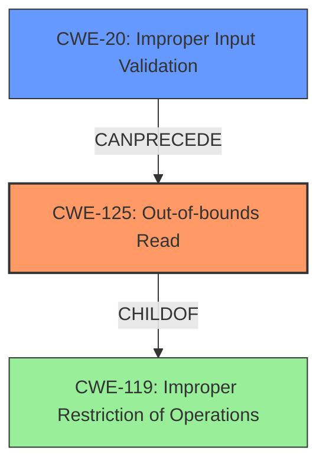

# Analysis for CVE-2021-34302

# Summary
| CWE ID | CWE Name | Confidence | CWE Abstraction Level | CWE Vulnerability Mapping Label | CWE-Vulnerability Mapping Notes |
|---|---|---|---|---|---|
| CWE-125 | Out-of-bounds Read | 1.0 | Base | Allowed | Primary CWE |
| CWE-20 | Improper Input Validation | 0.7 | Class | Discouraged | Secondary Candidate |

## Evidence and Confidence

*   **Confidence Score:** 0.9
*   **Evidence Strength:** HIGH

## Relationship Analysis
The primary relationship is that CWE-125 **Out-of-bounds Read** is often caused by **Improper Input Validation** CWE-20. The **Improper Input Validation** can **precede** the **Out-of-bounds Read**. CWE-125 is a child of CWE-119 **Improper Restriction of Operations within the Bounds of a Memory Buffer**. Choosing CWE-125 provides a more specific, base-level classification than its parent.

## Vulnerability Chain
The vulnerability chain begins with **Improper Input Validation** (CWE-20), which leads to an **Out-of-bounds Read** (CWE-125), and finally results in Information Disclosure.

## Summary of Analysis
The initial assessment indicated that **Improper Input Validation** (CWE-20) leads to an **Out-of-bounds Read** (CWE-125).

The vulnerability description clearly states: "The BMP_Loader.dll library in affected applications **lacks proper validation of user-supplied data** when parsing BMP files. This could result in an **out of bounds read** past the end of an allocated buffer."

The **Vulnerability Description Key Phrases** also confirms this:
- **rootcause:** **lacks proper validation of user-supplied data**
- **weakness:** **out of bounds read**

The CVE Reference Links Content Summary states:
*   The vulnerability lies in the `BMP_Loader.dll` library of Siemens JT2Go and Teamcenter Visualization when parsing BMP files.
*   The root cause is the **lack of proper validation of user-supplied data** within the library.
*   **Out-of-bounds Read:** The **lack of input validation** during BMP file parsing can lead to a read operation past the end of an allocated buffer.

The **Primary CWE Match** from **CWE for similar CVE Descriptions** is CWE-125.

Based on the evidence, selecting CWE-125 as the primary weakness is justified, with CWE-20 representing the root cause.

The graph relationships influenced the selection by illustrating how **Improper Input Validation** can **precede** an **Out-of-bounds Read**.

CWE-125 is at the optimal level of specificity (Base), accurately representing the vulnerability as an out-of-bounds read. While CWE-20 is also relevant as the cause, it's a more general class.

Relevant CWE Information:

# Enhanced Context (25 CWEs)
The following CWEs were identified as potentially relevant to this vulnerability:

## CWE-404: Improper Resource Shutdown or Release
**Abstraction Level**: Class
**Similarity Score**: 0.78
**Source**: dense

**Description**:
The product does not release or incorrectly releases a resource before it is made available for re-use.

**Mapping Guidance**:
- Usage: Allowed-with-Review
- Rationale: This CWE entry is a Class and might have Base-level children that would be more appropriate

*This CWE was considered but is not applicable because the vulnerability is specifically related to an out-of-bounds read due to a lack of input validation, not resource management.*

## CWE-789: Memory Allocation with Excessive Size Value
**Abstraction Level**: Variant
**Similarity Score**: 0.77
**Source**: dense

**Description**:
The product allocates memory based on an untrusted, large size value, but it does not ensure that the size is within expected limits, allowing arbitrary amounts of memory to be allocated.

**Mapping Guidance**:
- Usage: Allowed
- Rationale: This CWE entry is at the Variant level of abstraction, which is a preferred level of abstraction for mapping to the root causes of vulnerabilities.

*This CWE was considered but is not directly applicable because the vulnerability's primary characteristic is an out-of-bounds read, not excessive memory allocation, although the root cause involves **lack of proper validation of user-supplied data**.*

## CWE-131: Incorrect Calculation of Buffer Size
**Abstraction Level**: Base
**Similarity Score**: 0.77
**Source**: dense

**Description**:
The product does not correctly calculate the size to be used when allocating a buffer, which could lead to a buffer overflow.

**Mapping Guidance**:
- Usage: Allowed
- Rationale: This CWE entry is at the Base level of abstraction, which is a preferred level of abstraction for mapping to the root causes of vulnerabilities.

*This CWE was considered but is not the most accurate because the vulnerability is more directly related to reading beyond the bounds of a buffer rather than an incorrect calculation of buffer size, although the **lack of proper validation of user-supplied data** could relate to buffer size.*

## CWE-125: Out-of-bounds Read
**Abstraction Level**: Base
**Similarity Score**: 0.76
**Source**: dense

**Description**:
The product reads data past the end, or before the beginning, of the intended buffer.

**Mapping Guidance**:
- Usage: Allowed
- Rationale: This CWE entry is at the Base level of abstraction, which is a preferred level of abstraction for mapping to the root causes of vulnerabilities.

*This is the selected primary CWE.*

## CWE-226: Sensitive Information in Resource Not Removed Before Reuse
**Abstraction Level**: Base
**Similarity Score**: 0.76
**Source**: dense

**Description**:
The product releases a resource such as memory or a file so that it can be made available for reuse, but it does not clear or "zeroize" the information contained in the resource before the product performs a critical state transition or makes the resource available for reuse by other entities.

**Mapping Guidance**:
- Usage: Allowed
- Rationale: This CWE entry is at the Base level of abstraction, which is a preferred level of abstraction for mapping to the root causes of vulnerabilities.

*This CWE was considered but doesn't apply because the vulnerability involves reading beyond buffer boundaries, not the reuse of uncleared resources.*

## CWE-191: Integer Underflow (Wrap or Wraparound)
**Abstraction Level**: Base
**Similarity Score**: 0.76
**Source**: dense

**Description**:
The product subtracts one value from another, such that the result is less than the minimum allowable integer value, which produces a value that is not equal to the correct result.

**Mapping Guidance**:
- Usage: Allowed
- Rationale: This CWE entry is at the Base level of abstraction, which is a preferred level of abstraction for mapping to the root causes of vulnerabilities.

*This CWE was considered but is not relevant, as the vulnerability is not related to integer underflow.*

## CWE-1289: Improper Validation of Unsafe Equivalence in Input
**Abstraction Level**: Base
**Similarity Score**: 0.76
**Source**: dense

**Description**:
The product receives an input value that is used as a resource identifier or other type of reference, but it does not validate or incorrectly validates that the input is equivalent to a potentially-unsafe value.

**Mapping Guidance**:
- Usage: Allowed
- Rationale: This CWE entry is at the Base level of abstraction, which is a preferred level of abstraction for mapping to the root causes of vulnerabilities.

*This CWE was considered but is not the most precise, as the vulnerability is about **lack of proper validation of user-supplied data**, not specifically unsafe equivalence.*

## CWE-1325: Improperly Controlled Sequential Memory Allocation
**Abstraction Level**: Base
**Similarity Score**: 0.76
**Source**: dense

**Description**:
The product manages a group of objects or resources and performs a separate memory allocation for each object, but it does not properly limit the total amount of memory that is consumed by all of the combined objects.

**Mapping Guidance**:
- Usage: Allowed
- Rationale: This CWE entry is at the Base level of abstraction, which is a preferred level of abstraction for mapping to the root causes of vulnerabilities.

*This CWE was considered but is not the primary weakness because the issue is reading out of bounds due to a **lack of proper validation of user-supplied data** and not the