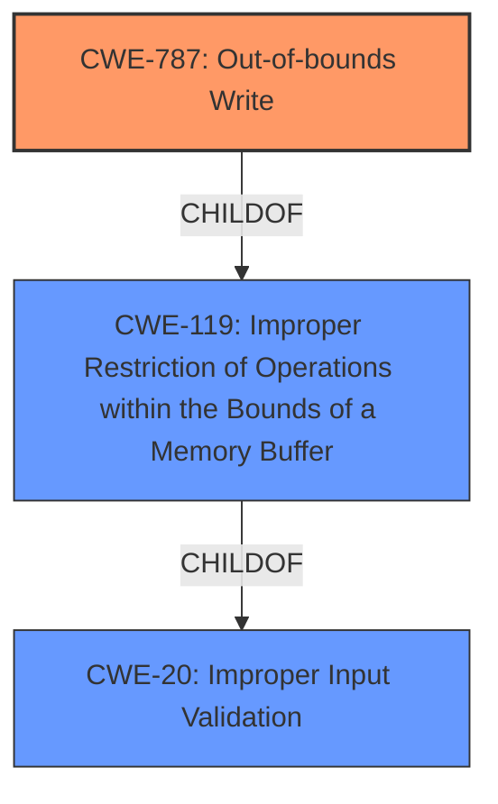

# Analysis for CVE-2021-34306

# Summary
| CWE ID | CWE Name | Confidence | CWE Abstraction Level | CWE Vulnerability Mapping Label | CWE-Vulnerability Mapping Notes |
|---|---|---|---|---|---|
| CWE-787 | Out-of-bounds Write | 1.0 | Base | Allowed | Primary CWE |
| CWE-20 | Improper Input Validation | 0.6 | Class | Discouraged | Secondary Candidate |
| CWE-119 | Improper Restriction of Operations within the Bounds of a Memory Buffer | 0.5 | Class | Discouraged | Secondary Candidate |

## Evidence and Confidence

*   **Confidence Score:** 0.8
*   **Evidence Strength:** HIGH

## Relationship Analysis
The primary relationship influencing the decision is the ChildOf relationship between CWE-787 and CWE-119. CWE-787 (Out-of-bounds Write) is a more specific type of CWE-119 (Improper Restriction of Operations within the Bounds of a Memory Buffer). The vulnerability description indicates a **memory corruption** condition due to a **lack of proper validation of user-supplied data**, which aligns with an out-of-bounds write scenario. While CWE-119 is a parent class, CWE-787 provides a more precise classification. CWE-20 (Improper Input Validation) is a high-level class that indicates the root cause, which allowed memory corruption to occur.

## Vulnerability Chain
The vulnerability chain starts with **improper input validation** (CWE-20), which leads to **memory corruption** through an **out-of-bounds write** (CWE-787). This then enables an attacker to **execute code** in the context of the current process.

## Summary of Analysis
The initial analysis focused on the provided vulnerability description and key phrases, highlighting the root cause as a **lack of proper validation of user-supplied data** and the weakness as **memory corruption**. The retriever results further supported this by listing CWE-787 (Out-of-bounds Write) as the top combined result.

The evidence from the "CVE Reference Links Content Summary" confirms that the `BMP_Loader.dll` library **lacks proper validation of user-supplied data**, leading to a **memory corruption** condition, specifically an "Improper Restriction of Operations within the Bounds of a Memory Buffer".

The hierarchical relationship between CWE-787, CWE-119, and CWE-20 helped refine the selection. While CWE-119 is relevant, CWE-787 provides a more specific and accurate representation of the memory corruption due to the write operation. CWE-20, while important as a root cause, is a class-level CWE and less specific than CWE-787.

The final decision prioritizes CWE-787 as the primary CWE because it directly reflects the **memory corruption** caused by an **out-of-bounds write** due to the **lack of proper input validation**. CWE-20 is a secondary weakness as it represents the root cause of the vulnerability that allowed the memory corruption to occur. CWE-119 represents that memory corruption occurred, but does not specify how.

Relevant CWE Information:

*   **CWE-787: Out-of-bounds Write**
    *   The vulnerability description explicitly mentions "memory corruption," and the "CVE Reference Links Content Summary" provides evidence for "Improper Restriction of Operations within the Bounds of a Memory Buffer", indicating an issue with how memory is being handled while parsing a specially crafted BMP file. This corresponds directly to CWE-787 which describes writing data past the end or before the beginning of the intended buffer, resulting in memory corruption.
    *   The security implication is that an attacker can overwrite critical data, potentially leading to code execution.
    *   CWE-787 is a base-level CWE and a child of CWE-119 (Improper Restriction of Operations within the Bounds of a Memory Buffer).
    *   The MITRE mapping guidance recommends using Base-level CWEs like CWE-787 when possible.
*   **CWE-20: Improper Input Validation**
    *   The vulnerability stems from the library lacking proper validation of user-supplied data when parsing BMP files. The lack of proper input validation directly relates to CWE-20, which describes the product receiving input but not validating that the input has the required properties to process the data safely and correctly.
    *   The security implication is that an attacker can craft malicious BMP files that exploit this lack of validation, leading to memory corruption and code execution.
    *   CWE-20 is a class-level CWE and is discouraged by MITRE when more specific CWEs are available. However, it represents the root cause.
*   **CWE-119: Improper Restriction of Operations within the Bounds of a Memory Buffer**
    *   The "CVE Reference Links Content Summary" mentions "Improper Restriction of Operations within the Bounds of a Memory Buffer" which indicates an issue with how memory is being handled while parsing a specially crafted BMP file.
    *   The security implication is that memory operations are occurring outside the intended buffer, resulting in a crash or code execution.
    *   CWE-119 is a class-level CWE, and the MITRE mapping guidance discourages its use when more specific CWEs like CWE-787 are applicable.

CWEs considered but not used:

*   CWE-120 (Buffer Copy without Checking Size of Input): While a buffer overflow is mentioned, the description doesn't explicitly state that a buffer copy operation is the root cause. The primary issue is the **lack of proper validation**, which could lead to various memory corruption scenarios, not just buffer copies.
*   CWE-789 (Memory Allocation with Excessive Size Value): The description does not mention any allocation with excessive size, just that there is a **lack of proper validation of user-supplied data**, which can then cause memory corruption.
*   CWE-131 (Incorrect Calculation of Buffer Size): The description focuses on a general **lack of validation** rather than specifically mentioning an incorrect calculation of buffer size.
*   CWE-125 (Out-of-bounds Read): The vulnerability description mentions memory corruption but doesn't specify whether it is due to a read or a write. Since the vulnerability allows arbitrary code execution and it says "Improper Restriction of Operations within the Bounds of a Memory Buffer" the **most likely** is a write.