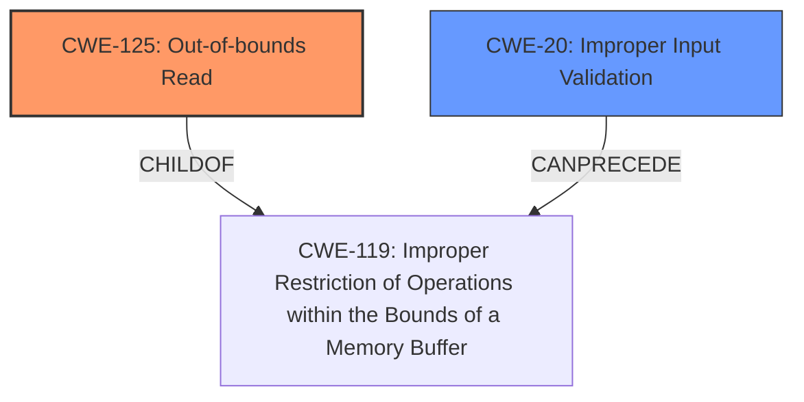

# Raw Analyzer Response for CVE-2021-34307

# Summary
| CWE ID  | CWE Name                                                    | Confidence | CWE Abstraction Level | CWE Vulnerability Mapping Label | CWE-Vulnerability Mapping Notes |
|---------|-------------------------------------------------------------|------------|-----------------------|---------------------------------|-------------------------------|
| CWE-125 | Out-of-bounds Read                                          | 1          | Base                  | Allowed                          | Primary CWE                   |
| CWE-20  | Improper Input Validation                                   | 0.7        | Class                 | Discouraged                      | Secondary Candidate           |

## Evidence and Confidence

*   **Confidence Score:** 0.9
*   **Evidence Strength:** HIGH

## Relationship Analysis
The primary relationship is that **CWE-125 (Out-of-bounds Read)** is a child of **CWE-119 (Improper Restriction of Operations within the Bounds of a Memory Buffer)**. While **CWE-20 (Improper Input Validation)** can precede several buffer-related issues, including **CWE-119 (Improper Restriction of Operations within the Bounds of a Memory Buffer)**, the description focuses on the **lack of validation** as the root cause and the resulting **out-of-bounds read** as the direct consequence. Therefore, **CWE-125 (Out-of-bounds Read)** is the more specific and accurate classification.

## Vulnerability Chain
The vulnerability chain starts with the **lack of proper validation of user-supplied data** (the root cause), leading to an **out-of-bounds read** (the weakness), and ultimately resulting in potential information leakage (the impact).

## Summary of Analysis
The initial assessment, supported by the vulnerability description and CVE details, strongly indicates **CWE-125 (Out-of-bounds Read)** as the primary weakness. The description explicitly states that the **lack of proper validation** when parsing TIFF files results in an **out-of-bounds read**. This aligns perfectly with the definition of **CWE-125 (Out-of-bounds Read)**, which involves reading data past the end or before the beginning of the intended buffer.

The CVE Reference Links Content Summary reinforces this by stating: "The Tiff_Loader.dll library **lacks proper validation of user-supplied data** when parsing TIFF files" which leads to "Out-of-bounds Read".

While **CWE-20 (Improper Input Validation)** is a contributing factor, it is a more general classification. The vulnerability description directly points to the **out-of-bounds read** as the immediate consequence of the **lack of validation**. Therefore, **CWE-125 (Out-of-bounds Read)** is the more specific and appropriate choice.

The selection is based on concrete evidence from the vulnerability description, aligning with the principle of choosing the most specific CWE that accurately represents the weakness. The relationship analysis also supports this decision, as **CWE-125 (Out-of-bounds Read)** is a direct consequence of the **improper input validation** in this specific context.

Relevant CWE Information:

# Enhanced Context (25 CWEs)

## CWE-404: Improper Resource Shutdown or Release
**Abstraction Level**: Class
**Similarity Score**: 0.78
**Source**: dense

**Description**:
The product does not release or incorrectly releases a resource before it is made available for re-use.

**Mapping Guidance**:
- Usage: Allowed-with-Review
- Rationale: This CWE entry is a Class and might have Base-level children that would be more appropriate

*Not Selected:* This CWE is about resource management, which is not directly related to the described vulnerability.

## CWE-789: Memory Allocation with Excessive Size Value
**Abstraction Level**: Variant
**Similarity Score**: 0.78
**Source**: dense

**Description**:
The product allocates memory based on an untrusted, large size value, but it does not ensure that the size is within expected limits, allowing arbitrary amounts of memory to be allocated.

**Mapping Guidance**:
- Usage: Allowed
- Rationale: This CWE entry is at the Variant level of abstraction, which is a preferred level of abstraction for mapping to the root causes of vulnerabilities.

*Not Selected:* While memory allocation could be indirectly involved, the core issue is the **lack of validation** leading to an **out-of-bounds read**, not necessarily the excessive size value itself.

## CWE-131: Incorrect Calculation of Buffer Size
**Abstraction Level**: Base
**Similarity Score**: 0.77
**Source**: dense

**Description**:
The product does not correctly calculate the size to be used when allocating a buffer, which could lead to a buffer overflow.

**Mapping Guidance**:
- Usage: Allowed
- Rationale: This CWE entry is at the Base level of abstraction, which is a preferred level of abstraction for mapping to the root causes of vulnerabilities.

*Not Selected:* The description mentions an **out-of-bounds read**, not a buffer overflow caused by an incorrect buffer size calculation.

## CWE-125: Out-of-bounds Read
**Abstraction Level**: Base
**Similarity Score**: 0.76
**Source**: dense

**Description**:
The product reads data past the end, or before the beginning, of the intended buffer.

**Mapping Guidance**:
- Usage: Allowed
- Rationale: This CWE entry is at the Base level of abstraction, which is a preferred level of abstraction for mapping to the root causes of vulnerabilities.

*Selected as Primary:* The description explicitly states that the **lack of proper validation** when parsing TIFF files results in an **out-of-bounds read**.

## CWE-226: Sensitive Information in Resource Not Removed Before Reuse
**Abstraction Level**: Base
**Similarity Score**: 0.76
**Source**: dense

**Description**:
The product releases a resource such as memory or a file so that it can be made available for reuse, but it does not clear or "zeroize" the information contained in the resource before the product performs a critical state transition or makes the resource available for reuse by other entities.

**Mapping Guidance**:
- Usage: Allowed
- Rationale: This CWE entry is at the Base level of abstraction, which is a preferred level of abstraction for mapping to the root causes of vulnerabilities.

*Not Selected:* This CWE relates to sensitive information not being cleared before reuse, which is not the focus of the described vulnerability.

## CWE-191: Integer Underflow (Wrap or Wraparound)
**Abstraction Level**: Base
**Similarity Score**: 0.76
**Source**: dense

**Description**:
The product subtracts one value from another, such that the result is less than the minimum allowable integer value, which produces a value that is not equal to the correct result.

**Mapping Guidance**:
- Usage: Allowed
- Rationale: This CWE entry is at the Base level of abstraction, which is a preferred level of abstraction for mapping to the root causes of vulnerabilities.

*Not Selected:* Integer underflow is not mentioned or implied in the vulnerability description.

## CWE-1325: Improperly Controlled Sequential Memory Allocation
**Abstraction Level**: Base
**Similarity Score**: 0.76
**Source**: dense

**Description**:
The product manages a group of objects or resources and performs a separate memory allocation for each object, but it does not properly limit the total amount of memory that is consumed by all of the combined objects.

**Mapping Guidance**:
- Usage: Allowed
- Rationale: This CWE entry is at the Base level of abstraction, which is a preferred level of abstraction for mapping to the root causes of vulnerabilities.

*Not Selected:* The vulnerability is related to a single **out-of-bounds read**, not the management of multiple memory allocations.

## CWE-129: Improper Validation of Array Index
**Abstraction Level**: Variant
**Similarity Score**: 0.75
**Source**: dense

**Description**:
The product uses untrusted input when calculating or using an array index, but the product does not validate or incorrectly validates the index to ensure the index references a valid position within the array.

**Mapping Guidance**:
- Usage: Allowed
- Rationale: This CWE entry is at the Variant level of abstraction, which is a preferred level of abstraction for mapping to the root causes of vulnerabilities.

*Not Selected:* While an array index could be involved, the description focuses on the general **lack of proper validation**, not specifically the array index.

## CWE-1289: Improper Validation of Unsafe Equivalence in Input
**Abstraction Level**: Base
**Similarity Score**: 0.75
**Source**: dense

**Description**:
The product receives an input value that is