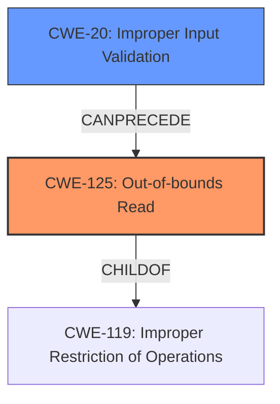

# Analysis for CVE-2021-34308

# Summary
| CWE ID | CWE Name | Confidence | CWE Abstraction Level | CWE Vulnerability Mapping Label | CWE-Vulnerability Mapping Notes |
|---|---|---|---|---|---|
| CWE-125 | Out-of-bounds Read | 1.0 | Base | Allowed | Primary CWE |
| CWE-20 | Improper Input Validation | 0.7 | Class | Discouraged | Secondary CWE |

## Evidence and Confidence

*   **Confidence Score:** 0.9
*   **Evidence Strength:** HIGH

## Relationship Analysis
The primary weakness is CWE-125, which is a base-level CWE that describes the out-of-bounds read vulnerability. It's a child of CWE-119, representing improper restriction of operations within memory buffer. The vulnerability also stems from CWE-20, which is a class-level CWE that describes the lack of proper input validation. This is a more general CWE, but it contributes to the vulnerability. The relationship between CWE-20 and CWE-125 is that improper input validation (CWE-20) can lead to an out-of-bounds read (CWE-125).

## Vulnerability Chain
The vulnerability chain starts with the **lack of proper validation of user-supplied data** (CWE-20), which leads to an **out-of-bounds read** (CWE-125), ultimately resulting in information disclosure.

## Summary of Analysis
The analysis indicates that the primary weakness is an out-of-bounds read (CWE-125) caused by a lack of proper validation of user-supplied data (CWE-20). The evidence for this is strong, as the vulnerability description explicitly mentions both the **lack of proper validation** and the **out-of-bounds read**. The "CVE Reference Links Content Summary" further reinforces this by stating that "The vulnerability stems from a **lack of proper validation of user-supplied data** when parsing BMP files within the `BMP_Loader.dll` library" and that this leads to an "**Out-of-bounds read**: The **lack of proper validation** can lead to a read operation that goes past the end of an allocated buffer."

CWE-125 is selected as the primary CWE because it directly describes the technical weakness. CWE-20 is included as a secondary CWE because it represents the root cause.

The retriever results also support this conclusion, with CWE-125 and CWE-20 being highly ranked. While CWE-787 (Out-of-bounds Write) is also highly ranked, the vulnerability description specifically mentions an "out of bounds read," making CWE-125 a more accurate fit.

The selected CWEs are at the optimal level of specificity. CWE-125 is a base-level CWE, which is preferred, and it accurately describes the vulnerability. CWE-20 is a class-level CWE, but it's included to capture the root cause of the vulnerability.

Relevant CWE Information:

# Enhanced Context (25 CWEs)

## CWE-404: Improper Resource Shutdown or Release
**Abstraction Level**: Class
**Similarity Score**: 0.77
**Source**: dense

**Description**:
The product does not release or incorrectly releases a resource before it is made available for re-use.

**Mapping Guidance**:
- Usage: Allowed-with-Review
- Rationale: This CWE entry is a Class and might have Base-level children that would be more appropriate

*Not Selected*: This CWE is not relevant because the vulnerability is related to improper input validation and out-of-bounds read, not resource management.

## CWE-789: Memory Allocation with Excessive Size Value
**Abstraction Level**: Variant
**Similarity Score**: 0.77
**Source**: dense

**Description**:
The product allocates memory based on an untrusted, large size value, but it does not ensure that the size is within expected limits, allowing arbitrary amounts of memory to be allocated.

**Mapping Guidance**:
- Usage: Allowed
- Rationale: This CWE entry is at the Variant level of abstraction, which is a preferred level of abstraction for mapping to the root causes of vulnerabilities.

*Not Selected*: While memory allocation might be involved, the core issue is the **lack of proper validation** leading to an **out-of-bounds read**, not specifically excessive memory allocation.

## CWE-131: Incorrect Calculation of Buffer Size
**Abstraction Level**: Base
**Similarity Score**: 0.77
**Source**: dense

**Description**:
The product does not correctly calculate the size to be used when allocating a buffer, which could lead to a buffer overflow.

**Mapping Guidance**:
- Usage: Allowed
- Rationale: This CWE entry is at the Base level of abstraction, which is a preferred level of abstraction for mapping to the root causes of vulnerabilities.

*Not Selected*: While an incorrect buffer size calculation could contribute to the vulnerability, the primary issue is the **lack of validation** of user-supplied data. This could then trigger an incorrect buffer size, but it isn't the root cause.

## CWE-226: Sensitive Information in Resource Not Removed Before Reuse
**Abstraction Level**: Base
**Similarity Score**: 0.76
**Source**: dense

**Description**:
The product releases a resource such as memory or a file so that it can be made available for reuse, but it does not clear or "zeroize" the information contained in the resource before the product performs a critical state transition or makes the resource available for reuse by other entities.

**Mapping Guidance**:
- Usage: Allowed
- Rationale: This CWE entry is at the Base level of abstraction, which is a preferred level of abstraction for mapping to the root causes of vulnerabilities.

*Not Selected*: This CWE is not relevant because the vulnerability is not related to the reuse of resources.

## CWE-1325: Improperly Controlled Sequential Memory Allocation
**Abstraction Level**: Base
**Similarity Score**: 0.76
**Source**: dense

**Description**:
The product manages a group of objects or resources and performs a separate memory allocation for each object, but it does not properly limit the total amount of memory that is consumed by all of the combined objects.

**Mapping Guidance**:
- Usage: Allowed
- Rationale: This CWE entry is at the Base level of abstraction, which is a preferred level of abstraction for mapping to the root causes of vulnerabilities.

*Not Selected*: This CWE is not relevant because the vulnerability is not related to sequential memory allocation.

## CWE-191: Integer Underflow (Wrap or Wraparound)
**Abstraction Level**: Base
**Similarity Score**: 0.76
**Source**: dense

**Description**:
The product subtracts one value from another, such that the result is less than the minimum allowable integer value, which produces a value that is not equal to the correct result.

**Mapping Guidance**:
- Usage: Allowed
- Rationale: This CWE entry is at the Base level of abstraction, which is a preferred level of abstraction for mapping to the root causes of vulnerabilities.

*Not Selected*: This CWE is not relevant because the vulnerability is not related to integer underflow.

## CWE-1289: Improper Validation of Unsafe Equivalence in Input
**Abstraction Level**: Base
**Similarity Score**: 0.75
**Source**: dense

**Description**:
The product receives an input value that is used as a resource identifier or other type of reference, but it does not validate or incorrectly validates that the input is equivalent to a potentially-unsafe value.

**Mapping Guidance**:
- Usage: Allowed
- Rationale: This CWE entry is at the Base level of abstraction, which is a preferred level of abstraction for mapping to the root causes of vulnerabilities.

*Not Selected*: While related to input validation, this is too specific. The vulnerability is caused by a general **lack of proper validation**, not specifically the validation of unsafe equivalence.

## CWE-667: Improper Locking
**Abstraction Level**: Class
**Similarity Score**: 0.75
**Source**: dense

**Description**:
The product does not properly acquire or release a lock on a resource, leading to unexpected resource state changes and behaviors.

**Mapping Guidance**:
- Usage: Allowed-with-Review
- Rationale: This CWE entry is a Class and might have Base-level children that would be more appropriate

*Not Selected*: This CWE is not relevant because the vulnerability is not related to locking mechanisms.

## CWE-252: Unchecked Return Value
**Abstraction Level**: Base
**Similarity Score**: 0.75
**Source**: dense

**Description**:
The product does not check the return value from a method or function, which can prevent it from detecting unexpected states and conditions.

**Mapping Guidance**:
- Usage