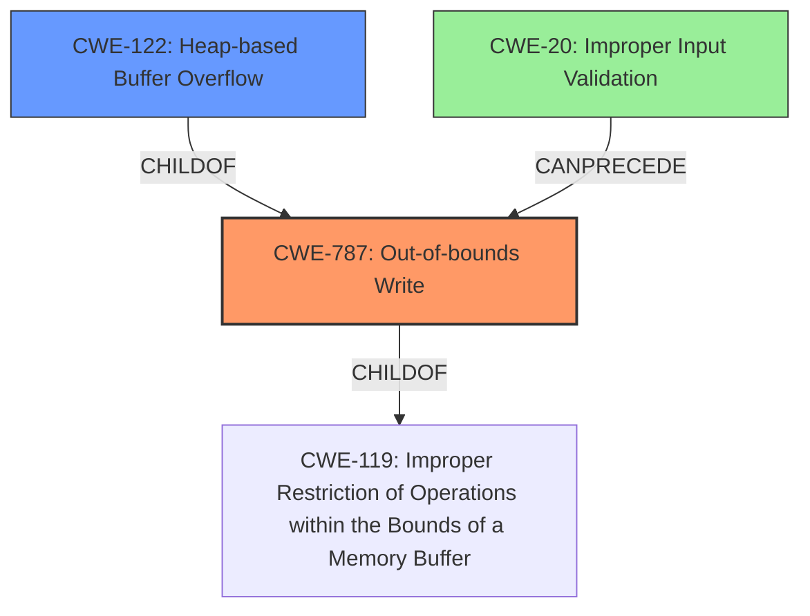

# Analysis Report for CVE-2021-34317

# Vulnerability Analysis Report: CVE-2021-34317

## Description


## Analysis (with Relationship Data)

# Summary
| CWE ID  | CWE Name                      | Confidence | CWE Abstraction Level | CWE Vulnerability Mapping Label | CWE-Vulnerability Mapping Notes |
| :-------- | :---------------------------- | :--------- | :---------------------- | :------------------------------ | :------------------------------ |
| CWE-787 | Out-of-bounds Write           | 1.0        | Base                    | Primary CWE                     | Allowed                       |
| CWE-122 | Heap-based Buffer Overflow | 0.8        | Variant                 | Secondary CWE                   | Allowed                       |
| CWE-20 | Improper Input Validation           | 0.6        | Class                 | Secondary CWE                   | Discouraged                       |

## Evidence and Confidence

*   **Confidence Score:** 0.9
*   **Evidence Strength:** HIGH

## Relationship Analysis
The primary CWE is CWE-787, which is a base-level CWE and a child of CWE-119 (Improper Restriction of Operations within the Bounds of a Memory Buffer). CWE-122 (Heap-based Buffer Overflow) is a variant of CWE-787, providing more specific information about the location of the buffer. CWE-20 is a class-level CWE indicating improper input validation, which can often lead to buffer overflows, but is too general here, given the evidence supports CWE-787 as the direct cause.



## Vulnerability Chain
The vulnerability chain starts with **improper validation of user-supplied data** when parsing PCX files. This leads to an **out-of-bounds write** to a fixed-length heap-based buffer, and ultimately could result in code execution.

## Summary of Analysis
The initial assessment focused on identifying the **root cause** and **weakness** described in the vulnerability. The description clearly states that the `BMP_loader.dll` library **lacks proper validation of user-supplied data** when parsing PCX files, leading to an **out of bounds write past the fixed-length heap-based buffer**.

The "CWE for similar CVE Descriptions" section listed CWE-787 as the primary match, which aligns well with the described **out-of-bounds write**. The CVE Reference Links Content Summary further reinforces this by mentioning a heap-based buffer overflow due to the software not checking the size of the user-supplied data before writing to a heap buffer.

The Retriever Results also listed CWE-787 and CWE-122, both strong candidates. CWE-787 is chosen as the primary because the vulnerability description and content summary explicitly describe an **out-of-bounds write**, making it the most direct and accurate representation of the weakness. CWE-122 is added as a secondary CWE because the buffer is heap-based, further specifying the location of the overflow.

CWE-20 was considered due to the **lack of proper validation** being a contributing factor, but it is a class-level CWE and less specific than CWE-787. The MITRE mapping guidance discourages using CWE-20 when more specific CWEs are available.

The selected CWEs are at the optimal level of specificity because they accurately describe the vulnerability's **root cause** (**out-of-bounds write** and **heap-based buffer**), while avoiding overly general classifications. The evidence from the vulnerability description, content summary, and retriever results all support this decision.

Relevant CWE Information:

# Enhanced Context (25 CWEs)
The following CWEs were identified as potentially relevant to this vulnerability:

## CWE-787: Out-of-bounds Write
**Abstraction:** Base
**Status:** Draft

### Description
The product writes data past the end, or before the beginning, of the intended buffer.

### Extended Description
Not provided

### Alternative Terms
Memory Corruption: Often used to describe the consequences of writing to memory outside the bounds of a buffer, or to memory that is otherwise invalid.

### Relationships
ChildOf -> CWE-119
ChildOf -> CWE-119
ChildOf -> CWE-119
ChildOf -> CWE-119

### Mapping Guidance
**Usage:** Allowed
**Rationale:** This CWE entry is at the Base level of abstraction, which is a preferred level of abstraction for mapping to the root causes of vulnerabilities.
**Comments:** Carefully read both the name and description to ensure that this mapping is an appropriate fit. Do not try to 'force' a mapping to a lower-level Base/Variant simply to comply with this preferred level of abstraction.
**Reasons:**
- Acceptable-Use

### Observed Examples
- **CVE-2023-1017:** The reference implementation code for a Trusted Platform Module does not implement length checks on data, allowing for an attacker to write 2 bytes past the end of a buffer.
- **CVE-2021-21220:** Chain: insufficient input validation (CWE-20) in browser allows heap corruption (CWE-787), as exploited in the wild per CISA KEV.
- **CVE-2021-28664:** GPU kernel driver allows memory corruption because a user can obtain read/write access to read-only pages, as exploited in the wild per CISA KEV.

## CWE-122: Heap-based Buffer Overflow
**Abstraction:** Variant
**Status:** Draft

### Description
A heap overflow condition is a buffer overflow, where the buffer that can be overwritten is allocated in the heap portion of memory, generally meaning that the buffer was allocated using a routine such as malloc().

### Extended Description
Not provided

### Alternative Terms
None

### Relationships
ChildOf -> CWE-788
ChildOf -> CWE-787

### Mapping Guidance
**Usage:** Allowed
**Rationale:** This CWE entry is at the Variant level of abstraction, which is a preferred level of abstraction for mapping to the root causes of vulnerabilities.
**Comments:** Carefully read both the name and description to ensure that this mapping is an appropriate fit. Do not try to 'force' a mapping to a lower-level Base/Variant simply to comply with this preferred level of abstraction.
**Reasons:**
- Acceptable-Use

### Additional Notes
**[Relationship]** Heap-based buffer overflows are usually just as dangerous as stack-based buffer overflows.

### Observed Examples
- **CVE-2021-43537:** Chain: in a web browser, an unsigned 64-bit integer is forcibly cast to a 32-bit integer (CWE-681) and potentially leading to an integer overflow (CWE-190). If an integer overflow occurs, this can cause heap memory corruption (CWE-122)
- **CVE-2007-4268:** Chain: integer signedness error (CWE-195) passes signed comparison, leading to heap overflow (CWE-122)
- **CVE-2009-2523:** Chain: product does not handle when an input string is not NULL terminated (CWE-170), leading to buffer over-read (CWE-125) or heap-based buffer overflow (CWE-122).

## CWE-20: Improper Input Validation
**Abstraction:** Class
**Status:** Stable

### Description
The product receives input or data, but it does
        not validate or incorrectly validates that the input has the
        properties that are required to process the data safely and
        correctly.

### Extended Description

Input validation is a frequently-used technique for checking potentially dangerous inputs in order to ensure that the inputs are safe for processing within the code, or when communicating with other components. When software does not validate input properly, an attacker is able to craft the input in a form that is not expected by the rest of the application. This will lead to parts of the system receiving unintended input, which may result in altered control flow, arbitrary control of a resource, or arbitrary code execution.

Input validation is not the only technique for processing input, however. Other techniques attempt to transform potentially-dangerous input into something safe, such as filtering (CWE-790) - which attempts to remove dangerous inputs - or encoding/escaping (CWE-116), which attempts to ensure that the input is not misinterpreted when it is included in output to another component. Other techniques exist as well (see CWE-138 for more examples.)

Input validation can be applied to:

  - raw data - strings, numbers, parameters,


## CWE Relationship Analysis

Current CWEs represent these abstraction levels: .


### Vulnerability Chain Analysis

**Chain starting from CWE-787:**
- 787 (Out-of-bounds Write) - ROOT


**Chain starting from CWE-170:**
- 170 (Improper Null Termination) - ROOT


### CWE Relationship Diagram

```mermaid
graph TD
    classDef primary fill:#f96,stroke:#333,stroke-width:2px
    classDef secondary fill:#69f,stroke:#333
    classDef tertiary fill:#9e9,stroke:#333
```


*Report generated on 2025-04-02 16:00:16*
