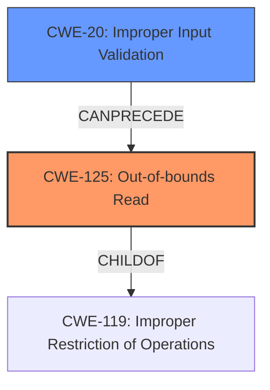

# Analysis Report for CVE-2021-34320

# Vulnerability Analysis Report: CVE-2021-34320

## Description


## Analysis (with Relationship Data)

# Summary
| CWE ID | CWE Name | Confidence | CWE Abstraction Level | CWE Vulnerability Mapping Label | CWE-Vulnerability Mapping Notes |
|---|---|---|---|---|---|
| CWE-125 | Out-of-bounds Read | 1.0 | Base | Allowed | Primary CWE |
| CWE-20 | Improper Input Validation | 0.7 | Class | Discouraged | Secondary Candidate |

## Evidence and Confidence

*   **Confidence Score:** 0.9
*   **Evidence Strength:** HIGH

## Relationship Analysis
The primary CWE is CWE-125 **Out-of-bounds Read**, which is a child of CWE-119 **Improper Restriction of Operations within the Bounds of a Memory Buffer**. The vulnerability description indicates **a lack of proper validation of user-supplied data**, which is a general case of CWE-20 **Improper Input Validation**. However, the specific result of this **lack of validation** is an **out-of-bounds read**. Therefore, CWE-125 is more specific and appropriate. CWE-20 can precede CWE-125, indicating that **improper input validation** can lead to an **out-of-bounds read**.



## Vulnerability Chain
The vulnerability chain starts with **improper input validation** (CWE-20), which leads to an **out-of-bounds read** (CWE-125), resulting in information disclosure.

## Summary of Analysis
The initial analysis identified CWE-125 **Out-of-bounds Read** as the primary candidate based on the **weakness description**. The vulnerability description clearly states that the **lack of proper validation of user-supplied data** when parsing JT files results in an **out-of-bounds read past the end of an allocated buffer**. This aligns perfectly with the description of CWE-125, which states: "The product reads data past the end, or before the beginning, of the intended buffer." The **CVE Reference Links Content Summary** also confirms that the primary vulnerability is an **out-of-bounds read**.

CWE-20 **Improper Input Validation** was considered due to the **root cause** being a **lack of proper validation of user-supplied data**. However, CWE-20 is a class-level CWE and the MITRE mapping guidance discourages its use when more specific CWEs are available. Since the specific consequence of the **improper input validation** is an **out-of-bounds read**, CWE-125 is a more accurate and specific classification.

The selection of CWE-125 is based on the evidence that the software reads past the end of an allocated buffer. The relationship analysis shows that **improper input validation** can lead to an **out-of-bounds read**, but the primary weakness is the **out-of-bounds read** itself. Therefore, CWE-125 is the most appropriate choice. The abstraction level of CWE-125 is Base, which is a preferred level of abstraction for mapping to the root causes of vulnerabilities.

The other CWEs from **Retriever Results** were considered but not used:
- CWE-787 **Out-of-bounds Write** was not selected because the vulnerability is specifically an out-of-bounds *read*, not a write.
- CWE-126 **Buffer Over-read** is a Variant of CWE-125, but the description doesn't provide sufficient information to distinguish between the two. Therefore, the more general CWE-125 is preferred.
- CWE-457 **Use of Uninitialized Variable**, CWE-121 **Stack-based Buffer Overflow**, CWE-170 **Improper Null Termination**, CWE-122 **Heap-based Buffer Overflow**, and CWE-1284 **Improper Validation of Specified Quantity in Input** do not directly align with the vulnerability description.

Relevant CWE Information:

# Enhanced Context (25 CWEs)
The following CWEs were identified as potentially relevant to this vulnerability:

## CWE-131: Incorrect Calculation of Buffer Size
**Abstraction Level**: Base
**Similarity Score**: 0.77
**Source**: dense

**Description**:
The product does not correctly calculate the size to be used when allocating a buffer, which could lead to a buffer overflow.

**Mapping Guidance**:
- Usage: Allowed
- Rationale: This CWE entry is at the Base level of abstraction, which is a preferred level of abstraction for mapping to the root causes of vulnerabilities.


## CWE-805: Buffer Access with Incorrect Length Value
**Abstraction Level**: Base
**Similarity Score**: 0.77
**Source**: dense

**Description**:
The product uses a sequential operation to read or write a buffer, but it uses an incorrect length value that causes it to access memory that is outside of the bounds of the buffer.

**Mapping Guidance**:
- Usage: Allowed
- Rationale: This CWE entry is at the Base level of abstraction, which is a preferred level of abstraction for mapping to the root causes of vulnerabilities.


## CWE-191: Integer Underflow (Wrap or Wraparound)
**Abstraction Level**: Base
**Similarity Score**: 0.76
**Source**: dense

**Description**:
The product subtracts one value from another, such that the result is less than the minimum allowable integer value, which produces a value that is not equal to the correct result.

**Mapping Guidance**:
- Usage: Allowed
- Rationale: This CWE entry is at the Base level of abstraction, which is a preferred level of abstraction for mapping to the root causes of vulnerabilities.


## CWE-125: Out-of-bounds Read
**Abstraction Level**: Base
**Similarity Score**: 0.76
**Source**: dense

**Description**:
The product reads data past the end, or before the beginning, of the intended buffer.

**Mapping Guidance**:
- Usage: Allowed
- Rationale: This CWE entry is at the Base level of abstraction, which is a preferred level of abstraction for mapping to the root causes of vulnerabilities.


## CWE-126: Buffer Over-read
**Abstraction Level**: Variant
**Similarity Score**: 0.76
**Source**: dense

**Description**:
The product reads from a buffer using buffer access mechanisms such as indexes or pointers that reference memory locations after the targeted buffer.

**Mapping Guidance**:
- Usage: Allowed
- Rationale: This CWE entry is at the Variant level of abstraction, which is a preferred level of abstraction for mapping to the root causes of vulnerabilities.


## CWE-119: Improper Restriction of Operations within the Bounds of a Memory Buffer
**Abstraction Level**: Class
**Similarity Score**: 0.75
**Source**: dense

**Description**:
The product performs operations on a memory buffer, but it reads from or writes to a memory location outside the buffer's intended boundary. This may result in read or write operations on unexpected memory locations that could be linked to other variables, data structures, or internal program data.

**Mapping Guidance**:
- Usage: Discouraged
- Rationale: CWE-119 is commonly misused in low-information vulnerability reports when lower-level CWEs could be used instead, or when more details about the vulnerability are available.


## CWE-124: Buffer Underwrite ('Buffer Underflow')
**Abstraction Level**: Base
**Similarity Score**: 0.75
**Source**: dense

**Description**:
The product writes to a buffer using an index or pointer that references a memory location prior to the beginning of the buffer.

**Mapping Guidance**:
- Usage: Allowed
- Rationale: This CWE entry is at the Base level of abstraction, which is a preferred level of abstraction for mapping to the root causes of vulnerabilities.


## CWE-789: Memory Allocation with Excessive Size Value
**Abstraction Level**: Variant
**Similarity Score**: 0.75
**Source**: dense

**Description**:
The product allocates memory based on an untrusted, large size value, but it does not ensure that the size is within expected limits, allowing arbitrary amounts of memory to be allocated.

**Mapping Guidance**:
- Usage: Allowed
- Rationale: This CWE entry is at the Variant level of abstraction, which is a preferred level of abstraction for mapping to the root causes of vulnerabilities.


## CWE-193: Off-by-one Error
**Abstraction Level**: Base
**Similarity Score**: 0.75
**Source**: dense

**Description**:
A product calculates or uses an incorrect maximum or minimum value that is 1 more, or 1 less, than the correct value.

**Mapping Guidance**:
- Usage: Allowed
- Rationale: This CWE entry is at the Base level


## CWE Relationship Analysis

Current CWEs represent these abstraction levels: .


### Vulnerability Chain Analysis

**Chain starting from CWE-787:**
- 787 (Out-of-bounds Write) - ROOT


**Chain starting from CWE-121:**
- 121 (Stack-based Buffer Overflow) - ROOT


### CWE Relationship Diagram

```mermaid
graph TD
    classDef primary fill:#f96,stroke:#333,stroke-width:2px
    classDef secondary fill:#69f,stroke:#333
    classDef tertiary fill:#9e9,stroke:#333
```


*Report generated on 2025-04-02 01:40:34*
