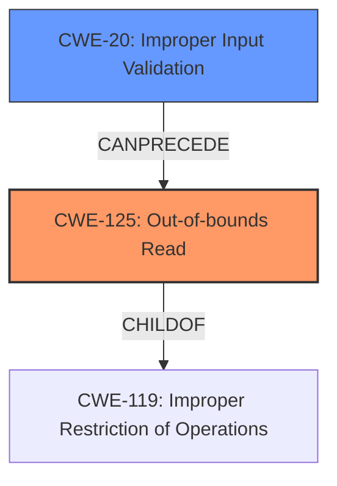

# Raw Analyzer Response for CVE-2021-34322

# Summary
| CWE ID  | CWE Name                                           | Confidence | CWE Abstraction Level | CWE Vulnerability Mapping Label | CWE-Vulnerability Mapping Notes |
| :-------- | :------------------------------------------------- | :---------- | :-------------------- | :------------------------------ | :------------------------------ |
| CWE-125   | Out-of-bounds Read                               | 1.0         | Base                  | Primary                         | Allowed                       |
| CWE-20    | Improper Input Validation                          | 0.7         | Class                 | Secondary                       | Discouraged                    |

## Evidence and Confidence

*   **Confidence Score:** 0.9
*   **Evidence Strength:** HIGH

## Relationship Analysis
The primary CWE is CWE-125, which is a base-level CWE describing an out-of-bounds read. It is related to CWE-119 (Improper Restriction of Operations Within the Bounds of a Memory Buffer), as an out-of-bounds read is a specific type of memory access violation. CWE-20 is related because the root cause is a lack of proper input validation, which could have prevented the out-of-bounds read.

## Vulnerability Chain
The vulnerability chain starts with **improper input validation** (CWE-20) of a J2K file, which then leads to an **out-of-bounds read** (CWE-125) because the user-supplied data is not properly validated before parsing, resulting in potential information disclosure.

## Summary of Analysis
The analysis indicates that the primary weakness is CWE-125 (Out-of-bounds Read), stemming from the **lack of proper validation** of user-supplied data.

The vulnerability description states: "The JPEG2K_Loader.dll library in affected applications **lacks proper validation of user-supplied data when parsing J2K files**. This could result in an out of bounds read past the end of an allocated buffer."

The CVE Reference Links Content Summary states: "The vulnerability stems from a **lack of proper validation of user-supplied data** within the `JPEG2K_Loader.dll` library when parsing J2K files... **Out-of-bounds Read**: The insufficient validation leads to an out-of-bounds read, where the application attempts to access memory beyond the allocated buffer for the J2K file."

The retriever results list CWE-125 as a strong candidate, and it is also the primary CWE match for similar CVE descriptions.

CWE-20 (Improper Input Validation) is considered as a secondary weakness because the **lack of proper validation** is the root cause that allows the out-of-bounds read to occur. However, CWE-20 is a class-level CWE and is discouraged for use when a more specific CWE is available.

The selected CWEs are at the optimal level of specificity because CWE-125 directly describes the out-of-bounds read, and CWE-20 identifies the root cause of the problem.

Relevant CWE Information:

# Enhanced Context (25 CWEs)
The following CWEs were identified as potentially relevant to this vulnerability:

## CWE-789: Memory Allocation with Excessive Size Value
**Abstraction Level**: Variant
**Similarity Score**: 0.77
**Source**: dense

**Description**:
The product allocates memory based on an untrusted, large size value, but it does not ensure that the size is within expected limits, allowing arbitrary amounts of memory to be allocated.

**Mapping Guidance**:
- Usage: Allowed
- Rationale: This CWE entry is at the Variant level of abstraction, which is a preferred level of abstraction for mapping to the root causes of vulnerabilities.

*This CWE was considered but is not the best fit because the vulnerability is not explicitly about memory allocation with an excessive size, but rather about reading beyond the allocated buffer.*

## CWE-404: Improper Resource Shutdown or Release
**Abstraction Level**: Class
**Similarity Score**: 0.77
**Source**: dense

**Description**:
The product does not release or incorrectly releases a resource before it is made available for re-use.

**Mapping Guidance**:
- Usage: Allowed-with-Review
- Rationale: This CWE entry is a Class and might have Base-level children that would be more appropriate

*This CWE was considered but is not the best fit because the vulnerability is not about improper resource shutdown or release.*

## CWE-131: Incorrect Calculation of Buffer Size
**Abstraction Level**: Base
**Similarity Score**: 0.77
**Source**: dense

**Description**:
The product does not correctly calculate the size to be used when allocating a buffer, which could lead to a buffer overflow.

**Mapping Guidance**:
- Usage: Allowed
- Rationale: This CWE entry is at the Base level of abstraction, which is a preferred level of abstraction for mapping to the root causes of vulnerabilities.

*This CWE was considered but is not the best fit because the vulnerability is an out-of-bounds read, not an incorrect buffer size calculation.*

## CWE-125: Out-of-bounds Read
**Abstraction Level**: Base
**Similarity Score**: 0.76
**Source**: dense

**Description**:
The product reads data past the end, or before the beginning, of the intended buffer.

**Mapping Guidance**:
- Usage: Allowed
- Rationale: This CWE entry is at the Base level of abstraction, which is a preferred level of abstraction for mapping to the root causes of vulnerabilities.

*This is the selected primary CWE.*

## CWE-226: Sensitive Information in Resource Not Removed Before Reuse
**Abstraction Level**: Base
**Similarity Score**: 0.76
**Source**: dense

**Description**:
The product releases a resource such as memory or a file so that it can be made available for reuse, but it does not clear or "zeroize" the information contained in the resource before the product performs a critical state transition or makes the resource available for reuse by other entities.

**Mapping Guidance**:
- Usage: Allowed
- Rationale: This CWE entry is at the Base level of abstraction, which is a preferred level of abstraction for mapping to the root causes of vulnerabilities.

*This CWE was considered but is not the best fit because the vulnerability is not about sensitive information in a resource not removed before reuse.*

## CWE-1325: Improperly Controlled Sequential Memory Allocation
**Abstraction Level**: Base
**Similarity Score**: 0.76
**Source**: dense

**Description**:
The product manages a group of objects or resources and performs a separate memory allocation for each object, but it does not properly limit the total amount of memory that is consumed by all of the combined objects.

**Mapping Guidance**:
- Usage: Allowed
- Rationale: This CWE entry is at the Base level of abstraction, which is a preferred level of abstraction for mapping to the root causes of vulnerabilities.

*This CWE was considered but is not the best fit because the vulnerability is not about improperly controlled sequential memory allocation.*

## CWE-191: Integer Underflow (Wrap or Wraparound)
**Abstraction Level**: Base
**Similarity Score**: 0.76
**Source**: dense

**Description**:
The product subtracts one value from another, such that the result is less than the minimum allowable integer value, which produces a value that is not equal to the correct result.

**Mapping Guidance**:
- Usage: Allowed
- Rationale: This CWE entry is at the Base level of abstraction, which is a preferred level of abstraction for mapping to the root causes of vulnerabilities.

*This CWE was considered but is not the best fit because the vulnerability is not related to integer underflow.*

## CWE-1289: Improper Validation of Unsafe Equivalence in Input
**Abstraction Level**: Base
**Similarity Score**: 0.75
**Source**: dense

**Description**:
The product receives an input value that is used as a resource identifier or other type of reference, but it does not validate or incorrectly validates that the input is equivalent to a potentially-unsafe value.

**Mapping Guidance**:
- Usage: Allowed
- Rationale: This CWE entry is at the Base level of abstraction, which is a preferred level of abstraction for mapping to the root causes of vulnerabilities.

*This CWE was considered but is not the best fit because the vulnerability is not about unsafe equivalence in input.*

## CWE-129: Improper Validation of Array Index
**Abstraction Level**: Variant
**Similarity Score**: 0.75
**Source**: dense

**Description**:
The product uses untrusted input when calculating or using an array index, but the product does not validate or incorrectly validates the index to ensure the index references a valid position within the array.

**Mapping Guidance**:
- Usage: Allowed
- Rationale: This CWE entry is at the Variant level of abstraction, which