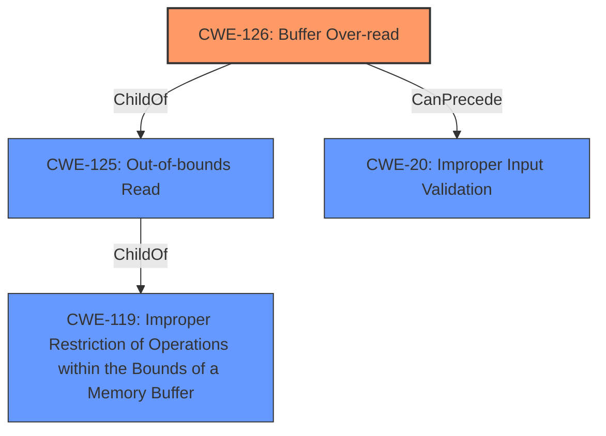

# Enhanced Analysis for CVE-2021-34325

# Summary
| CWE ID | CWE Name | Confidence | CWE Abstraction Level | CWE Vulnerability Mapping Label | CWE-Vulnerability Mapping Notes |
|---|---|---|---|---|---|
| CWE-126 | Buffer Over-read | 1.0 | Variant | Allowed | Primary CWE |
| CWE-20 | Improper Input Validation | 0.7 | Class | Discouraged | Secondary CWE |

## Evidence and Confidence

*   **Confidence Score:** 0.85
*   **Evidence Strength:** HIGH

## Relationship Analysis
The primary CWE is CWE-126, which is a variant of CWE-125 (Out-of-bounds Read). CWE-125 is, in turn, related to CWE-119 (Improper Restriction of Operations within the Bounds of a Memory Buffer). CWE-20, Improper Input Validation, is a class-level CWE, and its use is discouraged when more specific CWEs are available. It can be seen as a broader cause of the buffer over-read.



## Vulnerability Chain
The vulnerability chain starts with **improper validation of user-supplied data**, leading to an **out-of-bounds read**, which results in information disclosure.

## Summary of Analysis
The vulnerability description clearly states that the `Jt981.dll` library **lacks proper validation of user-supplied data when parsing JT files**, which results in an **out of bounds read** past the end of an allocated buffer.

The primary CWE is CWE-126 (Buffer Over-read), as it directly describes the **weakness** where the product reads from a buffer beyond its intended bounds. The "**out of bounds read** past the end of an allocated buffer" aligns perfectly with the description of CWE-126.

CWE-20 (Improper Input Validation) is considered as a secondary CWE because the root cause is **lacks proper validation of user-supplied data**. Although CWE-20 is a plausible cause, the description points to a more specific consequence: an **out-of-bounds read**. Therefore, CWE-126 is more descriptive and closer to the actual vulnerability. The mapping guidance for CWE-20 discourages its use when more specific CWEs are available.

The retriever results also support CWE-125 and CWE-126.

Relevant CWE Information:

# Enhanced Context (25 CWEs)

## CWE-125: Out-of-bounds Read
**Abstraction Level**: Base

**Description**:
The product reads data past the end, or before the beginning, of the intended buffer.

## CWE-126: Buffer Over-read
**Abstraction Level**: Variant

**Description**:
The product reads from a buffer using buffer access mechanisms such as indexes or pointers that reference memory locations after the targeted buffer.

CWE-126 is preferred over CWE-125, because CWE-126 is a variant of CWE-125 and the description matches the vulnerability details.


## CWE Relationship Analysis

Current CWEs represent these abstraction levels: .


### Vulnerability Chain Analysis

**Chain starting from CWE-125:**
- 125 (Out-of-bounds Read) - ROOT


**Chain starting from CWE-126:**
- 126 (Buffer Over-read) - ROOT


### CWE Relationship Diagram

```mermaid
graph TD
    classDef primary fill:#f96,stroke:#333,stroke-width:2px
    classDef secondary fill:#69f,stroke:#333
    classDef tertiary fill:#9e9,stroke:#333
```