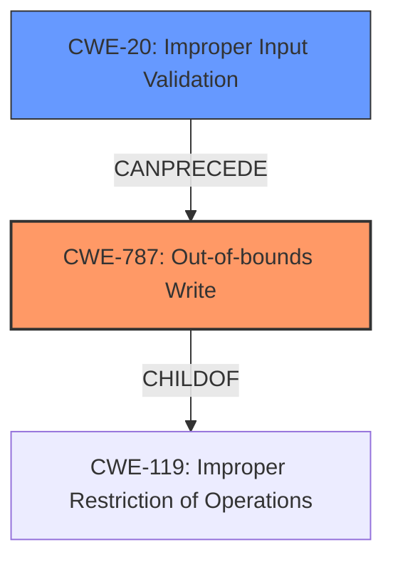

# Analysis Report for CVE-2021-34326

# Vulnerability Analysis Report: CVE-2021-34326

## Description


## Analysis (with Relationship Data)

# Summary
| CWE ID  | CWE Name                        | Confidence | CWE Abstraction Level | CWE Vulnerability Mapping Label | CWE-Vulnerability Mapping Notes |
| :-------- | :------------------------------ | :--------- | :-------------------- | :------------------------------ | :------------------------------ |
| CWE-787 | Out-of-bounds Write             | 1.0        | Base                  | Primary                         | Allowed                         |
| CWE-20  | Improper Input Validation       | 0.7        | Class                 | Secondary                       | Discouraged                     |

## Evidence and Confidence

*   **Confidence Score:** 0.85
*   **Evidence Strength:** HIGH

## Relationship Analysis
The primary relationship is that CWE-787 **Out-of-bounds Write** is a child of CWE-119 **Improper Restriction of Operations within a Memory Buffer**. CWE-20 **Improper Input Validation** can precede CWE-787, as **lack of input validation** can lead to an out-of-bounds write. Given that CWE-787 is a Base level CWE and more accurately describes the vulnerability, it is preferred over the more general CWE-20.



## Vulnerability Chain
The vulnerability chain starts with the **lack of proper validation of user-supplied data**, which leads to an **out-of-bounds write**, and ultimately results in the ability to execute code.

## Summary of Analysis
The initial analysis identified the primary weakness as CWE-787 **Out-of-bounds Write**, which directly corresponds to the vulnerability description. The description explicitly states "**lacks proper validation of user-supplied data** when parsing PAR files. This could result in an **out of bounds write** past the fixed-length heap-based buffer." The CVE Reference Links Content Summary reinforces this by stating, "The vulnerability stems from a **lack of proper validation of user-supplied data** within the `plmxmlAdapterSE70.dll` library when parsing PAR files. Specifically, the length of user-provided data is not checked before being copied into a fixed-size heap-based buffer," confirming that the **root cause** is a **lack of proper validation**, which leads to an **out-of-bounds write**.

The relationship analysis and retriever results further support this selection. CWE-787 is a base-level CWE, providing a more specific description of the vulnerability than its parent, CWE-119.

The mapping guidance for CWE-20 **Improper Input Validation** discourages its use when more specific CWEs are available. In this case, CWE-787 is a more precise classification. While **lack of input validation** is a contributing factor, the core issue is the **out-of-bounds write** itself, making CWE-787 the primary weakness. Therefore, based on the evidence provided, CWE-787 is the most appropriate and specific CWE for this vulnerability.

**CWE Considerations:**

*   **CWE-20 Improper Input Validation:** This CWE was considered because the vulnerability description mentions "**lacks proper validation of user-supplied data**". However, CWE-20 is a class-level CWE and is discouraged when more specific CWEs are available. Since the direct consequence of the **lack of validation** is an **out-of-bounds write**, CWE-787 is a more accurate and specific classification.

*   **CWE-125 Out-of-bounds Read:** This CWE was considered due to its similarity to out-of-bounds write. However, the vulnerability description clearly states that the issue is an **out-of-bounds write**, not a read, making CWE-125 inappropriate.

*   **CWE-122 Heap-based Buffer Overflow:** This CWE was considered because the out-of-bounds write occurs in a heap-based buffer. However, CWE-787 **Out-of-bounds Write** is more general and applicable, as the specific location (heap) is less important than the fact that an out-of-bounds write occurred.

*   **CWE-1284 Improper Validation of Specified Quantity in Input:** This CWE was considered as the **lack of validation** is related to the size of the input. However, it is less descriptive of the actual vulnerability, which is an **out-of-bounds write**. Therefore, it is less preferred than CWE-787.


## CWE Relationship Analysis

Current CWEs represent these abstraction levels: .


### Vulnerability Chain Analysis

**Chain starting from CWE-787:**
- 787 (Out-of-bounds Write) - ROOT


**Chain starting from CWE-122:**
- 122 (Heap-based Buffer Overflow) - ROOT


### CWE Relationship Diagram

```mermaid
graph TD
    classDef primary fill:#f96,stroke:#333,stroke-width:2px
    classDef secondary fill:#69f,stroke:#333
    classDef tertiary fill:#9e9,stroke:#333
```


*Report generated on 2025-04-02 04:24:39*
