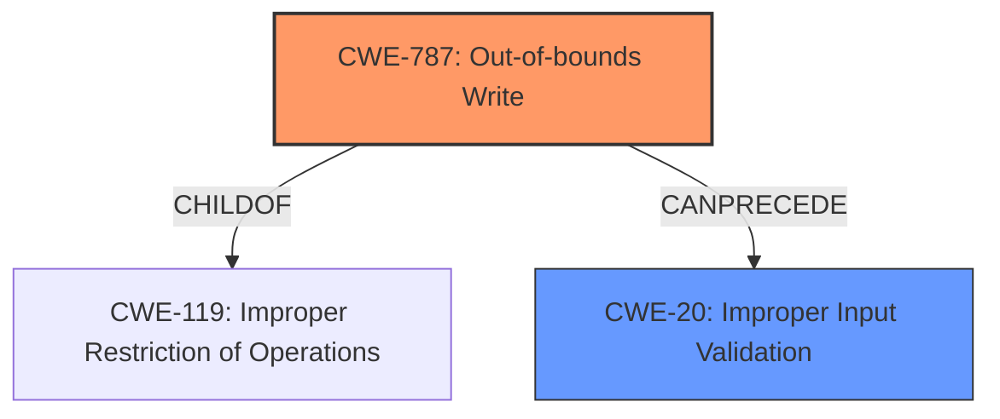

# Raw Analyzer Response for CVE-2021-34327

# Summary
| CWE ID  | CWE Name                                                    | Confidence | CWE Abstraction Level | CWE Vulnerability Mapping Label | CWE-Vulnerability Mapping Notes |
| :-------- | :---------------------------------------------------------- | :--------- | :-------------------- | :------------------------------ | :------------------------------ |
| CWE-787 | Out-of-bounds Write                                         | 1.0        | Base                  | Primary CWE                     | Allowed                       |
| CWE-20  | Improper Input Validation                                   | 0.7        | Class                 | Secondary Candidate             | Discouraged                    |

## Evidence and Confidence

*   **Confidence Score:** 0.85
*   **Evidence Strength:** HIGH

## Relationship Analysis

The primary CWE, CWE-787, is a child of CWE-119 (Improper Restriction of Operations Within the Bounds of a Memory Buffer). This indicates a hierarchical relationship where CWE-787 is a specific type of buffer handling issue. The secondary CWE, CWE-20, represents a broader class of input validation problems. This is a common pattern where missing or improper input validation leads to more specific vulnerabilities like out-of-bounds writes. The abstraction levels influenced the selection: CWE-787 is a Base level, offering more detail than its Class parent, while CWE-20 is a Class level, representing a more general issue.

## Vulnerability Chain

The vulnerability chain starts with the **lack of proper validation of user-supplied data** (CWE-20), which leads to an **out-of-bounds write** (CWE-787). This, in turn, could allow an attacker to **execute code**.

## Summary of Analysis

The initial analysis strongly points to CWE-787 (Out-of-bounds Write) as the primary weakness, supported by the vulnerability description stating an "**out of bounds write** past the fixed-length heap-based buffer." Further evidence is provided by the "CVE Reference Links Content Summary" section, which states: "An out-of-bounds write past the fixed-length heap-based buffer, potentially leading to arbitrary code execution." The "Vulnerability Description Key Phrases" section also indicates a "**weakness:** **out of bounds write**". This evidence directly aligns with CWE-787's description: "The product writes data past the end, or before the beginning, of the intended buffer."

CWE-20 (Improper Input Validation) is considered a secondary weakness. The "Vulnerability Description Key Phrases" section identifies "**rootcause:** **lacks proper validation of user-supplied data**," which is a clear indicator of missing or inadequate input validation. The "CVE Reference Links Content Summary" section supports this by stating: "The plmxmlAdapterSE70.dll library **lacks proper validation of user-supplied data** when parsing ASM files."

The retriever results listed CWE-787 and CWE-20, which supports the selection of these CWEs. The graph relationships also confirm the relationship between CWE-787 and CWE-20.

CWE-787 is selected as the primary CWE because it accurately describes the specific coding error, whereas CWE-20 is the broader cause. Selecting CWE-787 offers a more precise understanding of the vulnerability.

The selected CWEs are at the optimal level of specificity because they directly reflect the **rootcause** and **weakness** outlined in the vulnerability description and supporting evidence.

Relevant CWE Information: