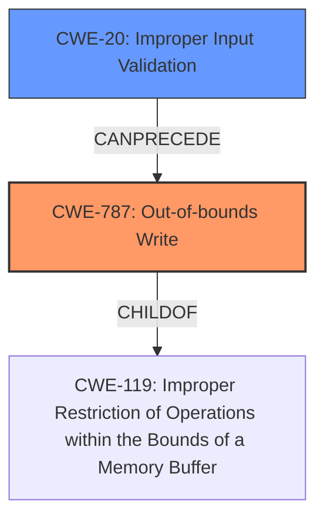

# Analysis for CVE-2021-34328

# Summary
| CWE ID | CWE Name | Confidence | CWE Abstraction Level | CWE Vulnerability Mapping Label | CWE-Vulnerability Mapping Notes |
|---|---|---|---|---|---|
| CWE-787 | Out-of-bounds Write | 1.0 | Base | Allowed | Primary CWE |
| CWE-20 | Improper Input Validation | 0.7 | Class | Discouraged | Secondary Candidate |

## Evidence and Confidence

*   **Confidence Score:** 0.9
*   **Evidence Strength:** HIGH

## Relationship Analysis
The primary CWE is CWE-787 **Out-of-bounds Write**, which is a base level CWE. This CWE is a child of CWE-119 **Improper Restriction of Operations within the Bounds of a Memory Buffer**. The secondary CWE is CWE-20 **Improper Input Validation**, which can lead to other vulnerabilities.

## Vulnerability Chain
The chain of events starts with **improper input validation** (CWE-20), leading to an **out-of-bounds write** (CWE-787), which allows for arbitrary code execution.

## Summary of Analysis
The vulnerability is due to the **lack of proper validation of user-supplied data when parsing PAR files** in the `plmxmlAdapterSE70.dll` library. This leads to an **out-of-bounds write** past the fixed-length heap-based buffer, potentially allowing for arbitrary code execution.

The primary weakness is CWE-787 **Out-of-bounds Write**. The vulnerability description clearly states, "**out of bounds write** past the fixed-length heap-based buffer." This aligns directly with the definition of CWE-787, which involves writing data past the end or before the beginning of the intended buffer. The "CWE for similar CVE Descriptions" section also lists CWE-787 as the primary CWE match and top CWE.

CWE-20 **Improper Input Validation** is considered as a secondary weakness because the **root cause** is the **lack of proper validation of user-supplied data when parsing PAR files**. The "CVE Reference Links Content Summary" states, "The core issue is the lack of proper validation of user-supplied data length before copying it to a fixed-length heap-based buffer." While CWE-20 is a class-level CWE and is generally discouraged, it accurately describes the **root cause** of the vulnerability. The Retriever Results also list CWE-20. The vulnerability chain starts with **improper input validation** which leads to the **out-of-bounds write**.

Other CWEs Considered:

*   CWE-125 **Out-of-bounds Read**: This was considered because it is related to out-of-bounds access, but the vulnerability is specifically about writing out of bounds, not reading.
*   CWE-122 **Heap-based Buffer Overflow**: This was considered since the overflow occurs on the heap. However, CWE-787 is more specific about the nature of the write itself.
*   CWE-121 **Stack-based Buffer Overflow**: This was not considered as the overflow occurs on the heap.
*   CWE-770 **Allocation of Resources Without Limits or Throttling**: This was not considered as the vulnerability is not directly related to resource allocation limits.
*   CWE-1284 **Improper Validation of Specified Quantity in Input**: While related to input validation, it focuses on validating quantities, whereas the core issue is a general lack of validation, making CWE-20 a more fitting secondary weakness.

The selected CWEs are at the optimal level of specificity. CWE-787 is a base-level CWE that precisely describes the out-of-bounds write. CWE-20, while a class, accurately captures the root cause of the vulnerability.