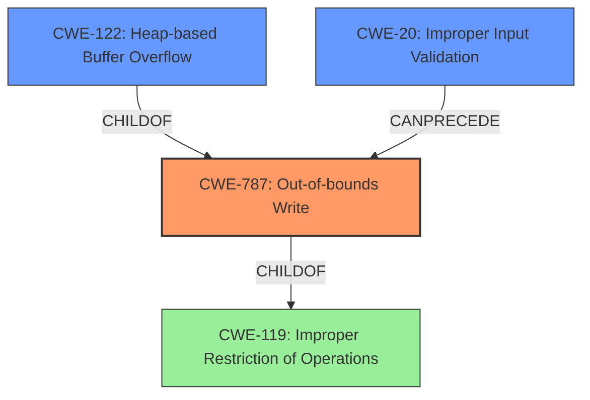

# Analysis for CVE-2021-34329

# Summary
| CWE ID | CWE Name | Confidence | CWE Abstraction Level | CWE Vulnerability Mapping Label | CWE-Vulnerability Mapping Notes |
|---|---|---|---|---|---|
| CWE-787 | Out-of-bounds Write | 1.0 | Base | Primary | Allowed |
| CWE-122 | Heap-based Buffer Overflow | 0.8 | Variant | Secondary | Allowed |
| CWE-20 | Improper Input Validation | 0.6 | Class | Secondary | Discouraged |

## Evidence and Confidence

*   **Confidence Score:** 0.9
*   **Evidence Strength:** HIGH

## Relationship Analysis
The primary CWE is CWE-787, which is a base-level CWE that accurately describes the out-of-bounds write. CWE-122 is a variant of CWE-787, specifying that the overflow occurs on the heap. CWE-20 is a class-level CWE that describes the root cause, which is the lack of proper input validation. While CWE-20 is often misused, it provides context to the root cause of the vulnerability.

## Vulnerability Chain
The vulnerability chain starts with **improper input validation** (CWE-20), which leads to an **out-of-bounds write** (CWE-787), specifically a **heap-based buffer overflow** (CWE-122). This can then lead to arbitrary code execution.

## Summary of Analysis
The initial analysis correctly identified CWE-787 as the primary weakness, which represents the **out-of-bounds write**. The vulnerability description and CVE reference links support this classification. The description explicitly states that the application **lacks proper validation of user-supplied data** and that it leads to an **out of bounds write** past a fixed-length heap-based buffer. The CVE reference link content summary confirms the **root cause** as the **lack of proper validation of user-supplied data** and identifies a **heap-based buffer overflow** as the vulnerability.

The secondary CWE, CWE-122, specifies the location of the buffer overflow on the heap, providing additional context. CWE-20 is included because the root cause is the **lack of proper validation of user-supplied data**.

The CWEs selected are at the optimal level of specificity. CWE-787 is a base-level CWE, and CWE-122 and CWE-20 provide further details on the type of overflow and its root cause, respectively. The evidence from the vulnerability description and CVE reference links strongly supports this classification.