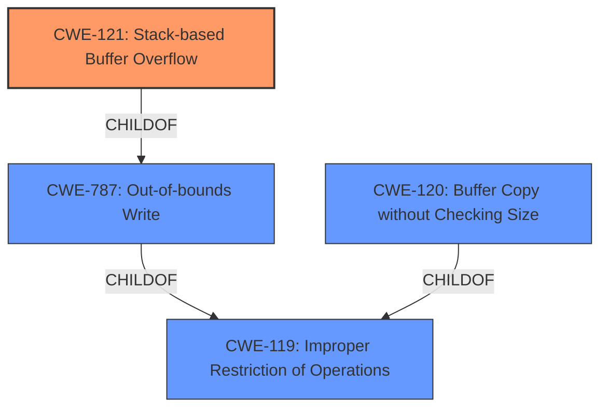

# Raw Analyzer Response for CVE-2021-34344

# Summary
| CWE ID  | CWE Name                                                                                                           | Confidence | CWE Abstraction Level | CWE Vulnerability Mapping Label | CWE-Vulnerability Mapping Notes |
| :-------- | :------------------------------------------------------------------------------------------------------------------- | :--------- | :---------------------- | :------------------------------ | :------------------------------ |
| CWE-121 | Stack-based Buffer Overflow                                                                                          | 0.9        | Variant                 | Primary                         | Allowed                         |
| CWE-119 | Improper Restriction of Operations within the Bounds of a Memory Buffer                                            | 0.7        | Class                   | Secondary                       | Discouraged                     |
| CWE-120 | Buffer Copy without Checking Size of Input ('Classic Buffer Overflow')                                               | 0.6        | Base                    | Secondary                       | Allowed-with-Review             |

## Evidence and Confidence

*   **Confidence Score:** 0.9
*   **Evidence Strength:** HIGH

## Relationship Analysis
The primary CWE is CWE-121, Stack-based Buffer Overflow, which is a variant of CWE-787 (Out-of-bounds Write) and CWE-119 (Improper Restriction of Operations within the Bounds of a Memory Buffer). CWE-120 (Buffer Copy without Checking Size of Input) is also related as a potential cause. The hierarchical relationships support the selection of CWE-121 as it is a more specific variant.

## Vulnerability Chain
The vulnerability chain starts with a **stack buffer overflow** (**CWE-121**). This can be caused by **improper** buffer size validation (**CWE-120**). The exploitation of the buffer overflow allows attackers to **execute arbitrary code**.

## Summary of Analysis
The vulnerability description explicitly mentions a **stack buffer overflow** in QUSBCam2, which allows attackers to **execute arbitrary code**. The key phrase "stack buffer overflow" directly points to **CWE-121 (Stack-based Buffer Overflow)**. This is further supported by the CVE Reference Links Content Summary, which states that the root cause is a **stack buffer overflow**.

The retriever results also list **CWE-121** as a potential match. While CWE-119 (Improper Restriction of Operations within the Bounds of a Memory Buffer) is listed with a higher score, the description clearly indicates a **stack buffer overflow**, making CWE-121 a more specific and appropriate choice. CWE-120 (Buffer Copy without Checking Size of Input) is a possible cause of the overflow.

The selection of CWE-121 is based on the explicit mention of "stack buffer overflow" in the vulnerability description and CVE summary, aligning with the CWE's definition. The mapping guidance for CWE-121 allows its usage and designates it as a Variant level, which is a preferred level of abstraction.

Relevant CWE Information:

# Enhanced Context (25 CWEs)
The following CWEs were identified as potentially relevant to this vulnerability:

## CWE-74: Improper Neutralization of Special Elements in Output Used by a Downstream Component ('Injection')
**Abstraction Level**: Class
**Similarity Score**: 0.76
**Source**: dense
**Description**:
The product constructs all or part of a command, data structure, or record using externally-influenced input from an upstream component, but it does not neutralize or incorrectly neutralizes special elements that could modify how it is parsed or interpreted when it is sent to a downstream component.
**Mapping Guidance**:
- Usage: Discouraged
- Rationale: CWE-74 is high-level and often misused when lower-level weaknesses are more appropriate.

*Not selected because it relates to injection vulnerabilities, not buffer overflows.*

## CWE-345: Insufficient Verification of Data Authenticity
**Abstraction Level**: Class
**Similarity Score**: 0.76
**Source**: dense
**Description**:
The product does not sufficiently verify the origin or authenticity of data, in a way that causes it to accept invalid data.
**Mapping Guidance**:
- Usage: Discouraged
- Rationale: This CWE entry is a level-1 Class (i.e., a child of a Pillar). It might have lower-level children that would be more appropriate

*Not selected because it related to data authenticity issues, not buffer overflows.*

## CWE-41: Improper Resolution of Path Equivalence
**Abstraction Level**: Base
**Similarity Score**: 0.76
**Source**: dense
**Description**:
The product is vulnerable to file system contents disclosure through path equivalence. Path equivalence involves the use of special characters in file and directory names. The associated manipulations are intended to generate multiple names for the same object.
**Mapping Guidance**:
- Usage: Allowed
- Rationale: This CWE entry is at the Base level of abstraction, which is a preferred level of abstraction for mapping to the root causes of vulnerabilities.

*Not selected because it is related to path equivalence issues, not buffer overflows.*

## CWE-1289: Improper Validation of Unsafe Equivalence in Input
**Abstraction Level**: Base
**Similarity Score**: 0.76
**Source**: dense
**Description**:
The product receives an input value that is used as a resource identifier or other type of reference, but it does not validate or incorrectly validates that the input is equivalent to a potentially-unsafe value.
**Mapping Guidance**:
- Usage: Allowed
- Rationale: This CWE entry is at the Base level of abstraction, which is a preferred level of abstraction for mapping to the root causes of vulnerabilities.

*Not selected because it is related to unsafe equivalence in input issues, not buffer overflows.*

## CWE-23: Relative Path Traversal
**Abstraction Level**: Base
**Similarity Score**: 0.75
**Source**: dense
**Description**:
The product uses external input to construct a pathname that should be within a restricted directory, but it does not properly neutralize sequences such as ".." that can resolve to a location that is outside of that directory.
**Mapping Guidance**:
- Usage: Allowed
- Rationale: This CWE entry is at the Base level of abstraction, which is a preferred level of abstraction for mapping to the root causes of vulnerabilities.

*Not selected because it is related to path traversal issues, not buffer overflows.*

## CWE-653: Improper Isolation or Compartmentalization
**Abstraction Level**: Class
**Similarity Score**: 0.75
**Source**: dense
**Description**:
The product does not properly compartmentalize or isolate functionality, processes, or resources that require different privilege levels, rights, or permissions.
**Mapping Guidance**:
- Usage: Allowed
- Rationale: This CWE entry is at the Base level of abstraction, which is a preferred level of abstraction for mapping to the root causes of vulnerabilities.

*Not selected because it is related to isolation issues, not buffer overflows.*

## CWE-668: Exposure of Resource to Wrong Sphere
**Abstraction Level**: Class
**Similarity Score**: 0.75
**Source**: dense
**Description**:
The product exposes a resource to the wrong control sphere, providing unintended actors with inappropriate access to the resource.
**Mapping Guidance**:
- Usage: Discouraged
- Rationale: CWE-668 is high-level and is often misused as a catch-all when lower-level CWE IDs might be applicable. It is sometimes used for low-information vulnerability reports [REF-1287]. It is a level-1 Class (i.e., a child of a Pillar). It is not useful for trend analysis.

*Not selected because it is related to resource exposure issues, not buffer overflows.*

## CWE-73: External Control of File Name or Path
**Abstraction Level**: Base
**Similarity Score**: 0.75
**Source**: dense
**Description**:
The product allows user input to control or influence paths or file names that are used in filesystem operations.
**Mapping Guidance**:
- Usage: Allowed
- Rationale: This CWE entry is at the Base level of abstraction, which is a preferred level of abstraction for mapping to the root causes of vulnerabilities.

*Not selected because it is related to file name or path control issues, not buffer overflows.*

## CWE-138: Improper Neutralization of Special Elements
**Abstraction Level**: Class
**Similarity Score**: 0.74
**Source**: dense
**Description**:
The product receives input from an upstream component, but it does not neutralize or incorrectly neutralizes special elements that could be interpreted as