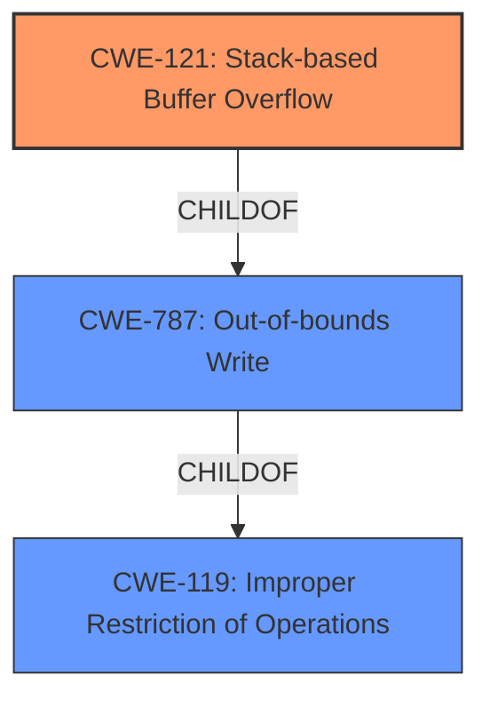

# Analysis Report for CVE-2021-34345

# Vulnerability Analysis Report: CVE-2021-34345

## Description


## Analysis (with Relationship Data)

# Summary
| CWE ID | CWE Name | Confidence | CWE Abstraction Level | CWE Vulnerability Mapping Label | CWE-Vulnerability Mapping Notes |
|---|---|---|---|---|---|
| CWE-121 | Stack-based Buffer Overflow | 1.0 | Variant | Allowed | Primary CWE |
| CWE-787 | Out-of-bounds Write | 0.8 | Base | Allowed | Secondary Candidate |
| CWE-119 | Improper Restriction of Operations within the Bounds of a Memory Buffer | 0.6 | Class | Discouraged | Secondary Candidate |

## Evidence and Confidence

*   **Confidence Score:** 0.9
*   **Evidence Strength:** HIGH

## Relationship Analysis
The primary CWE selected is CWE-121, Stack-based Buffer Overflow, which is a variant of CWE-787, Out-of-bounds Write. CWE-787 itself is a child of the class CWE-119, Improper Restriction of Operations within the Bounds of a Memory Buffer. The relationship indicates a hierarchical structure where the more specific CWE-121 is favored when the buffer is allocated on the stack.



## Vulnerability Chain
The vulnerability chain starts with the **stack buffer overflow** (**WEAKNESS**) which leads to the ability to execute arbitrary code (**IMPACT**). The vulnerability description and the CVE Reference Links Content Summary both confirm the stack-based nature of the overflow.

## Summary of Analysis
The analysis is based on the provided evidence, specifically the vulnerability description stating "A **stack buffer overflow** vulnerability" and the CVE Reference Links Content Summary confirming the root cause as a "stack-based buffer overflow." The primary CWE selected is CWE-121, Stack-based Buffer Overflow, as it is the most specific and accurate representation of the vulnerability. CWE-787 is a reasonable alternative as it represents the out-of-bounds write, but lacks the stack specificity. CWE-119 is a more general classification and is discouraged when more specific CWEs are available.

The selection of CWE-121 is at the optimal level of specificity because the vulnerability is explicitly identified as a stack-based buffer overflow. This is a variant level CWE, which is preferred when it accurately represents the weakness.

Relevant CWE Information:

# Enhanced Context (25 CWEs)
The following CWEs were identified as potentially relevant to this vulnerability:

## CWE-776: Improper Restriction of Recursive Entity References in DTDs ('XML Entity Expansion')
**Abstraction Level**: Base
**Similarity Score**: 0.80
**Source**: dense
Not applicable. This CWE relates to XML entity expansion, which is not relevant to the described vulnerability.

## CWE-611: Improper Restriction of XML External Entity Reference
**Abstraction Level**: Base
**Similarity Score**: 0.75
**Source**: dense
Not applicable. This CWE relates to XML external entity references, which is not relevant to the described vulnerability.

## CWE-131: Incorrect Calculation of Buffer Size
**Abstraction Level**: Base
**Similarity Score**: 0.75
**Source**: dense
Possibly applicable as an underlying cause, but there is no explicit information about incorrect buffer size calculation. It is not the primary weakness.

## CWE-191: Integer Underflow (Wrap or Wraparound)
**Abstraction Level**: Base
**Similarity Score**: 0.75
**Source**: dense
Not applicable. This CWE relates to integer underflow, which is not relevant to the described vulnerability.

## CWE-125: Out-of-bounds Read
**Abstraction Level**: Base
**Similarity Score**: 0.74
**Source**: dense
Not applicable. The vulnerability is an out-of-bounds write, not a read.

## CWE-674: Uncontrolled Recursion
**Abstraction Level**: Class
**Similarity Score**: 0.74
**Source**: dense
Not applicable. This CWE relates to uncontrolled recursion, which is not relevant to the described vulnerability.

## CWE-197: Numeric Truncation Error
**Abstraction Level**: Base
**Similarity Score**: 0.74
**Source**: dense
Not applicable. This CWE relates to numeric truncation, which is not relevant to the described vulnerability.

## CWE-129: Improper Validation of Array Index
**Abstraction Level**: Variant
**Similarity Score**: 0.74
**Source**: dense
Not applicable. This CWE relates to array index validation, which is not relevant to the described vulnerability.

## CWE-789: Memory Allocation with Excessive Size Value
**Abstraction Level**: Variant
**Similarity Score**: 0.73
**Source**: dense
Not applicable. This CWE relates to excessive memory allocation, which is not relevant to the described vulnerability.

## CWE-41: Improper Resolution of Path Equivalence
**Abstraction Level**: Base
**Similarity Score**: 0.73
**Source**: dense
Not applicable. This CWE relates to path equivalence, which is not relevant to the described vulnerability.

## CWE-190: Integer Overflow or Wraparound
**Abstraction Level**: Base
**Similarity Score**: 6927.48
**Source**: sparse
Possibly applicable as an underlying cause, but there is no explicit information about integer overflow. It is not the primary weakness.

## CWE-125: Out-of-bounds Read
**Abstraction Level**: Base
**Similarity Score**: 6429.87
**Source**: sparse
Not applicable. The vulnerability is an out-of-bounds write, not a read.

## CWE-119: Improper Restriction of Operations within the Bounds of a Memory Buffer
**Abstraction Level**: Class
**Similarity Score**: 6270.10
**Source**: sparse
Applicable as a general classification, but less specific than CWE-121 or CWE-787. The mapping guidance discourages its use when more specific CWEs are available.

## CWE-1284: Improper Validation of Specified Quantity in Input
**Abstraction Level**: Base
**Similarity Score**: 6268.41
**Source**: sparse
Possibly applicable as an underlying cause, but there is no explicit information about improper validation of input. It is not the primary weakness.

## CWE-131: Incorrect Calculation of Buffer Size
**Abstraction Level**: Base
**Similarity Score**: 6255.89
**Source**: sparse
Possibly applicable as an underlying cause, but there is no explicit information about incorrect buffer size calculation. It is not the primary weakness.

## CWE-128: Wrap-around Error
**Abstraction Level**: base
**Similarity Score**: 5.03
**Source**: graph
Not applicable. This CWE relates to integer wraparound, which is not relevant to the described vulnerability.

## CWE-190: Integer Overflow or Wraparound
**Abstraction Level**: base
**Similarity Score**: 5.03
**Source**: graph
Possibly applicable as an underlying cause, but there is no explicit information about integer overflow. It is not the primary weakness.

## CWE-120: Buffer Copy without Checking Size of Input ('Classic Buffer Overflow')
**Abstraction Level**: base
**Similarity Score**: 4.82
**Source**: graph
Possibly applicable if a buffer copy operation is involved, but the stack-based nature points more directly to CWE-121.

## CWE-195: Signed to Unsigned Conversion Error
**Abstraction Level**: variant
**Similarity Score**: 4.53
**Source**: graph
Not applicable. This CWE relates to signed to unsigned conversion, which is not relevant to the described vulnerability.

## CWE-123: Write-what-where Condition
**Abstraction Level**: base
**Similarity Score**: 4.33
**Source**: graph
A potential impact, but not the root cause. The root cause is the buffer overflow.

## CWE-681: Incorrect Conversion between Numeric Types
**Abstraction Level**: base
**Similarity Score**: 4.33
**Source**: graph
Not applicable. This CWE relates to incorrect conversion between numeric types, which is not relevant to the described vulnerability.

## CWE-170: Improper Null Termination
**Abstraction Level**: base
**Similarity Score**: 4.33
**Source**: graph
Not applicable. This CWE relates to improper null termination, which is not relevant to the described vulnerability.

## CWE-1284: Improper Validation of Specified Quantity in Input
**Abstraction Level**: base
**Similarity Score**: 4.33
**Source**: graph
Possibly applicable as an underlying cause, but there is no explicit information


## CWE Relationship Analysis

Current CWEs represent these abstraction levels: .


### Vulnerability Chain Analysis

**Chain starting from CWE-787:**
- 787 (Out-of-bounds Write) - ROOT


**Chain starting from CWE-123:**
- 123 (Write-what-where Condition) - ROOT


### CWE Relationship Diagram

```mermaid
graph TD
    classDef primary fill:#f96,stroke:#333,stroke-width:2px
    classDef secondary fill:#69f,stroke:#333
    classDef tertiary fill:#9e9,stroke:#333
```


*Report generated on 2025-04-02 06:03:21*
