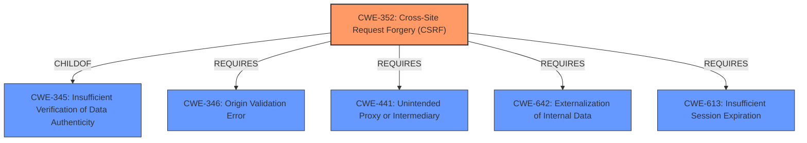

# Analysis for CVE-2021-34360

# Summary
| CWE ID | CWE Name | Confidence | CWE Abstraction Level | CWE Vulnerability Mapping Label | CWE-Vulnerability Mapping Notes |
|---|---|---|---|---|---|
| CWE-352 | Cross-Site Request Forgery (CSRF) | 1.0 | Compound | Allowed | Primary CWE |

## Evidence and Confidence

*   **Confidence Score:** 1.0
*   **Evidence Strength:** HIGH

## Relationship Analysis
The primary relationship influencing the decision is the direct match of the vulnerability to the definition of CWE-352. CWE-352 is a compound weakness describing a specific type of attack, and has child and required relationships to other CWEs that could be relevant in a more detailed analysis.

## Vulnerability Chain
The vulnerability chain starts with the **lack of** proper request verification (**Cross-Site Request Forgery**), leading to the **injection of malicious code**.

## Summary of Analysis
The primary **weakness** identified is **Cross-Site Request Forgery (CSRF)**. The vulnerability description and the CVE reference summary both explicitly state that the vulnerability is a CSRF. The description states, "A **cross-site request forgery** (CSRF) vulnerability has been reported... If exploited, this vulnerability allows remote attackers to inject malicious code." The CVE Reference Links Content Summary says, "**Root cause of vulnerability:** The vulnerability is a Cross-Site Request Forgery (CSRF) vulnerability present in the QNAP Proxy Server application." This evidence makes a clear case for CWE-352. The retriever results also list CWE-352 as the top match.

CWE-352 is a compound CWE, which are "attack-oriented in nature". The MITRE Mapping Guidance says, "Perform root-cause analysis to determine if other weaknesses allow CSRF attacks to occur, and map to those weaknesses." The report provides only the description of the attack.

Other CWEs were considered, particularly those related to path traversal and command injection, but they are not applicable as the primary **weakness** is a **cross-site request forgery**.

Relevant CWE Information:
- CWE-352: Cross-Site Request Forgery (CSRF)
  - Description: "The web application does not, or can not, sufficiently verify whether a well-formed, valid, consistent request was intentionally provided by the user who submitted the request." This aligns directly with the provided description of the vulnerability.
  - Usage: Allowed