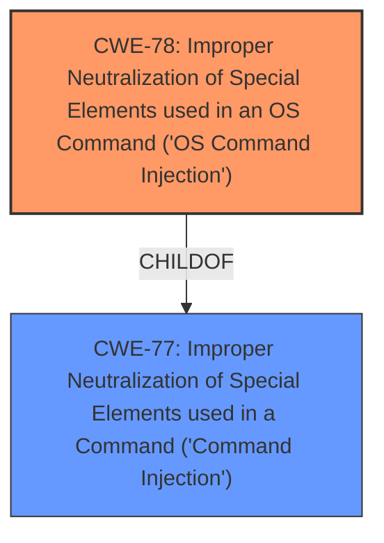

# Analysis for CVE-2021-34362

# Summary
| CWE ID | CWE Name | Confidence | CWE Abstraction Level | CWE Vulnerability Mapping Label | CWE-Vulnerability Mapping Notes |
|---|---|---|---|---|---|
| CWE-78 | Improper Neutralization of Special Elements used in an OS Command ('OS Command Injection') | 1.0 | Base | Allowed | Primary CWE |
| CWE-77 | Improper Neutralization of Special Elements used in a Command ('Command Injection') | 0.7 | Class | Allowed-with-Review | Secondary Candidate |

## Evidence and Confidence

*   **Confidence Score:** 0.9
*   **Evidence Strength:** HIGH

## Relationship Analysis
The primary relationship influencing the CWE selection is the parent-child relationship between CWE-77 and CWE-78. CWE-78 is a more specific Base level CWE that is a child of the Class level CWE-77. Since the vulnerability involves **command injection** in an OS command, CWE-78 is more appropriate.

## Vulnerability Chain
The chain of events for this vulnerability is:
1.  **Root Cause:** **Improper neutralization of special elements** in an OS command (CWE-78).
2.  **Impact:** Remote attackers can execute arbitrary commands on the affected QNAP device.

## Summary of Analysis
The initial assessment identified **command injection** as the root cause, aligning with both CWE-77 and CWE-78. However, CWE-78 is more specific as it explicitly refers to "OS Command Injection," while CWE-77 is a more general "Command Injection" that could apply to other command languages.

The vulnerability description states, "A **command injection** vulnerability has been reported to affect QNAP device running Media Streaming add-on. If exploited, this vulnerability allow remote attackers to run arbitrary commands." The CVE Reference Links Content Summary reinforces this: "Root cause of vulnerability: A **command injection** vulnerability exists in the Media Streaming add-on."

Given that the vulnerability allows remote attackers to execute arbitrary commands on the QNAP device's operating system, CWE-78 is the more precise and appropriate classification. CWE-77 could be considered as a broader category, but CWE-78 provides a more accurate representation of the vulnerability's root cause.

The retriever results also support this decision, listing CWE-77 and CWE-78 as the top candidates.

Relevant CWE Information:

# Enhanced Context (25 CWEs)

## CWE-78: Improper Neutralization of Special Elements used in an OS Command ('OS Command Injection')
**Abstraction:** Base
**Status:** Stable

### Description
The product constructs all or part of an OS command using externally-influenced input from an upstream component, but it does not neutralize or incorrectly neutralizes special elements that could modify the intended OS command when it is sent to a downstream component.

### Extended Description
(Omitted for brevity)

### Alternative Terms
Shell injection
Shell metacharacters
OS Command Injection

### Relationships
ChildOf -> CWE-77
ChildOf -> CWE-74
ChildOf -> CWE-77
ChildOf -> CWE-77
CanAlsoBe -> CWE-88

### Mapping Guidance
**Usage:** Allowed
**Rationale:** This CWE entry is at the Base level of abstraction, which is a preferred level of abstraction for mapping to the root causes of vulnerabilities.

## CWE-77: Improper Neutralization of Special Elements used in a Command ('Command Injection')
**Abstraction:** Class
**Status:** Draft

### Description
The product constructs all or part of a command using externally-influenced input from an upstream component, but it does not neutralize or incorrectly neutralizes special elements that could modify the intended command when it is sent to a downstream component.

### Extended Description
(Omitted for brevity)

### Alternative Terms
Command injection: an attack-oriented phrase for this weakness. Note: often used when "OS command injection" (CWE-78) was intended.

### Relationships
ChildOf -> CWE-74
ChildOf -> CWE-74

### Mapping Guidance
**Usage:** Allowed-with-Review
**Rationale:** CWE-77 is often misused when OS command injection (CWE-78) was intended instead [REF-1287].

**CWE-120**, **CWE-121** are less relevant because the description mentions a **command injection vulnerability**, not a buffer overflow. While buffer overflows could potentially lead to command execution, the primary weakness described is the injection itself.
**CWE-73**, **CWE-22**, **CWE-23** are path traversal related issues, which are not mentioned or implied in the description.
**CWE-306** (Missing Authentication) could be a contributing factor, but the core issue is the improper neutralization of special elements in the command.
**CWE-790** (Improper Filtering of Special Elements) is very similar to CWE-77, however, CWE-77 is more specific in that it results in command injection.