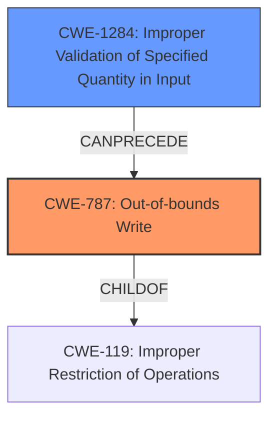

# Enhanced Analysis for CVE-2021-34379

# Summary
| CWE ID  | CWE Name                                                                 | Confidence | CWE Abstraction Level | CWE Vulnerability Mapping Label | CWE-Vulnerability Mapping Notes |
| :-------- | :----------------------------------------------------------------------- | :---------- | :---------------------- | :------------------------------ | :------------------------------ |
| CWE-787 | Out-of-bounds Write                                                    | 0.90         | Base                     | Primary                         | Allowed                       |
| CWE-1284 | Improper Validation of Specified Quantity in Input | 0.70         | Base                     | Secondary                         | Allowed                       |

## Evidence and Confidence

*   **Confidence Score:** 0.80
*   **Evidence Strength:** HIGH

## Relationship Analysis
The primary CWE selected is CWE-787, which is a child of CWE-119 (Improper Restriction of Operations within the Bounds of a Memory Buffer). While CWE-119 is a broader class, CWE-787 provides a more specific description of the vulnerability, focusing on out-of-bounds write. CWE-1284 (Improper Validation of Specified Quantity in Input) can precede the out-of-bounds write, as the **missing bounds checking** leads to the ability to write past the buffer.



## Vulnerability Chain
The vulnerability chain starts with **missing bounds checking** (Improper Validation of Specified Quantity in Input - CWE-1284), leading to an out-of-bounds write (CWE-787), which then results in memory corruption.

## Summary of Analysis
The analysis is primarily based on the provided evidence, specifically the **rootcause** " **missing bounds checking** " and the impact "memory corruption". The CVE Reference Links Content Summary confirms the **missing bounds check** on the length of the I/O buffer parameter.

The graph relationships show that CWE-787 is a child of CWE-119, but CWE-787 is more specific. CWE-1284 can precede CWE-787, representing the root cause of the vulnerability.

CWE-787 is at the optimal level of specificity, as it directly describes the out-of-bounds write that causes the memory corruption. CWE-1284 represents the **missing bounds checking** that enables the out-of-bounds write.

Relevant CWE Information:

# Enhanced Context (25 CWEs)
The following CWEs were identified as potentially relevant to this vulnerability:

## Vulnerability Description
Trusty contains a vulnerability in the HDCP service TA where bounds checking in command 10 is missing. The length of an I/O buffer parameter is not checked, which might lead to memory corruption.

### Vulnerability Description Key Phrases
- **rootcause:** **missing bounds checking**
- **impact:** memory corruption
- **product:** Trusty
- **component:** HDCP service TA, command 10

## CVE Reference Links Content Summary
Based on the provided document, here's the information regarding CVE-2021-34379:

**Root Cause of Vulnerability:**
- The vulnerability lies within the HDCP service Trusted Application (TA) of the Trusty OS, specifically in command 10.
- The root cause is a **missing bounds check** on the length of an I/O buffer parameter.

**Weaknesses/Vulnerabilities Present:**
- Improper restriction of operations within the bounds of a memory buffer.
- Lack of validation of the length of the I/O buffer parameter in command 10 of the HDCP service TA.
- This can lead to memory corruption.

**Impact of Exploitation:**
- Memory corruption.
- The potential for information disclosure, denial of service, or escalation of privileges.

**CWE Considerations:**

*   **CWE-787: Out-of-bounds Write** - This is the primary candidate because the vulnerability description explicitly mentions the possibility of memory corruption due to **missing bounds checking**. The **missing bounds checking** allows the product to write data past the end of the intended buffer leading to memory corruption. This directly aligns with the description of CWE-787.
*   **CWE-1284: Improper Validation of Specified Quantity in Input** - This is a secondary candidate because the **rootcause** is the **missing bounds checking** on the length of an I/O buffer parameter. This means the quantity (length of buffer) was not validated leading to the out-of-bounds write.
*   **CWE-119: Improper Restriction of Operations within the Bounds of a Memory Buffer** - While this CWE is related, it's a broader category. CWE-787 (Out-of-bounds Write) is a more specific child of CWE-119 and better describes the actual vulnerability. Therefore, CWE-119 is not selected.
*   **CWE-125: Out-of-bounds Read** - This CWE is not selected because the description focuses on memory corruption, implying a write operation rather than a read.
*   **CWE-131: Incorrect Calculation of Buffer Size** - This CWE is not selected because the issue is not with the calculation of the buffer size, but with the validation of the provided length.
*   **CWE-805: Buffer Access with Incorrect Length Value** - While the vulnerability involves an incorrect length, the fundamental issue is the **lack of validation** of the length. This makes CWE-1284 a more direct fit.
*   **CWE-190: Integer Overflow or Wraparound** - This CWE is not directly applicable, as the vulnerability is not explicitly related to integer overflow or wraparound issues.
*   **CWE-20: Improper Input Validation** - This CWE is too broad. CWE-1284 is a more specific child and better describes the vulnerability.


## CWE Relationship Analysis

Current CWEs represent these abstraction levels: .


### Vulnerability Chain Analysis

**Chain starting from CWE-787:**
- 787 (Out-of-bounds Write) - ROOT


**Chain starting from CWE-805:**
- 805 (Buffer Access with Incorrect Length Value) - ROOT


### CWE Relationship Diagram

```mermaid
graph TD
    classDef primary fill:#f96,stroke:#333,stroke-width:2px
    classDef secondary fill:#69f,stroke:#333
    classDef tertiary fill:#9e9,stroke:#333
```